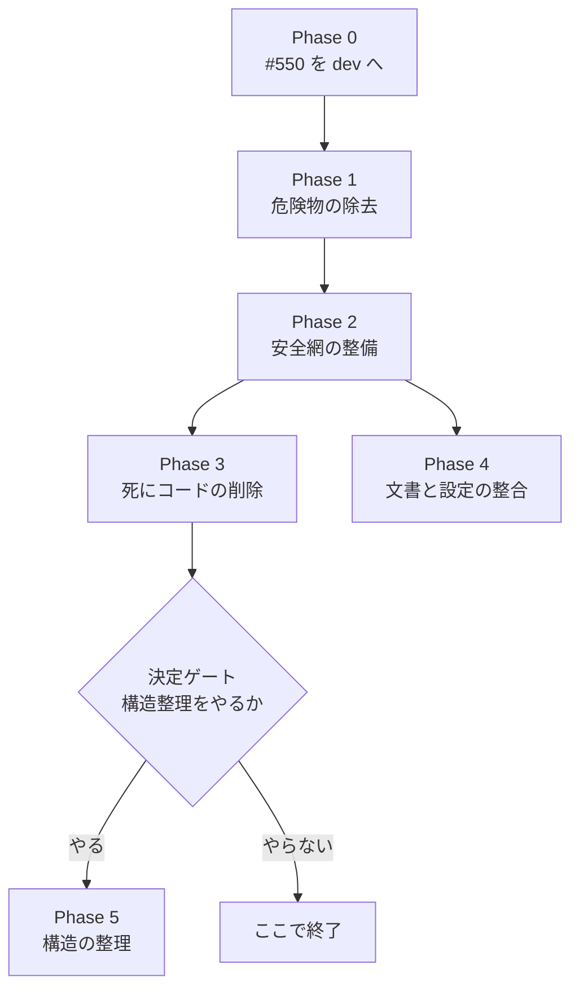

# tc 計画台帳 Plans.md

---

## 現行計画: ドキュメント刷新（tc-ops #592）

作成日: 2026-10-04
記録先: Redmine tc-ops #592
状態: 計画のみ（未承認・未着手）。承認後に harness-work で実行する。
タスク ID は完了済みの計画（下に残す）と衝突しないよう `D` を前置する。

### 依頼

「ドキュメント全般が古い。最新の説明文書に一気に更新してほしい」（2026-10-04、ユーザー）。

### 調査で分かったこと（読み取りと機械検査。2026-10-04）

- 追跡中の Markdown は 200 本。うち 143 本は `00_レビュー依頼/`（作業の依頼・報告の記録で、文書ではない）。現行文書は約 30 本、履歴資料が約 30 本。
- 2026-10-02〜03 の Phase 4・5 で主要文書（README、DEVELOPMENT、docs/user-guides、docs/developer-guides ほか）は一度更新済み。それでも古い箇所が残る。
  - `CHANGELOG.md` は 2025-08-11 から更新が無い。壊れたリンク 1 件、存在しないパスへの言及 3 件。
  - `docs/INVESTIGATION_REPORT.md`・`docs/REFACTORING_LOG.md`（2026-03）は、存在しないパスへの言及が 8 件。現行文書の位置づけのまま索引に載っている。
  - `SECURITY.md` に連絡先のプレースホルダ（`security@yourproject.com`）が残る。`.github/` のテンプレートは 2025-08 のまま。
  - `docs/user-guides/configuration.md` が、存在しない `config/context_hints.txt` を実在のように参照する（サンプルのみ実在）。
  - 直近の変更が文書に無い: 進捗バーと経過時間、`finalize_transcription`（保存→アップロード→履歴→削除の共通化）、`find_yt_dlp`（yt-dlp 検出）、ログの 1 行化（`one_line`）、`scripts/release_dev_main.sh`（統合手順）。`docs/system-docs/webui_architecture.md` はサーバー構成の運用手順だけで、アプリ内部（キュー・状態遷移・作業領域の整理）の説明が無い。
- 全体像を図で示した文書が無い（構成、処理の流れ、状態遷移）。
- 再発防止の仕組みが無い。文書と実装の整合を機械で検査するテストが無く、CI も文書を見ていない。
- 確認できなかったこと（`unknown`）: 各文書の記述のうち、パス以外（手順・数値・挙動の説明）が実装と合っているかは未検査。Task D0.1 で全件確認する。harness-mem は `daemon-unreachable` のため過去の判断の検索ができなかった。

### Spec delta / Spec skip reason

- Spec delta: `docs/spec/00-project-spec.md`（Task D1.1）。記録されていない既存の決定を追記する（進捗表示の仕様、外部由来の文字列の扱い、作業領域の整理の値）。利用者に見える挙動は変えない。
- Spec skip reason（D1.1 以外）: 文書だけの変更。仕様の正本は実装と `docs/spec/00-project-spec.md` で、文書は従う側。

### 計画メタ情報

- team_validation_mode: `manual-pass`（サブエージェント未使用。Product / Architecture / Security / QA / Skeptic の視点を単独で分けて評価した。棚卸しそのものを Task D0.1 に置いたため、計画段階では追加の独立調査をしない）
- lint / formatter baseline: ruff 設定済み。文書の検査は D0.2 で追加する。
- 既存仕様・過去判断との整合: 完了済み計画の D2（両 CLI を残す）、D4〜D8（`docs/spec/00-project-spec.md`）に従う。衝突なし。

### 優先度の分類

| 区分 | 内容 | 理由 |
|------|------|------|
| Required | D0.1 棚卸し、D0.2 整合検査の pytest 化、D0.3 図の検査環境、D1.1 仕様書、D2.1 システム全体像、D2.2 WebUI、D2.3 利用者向け、D2.4 開発者向け、D2.6 CHANGELOG、D4.1 検証、D4.2 独立レビュー、D4.3 統合 | 依頼の本体。D0.2 は再発防止で、これが無いと再び古くなる |
| Recommended | D2.5 運用・リリース手順書、D3.1 履歴資料の整理 | 運用の事故（統合スクリプト）と、現行文書と履歴の混同を防ぐ |
| Optional | D2.7 SECURITY.md と `.github` テンプレート（連絡先の決定が要る）、O1 API.md の半自動生成 | 効果はあるが、利用者の決定または規模が要る |
| Reject | `00_レビュー依頼/`（143 本）、`docs/obsolete/`（15 本）、既存の `docs/historical-records/`、`docs/notebooklm/` | 記録・履歴であり、現状を説明する文書ではない。書き換えると記録が壊れる。`docs/notebooklm/` は D3.1 で扱いを判断する |
| 別依頼 | 独立レビューの未対応指摘（統合スクリプト、`one_line`、ログの取りこぼし） | 文書ではなく実装の修正。D2.5 と D4.3 は修正後が望ましい（依存として下に記載） |

### 図についての規則（`~/.claude/CLAUDE.md` に従う）

構成・仕組みの説明には図を入れる。1 つの問いにつき 1 枚、1 枚あたり 8 要素前後まで。`diagram-design` で作り、`fig.sh` で機械検査し、画像を目視で確認する。図は検査環境のある `~/Projects/claude/explainer-trial/docs/tc-docs/figures/` で作り、検査済みの SVG を `docs/figures/` へ取り込む（D0.3 で運用を確認する）。要素が 4 つ未満の説明は図にせず、その理由を 1 行書く。

### Phase D0: 基準づくり [Required]

| Task | 内容 | DoD | Depends | Status |
|------|------|-----|---------|--------|
| D0.1 | `[Audit]` `[lane:gate]` `[tdd:skip:audit-no-code]` 現行文書（`README.md`、`CLAUDE.md`、`CONTRIBUTING.md`、`DEVELOPMENT.md`、`DEVELOPMENT_QUICKREF.md`、`SECURITY.md`、`docs/{developer-guides,system-docs,user-guides,feature,spec}/` の約 30 本）の記述を実装と突き合わせ、古い・誤り・欠落を全件一覧にする。確認方法（grep / コマンド実行 / 実装の該当箇所）を主張ごとに書く | 文書ごとに「確認した主張数 / 古い・誤り・欠落の件数 / 根拠」の表が Redmine #592 にある。古い記述が 0 件の文書も、根拠つきで 0 と書く。パス・コマンド・オプション・数値・挙動の説明のすべてを対象にしたと明記する | - | cc:TODO |
| D0.2 | `[Tool]` `[lane:gate]` `[tdd:required]` 文書の整合検査を `tests/test_docs_consistency.py` として pytest に入れる。検査: (a) 相対リンク切れ、(b) バッククォート内の `core/…` `handlers/…` `scripts/…` `tests/…` `docs/…` `config/…` のパスの実在、(c) 削除済みモジュール名の言及（`CLAUDE.md` の削除済み一覧）、(d) `tc` のオプション（`--xxx`）が `build_parser()` に実在、(e) 文書中の `uv run python -m pytest <パス>` のパスの実在。対象は現行文書。`00_レビュー依頼/`・`docs/obsolete/`・`docs/historical-records/` を除外し、理由をテスト内に書く | 現状の文書で先に実行し、リンク切れ 2 件・存在しないパス 17 件を検出して失敗する（赤の証拠）。刷新後に pass。除外ディレクトリの根拠がテスト内にある。`ci.yml` の pytest で実行される | D0.1 | cc:TODO |
| D0.3 | `[Spike]` `[lane:fast]` `[tdd:skip:spike]` 図の運用を確認する。`explainer-trial/docs/tc-docs/figures/` で試作図を `.mmd` → `fig.sh` → SVG と作り、`docs/figures/` へ取り込んで、tc の Markdown から `` で参照できることを確認する | 試作図 1 枚が `fig.sh` で CLEAN。tc の Markdown から相対参照で表示できる（GitHub 上の表示は未確認のまま、ローカルの参照解決のみ確認と明記）。作り方と取り込み手順が `docs/README.md` に 5 行以内で書かれている | - | cc:TODO |

### Phase D1: 正本の更新 [Required]

| Task | 内容 | DoD | Depends | Status |
|------|------|-----|---------|--------|
| D1.1 | `[Contract]` `[lane:gate]` `[tdd:skip:docs-contract]` `docs/spec/00-project-spec.md` に、記録されていない既存の決定を追記する: 進捗表示（ダウンロードの割合、長音声のチャンク進捗、経過・残り時間、Nemotron は経過時間のみ）、外部由来の文字列（アップロード名・URL・エラー文）をログとラベルで 1 行にする方針、アップロード名の安全化。値は実装の定数に合わせる | 仕様書に書いた数値（保持日数 7 日と 1 日、エラー文の最大 1,000 文字、アップロード名の最大 200 文字）が、実装の定数（`UPLOAD_RETENTION_DAYS`、`DOWNLOAD_RETENTION_DAYS`、`ERROR_TEXT_LIMIT`、`MAX_UPLOAD_FILENAME_LENGTH`）と一致することを確認するテスト（`tests/test_docs_consistency.py` 内）が pass。各決定に決定日がある | D0.1 | cc:TODO |

### Phase D2: 説明文書の刷新 [Required]

| Task | 内容 | DoD | Depends | Status |
|------|------|-----|---------|--------|
| D2.1 | `[Docs]` `[lane:gate]` `[tdd:skip:docs-only]` システム全体像: `docs/system-docs/system_overview_2025.md` を `system_overview.md` へ改名し全面更新する。図 3 枚: (1) コンポーネント構成、(2) 1 件の処理の流れ（入力 → 解決 → キュー → 文字起こし → 保存 → アップロード → 履歴 → 削除）、(3) エンジン選択（`create_engine`） | 3 枚の図が `fig.sh` で CLEAN で、画像を目視確認済み（読めたか・直したかを報告に書く）。`grep -rn "system_overview_2025"`（`00_レビュー依頼/` と履歴資料を除く）が 0 件。本文の識別子が実在する（D0.2 が pass） | D0.2, D0.3, D1.1 | cc:TODO |
| D2.2 | `[Docs]` `[lane:gate]` `[tdd:skip:docs-only]` WebUI: `docs/system-docs/webui_architecture.md` にアプリ内部の章を足す。キューの状態遷移図（`RESOLVING → QUEUED → PROCESSING → DONE / FAILED`）、進捗表示の流れ、作業領域（`output/uploads`、`output/queue_downloads`）と整理の規則、アップロードの安全化。既存の運用の章（systemd、ヘルスチェック）は実機に照らして再確認する | 状態遷移図の遷移が `core/webui_workflow.py` の `QueueItemState` と一致する（照合した行番号を報告に書く）。図が CLEAN。運用の章のコマンドを実機で実行して確認した結果（実行したもの・していないもの）を報告に分けて書く | D2.1 | cc:TODO |
| D2.3 | `[Docs]` `[lane:gate]` `[tdd:skip:docs-only]` 利用者向け: `README.md`（更新履歴は CHANGELOG へ移し、概要・クイックスタート・機能・制約に絞る）、`TUTORIAL.md`、`new_cli_usage.md`、`configuration.md`、`language_support_guide.md`、`timestamp_feature.md`（D4 の保存形式を反映）、`TROUBLESHOOTING.md`（新しいエラー: yt-dlp 不在は `uv sync`、取得のタイムアウト、長い動画の所要時間、アップロード・ダウンロードの自動削除）を更新する | 文書に載せた `tc` のコマンドを `--help` または `--dry-run` で実行して成功を確認し、結果を #592 に残す。D0.2 が pass。D0.1 の「古い・誤り・欠落」のうち本タスクの文書に属する全件が解消済み | D1.1 | cc:TODO |
| D2.4 | `[Docs]` `[lane:gate]` `[tdd:skip:docs-only]` 開発者向け: `DEVELOPMENT.md`、`DEVELOPMENT_QUICKREF.md`、`CONTRIBUTING.md`、`docs/developer-guides/API.md`、`coding_standards.md`、`CLAUDE.md`（べからず集）を更新する。新モジュール一覧（`progress`、`housekeeping`、`history`、`engine_factory`、`finalize_transcription` ほか）、ログ初期化（`setup_logging`）、外部由来の文字列の扱い、テストと lint の手順 | `API.md` の公開クラス・関数名が実在する（D0.2 が pass）。文書の手順（`uv run ruff check .`、`uv run python -m pytest tests -q`）を実行して成功し、件数を文書に書く場合は実測と一致する。`CLAUDE.md` の「main 更新は明示的な指示があるときだけ」などの禁止事項は変更しない（差分で確認） | D1.1 | cc:TODO |
| D2.5 | `[Docs]` `[lane:gate]` `[tdd:skip:docs-only]` 運用・リリース手順書を新設する（`docs/system-docs/release_operations.md`）: ブランチ戦略（feature → dev → main）、本番 `tc-prod` の位置づけ、`scripts/release_dev_main.sh` の使い方・止まる条件・途中で止まったときの復旧、WebUI 再起動前のジョブ確認。図 1 枚（ブランチと環境の関係）。統合スクリプトの修正（別依頼）が済んでいなければ、既知の制約を明記して書く | スクリプトの引数と停止条件が、`--help` と実コード（`bash -n` と読解）と一致する。図が CLEAN。未修正の既知の制約を載せた場合は、その一覧が独立レビュー（`#578` のコメント）と一致する | D0.3, D1.1 | cc:TODO |
| D2.6 | `[Docs]` `[lane:gate]` `[tdd:skip:docs-only]` `CHANGELOG.md` に、2025-08-11 以降の変更を Keep a Changelog 形式で追記する。出典は `git log --since=2025-08-11` と Redmine tc-ops。利用者に見える変更だけを載せる | 日付つきのセクションがあり、Redmine #546〜#592 のうち利用者に見える変更の一覧（出典の突合せ表を #592 に貼る）がすべて載っている。壊れたリンクと存在しないパスが 0 件（D0.2 が pass） | D1.1 | cc:TODO |
| D2.7 | `[Docs]` `[lane:fast]` `[tdd:skip:docs-only]` `SECURITY.md` と `.github/` のテンプレートを実態に合わせる。プレースホルダの連絡先と、古い手順（規約の熟読宣言など）を直す。**連絡先はユーザーの決定が要る** | `grep -rn "yourproject" SECURITY.md .github` が 0 件。テンプレートのコマンドが `uv`・`pytest`・`ruff` である。連絡先をユーザーが決めた記録が #592 にある | - | blocked（連絡先の決定待ち） |

### Phase D3: 履歴資料の整理 [Recommended]

| Task | 内容 | DoD | Depends | Status |
|------|------|-----|---------|--------|
| D3.1 | `[Docs]` `[lane:fast]` `[tdd:skip:docs-only]` `docs/INVESTIGATION_REPORT.md` と `docs/REFACTORING_LOG.md`（存在しないパスを多数含む 2026-03 の資料）を `docs/historical-records/` へ移し、冒頭に「履歴資料。現状と異なる」と注記する。`docs/notebooklm/`・`docs/kaizen/` を現状と照合して扱いを決める（理由を書く）。`docs/README.md` の索引とリンクを更新する | `docs/` 配下の Markdown のうち `docs/README.md` の索引にないものが 0 件（機械検査）。移した 2 本が D0.2 の除外ディレクトリに入り、現行文書側のリンク切れが 0 件 | D0.2 | cc:TODO |

### Phase D4: 検証と統合 [Required]

| Task | 内容 | DoD | Depends | Status |
|------|------|-----|---------|--------|
| D4.1 | `[Verify]` `[lane:gate]` `[tdd:skip:verification]` 全体の機械検査と、文書のコマンドの実行確認 | `uv run ruff check .` 全通過、`uv run python -m pytest tests -q` 全 pass（D0.2 を含む）。全図が `fig.sh` で CLEAN。リンク切れ 0。結果を「機械の検査 / 目で見て確認 / 未確認」に分けて #592 に記録する | D2.1, D2.2, D2.3, D2.4, D2.6, D3.1 | cc:TODO |
| D4.2 | `[Review]` `[lane:gate]` `[tdd:skip:review]` 独立レビュー（読み取り専用）: (a) 各文書から 10 件の主張を抜き取り、実装と突き合わせる。(b) 初見の読み手（新しく入った開発者、運用担当）の視点で通読し、詰まる箇所・前提が足りない箇所・図と本文の食い違いを挙げる | APPROVE かつ critical・major が 0 件。レビューが実行した確認（コマンドと出力の要点）が #592 にある | D4.1 | cc:TODO |
| D4.3 | `[Release]` `[lane:release]` `[tdd:skip:release]` `dev` → `main` へ統合する（ユーザーが `scripts/release_dev_main.sh` を実行。`main` の更新は都度ユーザーの GO） | `origin/dev`・`origin/main` がローカルと一致。`main` と `dev` の tree が一致。WebUI の再起動は文書だけの変更なので不要（再起動しないことを実行前に確認する） | D4.2（推奨: 統合スクリプトの修正後） | cc:TODO |

### 事前確認

- 事項: destructive — 追跡中の文書の改名・移動（`system_overview_2025.md` → `system_overview.md`、`INVESTIGATION_REPORT.md` と `REFACTORING_LOG.md` → `docs/historical-records/`）
  理由: 古い名前・位置づけの文書を現状に合わせる。参照元はすべて直す。履歴は git に残る
  scope: Phase D2 / Task D2.1、Phase D3 / Task D3.1
- 事項: rule-file — `CLAUDE.md`・`CONTRIBUTING.md`・`SECURITY.md`・`.github/` のテンプレートの修正
  理由: 実装と食い違う記述を直す。禁止事項（`main` の更新、`.venv` の削除など）は変更しない
  scope: Phase D2 / Task D2.4、D2.7
- 事項: external-send — 検査環境のあるリポジトリ `~/Projects/claude/explainer-trial/docs/tc-docs/` への図の書き込み（tc の外）
  理由: `fig.sh` が mermaid の入った `package.json` を要求するため、図はそこで作る。検査済みの SVG を tc に取り込む
  scope: Phase D0 / Task D0.3、Phase D2 / Task D2.1、D2.2、D2.5
- 事項: external-send — `git push`（`dev`・`main`）。ユーザーが `scripts/release_dev_main.sh` を実行する
  理由: 統合と push は実行時の分類器が私の実行を拒否するため、ユーザーが行う
  scope: Phase D4 / Task D4.3
- 事項: `main` の更新は都度ユーザーの GO を得る
  理由: `CLAUDE.md` の絶対厳守事項
  scope: 全 Phase
- 事項: secret-read は無い
  理由: 認証情報ファイルは読まない（文書には名前だけを書く）
  scope: 全 Phase

---

## 完了済み計画: tc リファクタリング（tc-ops #566 / #567）

作成日: 2026-10-02
記録先: Redmine tc-ops #566
状態: 実行中（harness-work、2026-10-02 開始）。Phase 1〜4 は完了・dev/main 統合済み（2026-10-02〜03）。Phase 5 は 2026-10-03 にユーザーが承認（「Phase 5 に進んで」）

---

## この計画の前提

- 目的: 動作を変えずに、壊れた周辺資産・死にコード・陳旧化した文書を片付け、変更しやすい状態にする。
- 根拠: 2026-10-02 の読み取り調査 3 本（本体コードの構造 / scripts・CI・docs / テストと lint）と、作(saku)による抜き取り確認。
- 規律: `CLAUDE.md` のブランチ戦略（feature → dev → main、main はユーザーの GO まで更新しない）、改変前バックアップ、依存変更は別コミット、を全タスクに適用する。
- 作業場所: `origin/dev` から切ったブランチ `feature/refactoring-phase1-4-20261002` の専用ワークツリー（`.claude/worktrees/refactor-trunk`）。共有の作業ツリーにある #550 の未コミット差分には触れない。
- ローカルの `dev` は本番 WebUI（`/home/abem/Projects/tc-prod`）が使っているため、`dev` へのマージは本実行では行わず、完了後にユーザーが判断する。
- 全タスク共通の完了条件: `uv run python -m pytest tests -q` が全件 pass（着手前の基準は 182 passed / 1 skipped）。

## フェーズの順序



## 計画メタ情報

```text
team_validation_mode: subagent（Architecture / QA / 周辺資産は subagent、Product / Security / Skeptic は作が単独で評価）
formatter_baseline: missing
formatter_baseline_evidence: pyproject.toml の [tool.*] は uv と pytest のみ。.venv に ruff/black/flake8/mypy なし。.pre-commit-config.yaml なし
formatter_baseline_action: add_setup_task（Task 2.1）
記憶の確認: Redmine tc-ops を「リファクタリング」で検索し、tc の既存チケットは 0 件。docs/REFACTORING_LOG.md（2026-03-01、4 フェーズ）は見出しのみ確認し、本文は未読。claude-mem と harness-mem の検索は未実施
```

Spec skip reason（Phase 0〜4）:
- path checked: `spec.md`（存在しない）、`docs/spec/`（存在しない）
- reason: 動作を変えない削除・テスト追加・文書修正であり、正解は既存テストで固定される（各タスクの DoD に残す）

Spec delta（Phase 5 のみ）: `docs/spec/00-project-spec.md` を Task 5.0 で新設し、保存形式・一時ファイルの削除対象・yt-dlp が無いときの挙動を決めて記録する。

---

## Phase 0: 前提条件 [Required]

Purpose: 未コミットの #550 を片付け、リファクタリングの差分と混ざらないようにする

| Task | 内容 | DoD | Depends | Status |
|------|------|-----|---------|--------|
| 0.1 | `[lane:gate]` tc-ops #550 の未コミット差分（`handlers/youtube.py` と完了報告書）を査が検査し、計がコミットして dev へマージする。本計画の作業ではなく待ち条件。作業を専用ワークツリーに分けたため、これを待つのは 2.2b だけ | `git status --short handlers/youtube.py` が空、かつ `git branch --contains <#550のコミット>` に dev が含まれる | - | cc:TODO |

## Phase 1: 危険物の除去と既知の不具合 [Required]

Purpose: 実行すると本番環境を壊しうるスクリプトと、確認済みの不具合を先に片付ける

| Task | 内容 | DoD | Depends | Status |
|------|------|-----|---------|--------|
| 1.1 | `[Cleanup]` `[lane:gate]` `[tdd:skip:deletes-dead-scripts]` 起動不能な 3 本を削除する: `scripts/core/setup.sh`（存在しない `scripts/lib/common.sh` を source した後、`rm -rf .venv` と `config/config.yaml` の上書きに到達しうる）、`scripts/core/transcribe.sh`、`scripts/tools/monitor.sh` | 3 ファイルが `git ls-files` に無い。`git grep -nE "scripts/core/(setup|transcribe)\.sh|scripts/tools/monitor\.sh"` が `docs/obsolete` `docs/historical-records` `00_レビュー依頼` `Plans.md` 以外で 0 件（当初の `scripts/core/` という広い条件は、過去に削除済みの別ファイルを記録した CHANGELOG 等も拾うため、2026-10-02 に削除対象の 3 本へ絞った） | - | cc:完了 [58697c3] |
| 1.2 | `[Cleanup]` `[lane:gate]` `[tdd:skip:deletes-dead-scripts]` 常に失敗する `scripts/pre_check.sh` と、存在しない `output/transcriptions` を前提とする `scripts/cleanup_transcriptions.sh` を削除する。参照元（`.github/workflows/pre-commit.yml`、`DEVELOPMENT.md` の 137・141・155・229 行付近）も同じコミットで直す | 2 ファイルが `git ls-files` に無い。`git grep -nE "pre_check\.sh|cleanup_transcriptions"` が、Task 1.1 と同じ除外先に加えて `docs/REFACTORING_LOG.md` と `docs/system-docs/current_status_2025_july.md`（どちらも過去の状態を記録した文書で書き換えない。後者は Task 4.4 で `docs/historical-records/` へ移す）を除いて 0 件 | - | cc:完了 [2e8a388] |
| 1.3 | `[Bugfix]` `[lane:gate]` `[tdd:required]` `[bugfix:reproduce-first]` `transcribe.py` 275〜280 行の `type_names` に `"twitter"` が無く、X の URL で `KeyError` になる（D2 で `transcribe.py` は残すと決定済み） | X の URL を渡すテストが修正前に失敗し、修正後に pass する | 2.0 | cc:完了 [bbab283] |

## Phase 2: 安全網の整備 [Required]

Purpose: コードを動かす前に、壊れたら気づける状態を作る

| Task | 内容 | DoD | Depends | Status |
|------|------|-----|---------|--------|
| 2.0 | `[Bugfix]` `[lane:gate]` `[tdd:required]` クリーンな checkout でテストが通るようにする。Nemotron のテスト 10 件が `samples/e2e_sample.wav` を前提にしているが、このファイルは後から実行される `tests/test_e2e_dry_run.py` が生成するため、初回実行で 10 件失敗する（2026-10-02 に新しいワークツリーで再現）。他のコード変更タスクより先に行う | `samples/` の無い新しいワークツリーで `pytest tests -q` が初回から全件 pass | - | cc:完了 [fa0c878] |
| 2.1 | `[Setup]` `[lane:gate]` `[tdd:skip:tooling-setup]` ruff を dev 依存に追加し、`pyproject.toml` に `[tool.ruff]` を置く。規則は F（pyflakes）のみ。一括 reformat は範囲外。`pyproject.toml` / `uv.lock` / `.venv` の変更を伴うため単独コミット | `uv run ruff check .` が実行でき、検出件数を Redmine に記録。`git show --stat` の変更が `pyproject.toml` と `uv.lock` のみ | 1.1, 1.2 | cc:完了 [bf5a4e8] |
| 2.2 | `[Test]` `[lane:gate]` `[tdd:skip:characterization-tests-of-existing-code]` `handlers/youtube.py` の `download_audio` の正常系 / 非 0 終了 / 出力ファイル名のフォールバックにテストを足す。偽の yt-dlp 実行ファイルを使い、#550 の適用前後どちらの実装でも通る形にする | 追加した 3 ケース以上が pass。実ネットワークを使わない | 2.0 | cc:完了 [a253cb9] |
| 2.2b | `[Test]` `[lane:gate]` `[tdd:required]` #550 で追加した分岐（無出力による `TimeoutError`、`extract_video_info` の `TimeoutExpired`）にテストを足す。#550 のコードが dev に入るまで着手できない | 追加した 2 ケース以上が pass | 0.1, 2.2 | blocked（0.1 待ち） |
| 2.3 | `[Test]` `[lane:gate]` `[tdd:skip:characterization-tests-of-existing-code]` `core/cli_workflow.py` の `record_transcription_history`、`upload_transcription_result`、`resolve_input_audio` の gdrive / local / unknown 分岐にテストを足す | 追加テストが pass。Drive API は差し替え、実 API を呼ばない | 2.0 | cc:完了 [0c25cd1] |
| 2.4 | `[Test]` `[lane:gate]` `[tdd:skip:characterization-tests-of-existing-code]` `core/webui_workflow.py` の `resolve_success` / `resolve_failed` / `enqueue_pending` / `segments_to_srt` / `drain_progress` にテストを足す | 追加テストが pass | 2.0 | cc:完了 [f4db722] |
| 2.5 | `[Test]` `[lane:gate]` `[tdd:skip:characterization-tests-of-existing-code]` `webui.py` の `_save_and_record` / `_cleanup_temp_file` / `_resolve_input` にテストを足す | 追加テストが pass | 2.0 | cc:完了 [9bd6f46] |
| 2.6 | `[Test]` `[lane:gate]` `[tdd:skip:characterization-tests-of-existing-code]` `tc` の `load_config` / `transcribe_audio` / `main` の本処理にテストを足す（Phase 5 の CLI 整理の前提） | 追加テストが pass。モデルのロードは差し替える | 2.0 | cc:完了 [d073498] |
| 2.7 | `[Setup]` `[lane:gate]` `[tdd:skip:tooling-setup]` pytest-cov を dev 依存に追加し、モジュール別カバレッジの基準値を取る。2.1 とは別コミット | `uv run python -m pytest tests --cov=core --cov=handlers -q` が実行でき、基準値を Redmine に記録 | 2.1 | cc:完了 [6be9e8e] |
| 2.8 | `[CI]` `[lane:gate]` `[tdd:skip:ci-config]` `[needs-spike]` GitHub Actions に uv + pytest + ruff の workflow を 1 本新設し、`ci.yml.disabled` / `minimal-test.yml` / `simple-test.yml` / `pre-commit.yml` を削除する | feature ブランチで workflow が成功し、実行 URL を Redmine に記録 | 2.8-spike, 2.1 | blocked（workflow は e2e6c42 で取り込み済み。GitHub Actions 上での成功は、この環境から結果を取得できないため未確認） |
| 2.8-spike | `[spike]` torch と qwen-asr を含む `uv sync` が GitHub ランナーの時間・容量に収まるか、GPU 無しで全テストが通るかを検証する | 「可能 / 不可能 / 依存グループの分割が必要」のいずれかを所要時間とともに Redmine に記録 | 1.2 | blocked（ローカルの材料のみ: GPU を隠した pytest は全件 pass、依存一式は約 5.7GB。ランナーでの所要時間と成否は未確認） |

## Phase 3: 死にコードと重複の削除（挙動は変えない） [Recommended]

Purpose: 参照されていないコードを消し、読む量を減らす

| Task | 内容 | DoD | Depends | Status |
|------|------|-----|---------|--------|
| 3.1 | `[Refactor]` `[lane:fast]` `[tdd:skip:behavior-unchanged]` 未使用 import を削除し、ruff F を 0 件にする。あわせて `tests/test_core_utils.py:222` の古い skip 理由（torch は依存に入っている）を直す | `uv run ruff check .` が exit 0 | 2.1 | cc:完了 [6a7bc6e] |
| 3.2 | `[Refactor]` `[lane:gate]` `[tdd:skip:behavior-unchanged]` 参照 0 件の関数・クラスを削除する。対象は Redmine #566 の一覧（`core/transcription_interface.py` の `_create_segments_from_result` / `_load_audio` / `_results_to_segments`、`core/utils.py` の `YOUTUBE_URL_PATTERN`、`core/cli_common.select_model`、`core/config.py` の `for_device` / `create_for_use_case` / `to_dict` / `from_dict`、`core/model_manager.py` と `core/logging.py` の未使用メソッド、`handlers/gdrive.py` の未使用メソッドと別名、ルート `config.py` の `load_config`）。削除の直前に 1 件ずつ grep で 0 件を再確認する | 削除した各シンボルについて、定義行を除く `grep -rn` が 0 件（コマンドと対象範囲を完了報告に記載） | 2.2, 2.3, 2.4, 3.1 | cc:完了 [ede8913] |
| 3.3 | `[Refactor]` `[lane:gate]` `[tdd:skip:behavior-unchanged]` `TranscriptionConfig` のどのエンジンも読まないフィールド（`compute_type`、`chunk_size`、GPU 最適化群、`max_line_length`、`timestamp_format` ほか）を削除し、`tc` の渡し方と `config/config.yaml` の対応キーを揃える。`config.yaml` は改変前にバックアップを取る | 削除した各フィールド名の grep が 0 件。`tests/test_e2e_dry_run.py` が pass | 2.6, 3.2 | cc:完了 [6077d30] |
| 3.4 | `[Refactor]` `[lane:gate]` `[tdd:skip:refactor-tests-added-after-implementation]` 音声長の取得が Whisper / Qwen3 / Nemotron に 3 実装ある重複を 1 つにし、bare `except:`（`transcribe.py:264, 303`、Whisper の長さ取得）を具体的な例外にする | 3 エンジンが同じ関数を呼ぶ。`grep -rnE "except:\s*$"` が本体コードで 0 件 | 3.2 | cc:完了 [e3fb2d3] |
| 3.5 | `[Refactor]` `[lane:fast]` `[tdd:skip:behavior-unchanged]` 再エクスポートまたはテストからしか参照されないもの（`create_*_transcriber`、`configure_model_manager`、別名 `YouTubeHandler`、`TranscriptionJobQueue.enqueue`）を削除する。対応するテストも同時に直す。リポジトリ外（個人スクリプト、systemd unit）からの利用が無いことをユーザーに確認してから行う | 各シンボルの grep が 0 件 | 3.2 | cc:完了 [464d6e6] |

## Phase 4: 文書と設定の整合 [Recommended]

Purpose: 文書どおりに操作すると失敗する箇所を無くす

| Task | 内容 | DoD | Depends | Status |
|------|------|-----|---------|--------|
| 4.1 | `[Docs]` `[lane:gate]` `[tdd:skip:docs-only]` `CLAUDE.md` と実装の不一致を直す: 存在しない `DiarizationConfig` と `speaker_diarization.py`、「デュアルエンジン」（実際は Nemotron を含む 3 エンジン）、`transcribe.py` と `tc` の説明。規則ファイルのため差分はユーザーが確認する | `CLAUDE.md` 内の `DiarizationConfig` と `speaker_diarization` が 0 件。記載したコマンドを実行して成功することを確認 | - | cc:完了 [56732f3] |
| 4.2 | `[Docs]` `[lane:fast]` `[tdd:skip:docs-only]` `CONTRIBUTING.md` / `DEVELOPMENT.md` / `DEVELOPMENT_QUICKREF.md` を実在するツール（uv、pytest、ruff）に合わせる。black / isort / flake8 / mypy と Python 3.11 の記述を除く | 3 ファイルで `black|isort|flake8|mypy|3\.11` が 0 件 | 1.2, 2.1 | cc:完了 [ac5b62a]（レビュー指摘は統合ブランチで解消。workflows ツリーも修正） |
| 4.3 | `[Docs]` `[lane:gate]` `[tdd:skip:docs-only]` 利用者向け文書（`TUTORIAL.md`、`API.md`、`configuration.md`、`TROUBLESHOOTING.md`、`new_cli_usage.md`、`optimization_features.md`、`system_overview_2025.md`、`timestamp_feature.md`）から、話者分離・削除済みモジュール・`exec.sh`・`requirements` の記述を除き、Nemotron と WebUI を追記する。記載するコマンドとオプションは argparse の定義を確認してから書く | 語彙群（`venv-clean`、`main_cli\.py`、`requirements[-/.]`、`pip install`、`gdrive_handler`、`exec\.sh`、`AppConfig`、`WhisperTranscriber`、`pyannote`）の grep が、`docs/obsolete` `docs/historical-records` `00_レビュー依頼` `.venv` `venv-nemotron*` `backup` 以外で 0 件 | 3.3 | cc:完了 [d216870, 64b1b70] |
| 4.4 | `[Docs]` `[lane:fast]` `[tdd:skip:docs-only]` `docs/README.md` の索引（件数、未掲載の 4 件）を実体に合わせ、`current_status_2025_july.md` と `dependency_migration.md` を `docs/historical-records/` へ移す | 索引の件数が `ls` の結果と一致。リンク切れ 0 件 | 4.3 | cc:完了 [0d4ee00]（機械的な文書修正のため独立レビューなし。リンク切れ 0 件を確認） |
| 4.5 | `[Config]` `[lane:gate]` `[tdd:skip:config-only]` `.gitignore` を直す: `!tests/**` が `__pycache__/` の除外を打ち消している点、`lib/` が `scripts/lib/` を黙って除外している点、常時 untracked に並ぶ ccc 運用資産（`backup/`、`WORK_*/`、`agmsg_send.py` ほか）の扱い。追跡対象が変わらないことを確認する | 変更前後で `git ls-files` の出力が同一。`git status --short` に `tests/__pycache__/` が出ない | 1.1 | cc:完了 [16a81cf] |

## Phase 5: 構造の整理 [Optional・決定ゲートあり]

Purpose: 同じ処理の重複実装を 1 か所にまとめる。利用者に見える挙動の統一を含むため、やるかどうかをユーザーが決める

| Task | 内容 | DoD | Depends | Status |
|------|------|-----|---------|--------|
| 5.0 | `[Contract]` `[lane:gate]` `[tdd:skip:docs-contract]` `docs/spec/00-project-spec.md` を新設し、未決事項 D2 の決定（正とする CLI、保存形式、一時ファイルの削除対象、yt-dlp が無いときの挙動）を記録する | ファイルが存在し、4 項目すべてに決定と決定日が書かれている | Phase 3 | cc:完了 [e7ad0a7] |
| 5.1 | `[Refactor]` `[lane:gate]` `[tdd:required]` CLI を整理する。`tc`（228 行）と `transcribe.py`（318 行）が同じ流れを別々に実装し、gdrive の一時ファイル削除と `[MM:SS]` 付き保存の挙動が食い違っている。D2 の決定どおり両方を残し、食い違う挙動を 5.0 で決めた側に揃える。`transcribe`（bash）は `transcribe.py` の shebang と役割が重なるため扱いを 5.0 で決める | 5.0 で決めた挙動を、`tc` と `transcribe.py` の両方について確認するテストが pass | 5.0, 2.6 | cc:完了 [ebcfa57] |
| 5.2 | `[Refactor]` `[lane:gate]` `[tdd:required]` 保存 → アップロード → 履歴記録 → 一時ファイル削除の流れを `core/` の 1 関数にまとめ、`tc` と `webui.py` の両方から呼ぶ | `tc` と `webui.py` に同じ流れの重複実装が無い。2.3 / 2.5 / 2.6 のテストが pass | 5.1, 2.3, 2.5 | cc:完了 [155b2ab] |
| 5.3 | `[Refactor]` `[lane:gate]` `[tdd:required]` `handlers/youtube.py` の `install_yt_dlp`（`pip install` で uv 管理の `.venv` を書き換える経路）を除き、yt-dlp の検出を 1 つの方法に揃える。挙動が変わるため 5.0 の決定に従う | `grep -rn "pip install" handlers/ core/` が 0 件。yt-dlp が無い場合のエラーメッセージを確認するテストが pass | 5.0, 2.2 | cc:完了 [cd777f1] |
| 5.4 | `[Refactor]` `[lane:gate]` `[tdd:required]` `core/transcription_interface.py`（1,123 行）を、型と抽象基底 / Whisper / Qwen3 / テキスト整形 / ファサードに分ける。あわせてエンジン判定を 1 か所に集め、`core/nemotron_engine.py` との相互 import を解消する。公開名 `core.transcription_interface.*` の import は維持する。反復検出の論理と閾値は変えない | 分割後の各ファイルが 500 行以下。既存の `tests/test_core_transcription_interface*.py` と `tests/test_core_nemotron_*.py` が pass。関数内 import による循環回避が 0 件 | 5.4-pre | cc:完了 [da03ddb] |
| 5.4-pre | `[Test]` `[lane:gate]` `[tdd:required]` `WhisperTranscriptionEngine` のテキスト整形（`_parse_timestamped_text`、`_add_timestamps_to_text`、`_ensure_timestamps_at_line_start`、`_create_chunks`）に、現在の出力を固定するテストを足す | 追加テストが pass | Phase 3 | cc:完了 [fd18f17] |
| 5.5 | `[Refactor]` `[lane:gate]` `[tdd:skip:needs-manual-auth-check]` `[needs-spike]` ルート `config.py`（実体は Drive 認証）を `handlers/` 配下へ移して改名し、import 時の `OAUTHLIB_INSECURE_TRANSPORT=1` 設定と、`config.yaml` の読まれていないキー（`credentials_file` / `token_file` / `logging:`）を整理する。`CLAUDE.md` の確認コマンドも同時に更新する | `uv run python -c "<新しい import 文>; print('ok')"` が成功。実機での Drive 認証をユーザーが 1 回確認 | 5.5-spike | cc:完了 [896f889] ※実機Drive認証のユーザー確認待ち |
| 5.5-spike | `[spike]` WebUI のバックグラウンドスレッドから再認証に入ったとき、`config.py:58-77` の `input()` で止まるかを確認する（コードの読み取りでは止まり得るが未確認） | 「止まる / 止まらない」を再現手順とともに Redmine に記録 | Phase 3 | cc:完了（コード読み取り+標準入力の確認。Redmine #567 に記録） |
| 5.6 | `[Refactor]` `[lane:gate]` `[tdd:required]` `core/__init__.py` の import 時の副作用（ルートロガーの付け替えとログファイル作成）を、エントリポイントからの明示的な初期化に変える | `import core` だけではログファイルが作られないことを確認するテストが pass。`tests/test_core_init_pytest_log_guard.py` が pass | Phase 3 | cc:完了 [ae7e3b9] |
| 5.7 | `[Refactor]` `[lane:gate]` `[tdd:required]` 履歴 DB の操作を `core/history.py` に集める。`webui.py` 482〜501・566〜590 行に直書きされた SELECT / DELETE を移す。DDL と FTS トリガーは変えない | `grep -nE "SELECT|DELETE FROM" webui.py` が 0 件。`tests/test_core_cli_workflow_history_fts.py` と `tests/test_webui_history_cleanup.py` が pass | Phase 3 | cc:完了 [b0e9d00] |

---

## 優先度の分類

| 分類 | 対象 | 理由 |
|------|------|------|
| Required | Phase 0、1、2（2.7 と 2.8 を除く） | 実行すると `.venv` を消しうるスクリプトが残っている。確認済みの不具合がある。コードを動かす前のテストと lint が無い |
| Recommended | 2.7、2.8、Phase 3、Phase 4 | 挙動を変えずに読む量と誤操作を減らせる。リスクは低い |
| Optional | Phase 5 | 効果は大きいが、利用者に見える挙動の統一と、実機でしか確認できない認証経路を含む |
| Reject | 下の表 | 理由を個別に記載 |

### Reject（この計画では行わない）

| 項目 | 理由 |
|------|------|
| Qwen3 の反復検出・再試行・閾値（`REPETITION_PENALTY`、`CHUNK_THRESHOLD_SEC=300`）の変更 | 実障害ごとに積んだ是正。ファイルの移動（5.4）は可、論理と値は変えない |
| Nemotron の分割閾値とフォールバックの変更 | 実機の実測と采の決定に基づく |
| `QueueItemState(str, Enum)` と `==` 比較、`_enqueue_job` が `st.*` を呼ばない構造の変更 | Streamlit のリロードと Rerun への対策そのもの（#548、#440） |
| `suppress_warnings.py` の import 順の変更 | 各エントリが「core より先に import」する前提で動いている |
| 履歴 DB の DDL と FTS トリガーの変更 | 既存の `output/history.db` と互換が必要 |
| OAuth の手順そのものの変更 | WSL 向けの手動リダイレクト手順。実機認証でしか検証できない |
| リポジトリ全体の一括 reformat（ruff format / black） | 差分が全ファイルに及び、進行中のブランチと衝突する |
| mypy / pyright の導入 | 型注釈が揃っておらず、今回は ruff の F 規則までにとどめる |
| yt-dlp・transformers など依存のバージョン変更 | 影響調査が別途必要 |
| ダウンロード進捗を WebUI に表示する（#550 の所見） | 機能追加であり、リファクタリングではない。#550 側で判断する |
| `docs/obsolete/`（17 件）と `docs/historical-records/`（9 件）の削除 | 履歴として残す。4.3 の grep では除外ディレクトリとして扱う |
| 未追跡の ccc 運用資産、`backup/`、`WORK_*/`、`venv-nemotron*/` の削除 | 運用中の資産。`venv-nemotron-poc/`（5.3G）を参照するコードの有無は未確認 |

---

## 決定事項（2026-10-02、ユーザー回答）

| ID | 決めること | 決定 |
|----|-----------|------|
| D1 | 実行体制 | harness-work で進める。Git 操作を計の専任とする ccc のロール規則とは両立しないため、harness のワーカーがコミットする範囲は feature ブランチと dev に限る |
| D2 | 正とする CLI | `tc` と `transcribe.py` を両方残し、共通処理に寄せる。廃止はしない |
| D3 | Phase 5 を行うか | 行う（2026-10-03、ユーザー「Phase 5 に進んで」）。D4〜D6 は `docs/spec/00-project-spec.md` に記録 |

## 事前確認

ユーザーの承認: Phase 1〜4 を承認、Phase 5 は 2026-10-03 に承認。main の更新は都度ユーザーの GO を得る。削除と push は `.claude/state/plan-preapprovals.json` に記録済み（期限 2026-10-16）。依存・`config.yaml`・`CLAUDE.md` の変更は記録形式の対象外のため、本節の記載を承認の記録とする。
- 事項: destructive — 追跡中のファイルの削除（`scripts/` の 5 本、`.github/workflows/` の 4 本）
  理由: 起動不能または常に失敗し、うち 1 本は `.venv` 削除に到達しうる
  scope: Phase 1 / Task 1.1, 1.2、Phase 2 / Task 2.8
- 事項: destructive — 参照 0 件の関数・クラス・設定フィールドの削除
  理由: Phase 3 の目的そのもの。削除直前に grep で再確認する
  scope: Phase 3 / Task 3.2, 3.3, 3.5
- 事項: dependency — `pyproject.toml` / `uv.lock` / `.venv` の変更（ruff、pytest-cov の追加）
  理由: lint とカバレッジ計測の基盤。`CLAUDE.md` が慎重な扱いを求める領域
  scope: Phase 2 / Task 2.1, 2.7
- 事項: config — `config/config.yaml` のキー整理
  理由: 読まれていないキーを消す。改変前にバックアップを取る
  scope: Phase 3 / Task 3.3、Phase 5 / Task 5.5
- 事項: rule-file — `CLAUDE.md` の修正
  理由: 存在しないクラスとファイルへの言及を直す
  scope: Phase 4 / Task 4.1
- 事項: external-send — `git push`（feature ブランチと dev）、GitHub Actions の実行
  理由: ブランチ戦略どおりのマージと CI の確認。計(kei)が実行する
  scope: 全 Phase、Phase 2 / Task 2.8
- 事項: main の更新は本計画のどのタスクにも含まない
  理由: `CLAUDE.md` の絶対厳守事項。main へのマージは都度ユーザーの GO を采経由で得る
  scope: 全 Phase
- 事項: secret-read は無い
  理由: `credentials.json` と `token.pickle` の内容は読まない。5.5 は実機認証をユーザーが確認する
  scope: Phase 5 / Task 5.5
