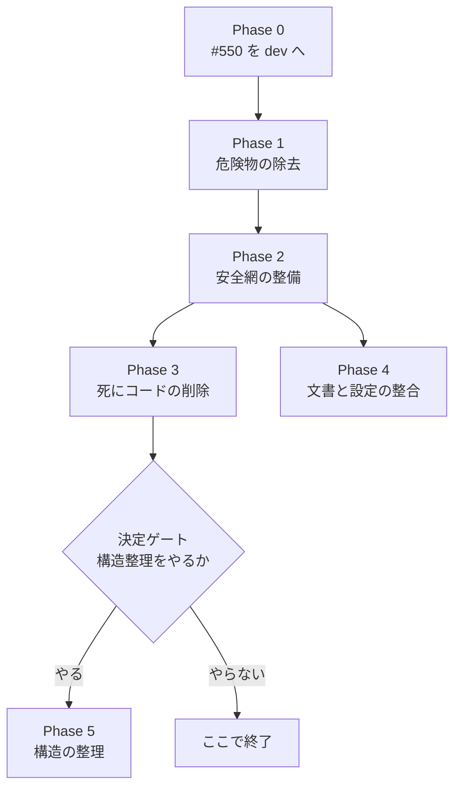

# tc リファクタリング計画 Plans.md

作成日: 2026-10-02
記録先: Redmine tc-ops #566
状態: 実行中（harness-work、2026-10-02 開始）。Phase 1〜4 は承認済み、Phase 5 は未承認

---

## この計画の前提

- 目的: 動作を変えずに、壊れた周辺資産・死にコード・陳旧化した文書を片付け、変更しやすい状態にする。
- 根拠: 2026-10-02 の読み取り調査 3 本（本体コードの構造 / scripts・CI・docs / テストと lint）と、作(saku)による抜き取り確認。
- 規律: `CLAUDE.md` のブランチ戦略（feature → dev → main、main はユーザーの GO まで更新しない）、改変前バックアップ、依存変更は別コミット、を全タスクに適用する。
- 作業場所: `origin/dev` から切ったブランチ `feature/refactoring-phase1-4-20261002` の専用ワークツリー（`.claude/worktrees/refactor-trunk`）。共有の作業ツリーにある #550 の未コミット差分には触れない。
- ローカルの `dev` は本番 WebUI（`/home/abem/Projects/tc-prod`）が使っているため、`dev` へのマージは本実行では行わず、完了後にユーザーが判断する。
- 全タスク共通の完了条件: `uv run python -m pytest tests -q` が全件 pass（着手前の基準は 182 passed / 1 skipped）。

## フェーズの順序



## 計画メタ情報

```text
team_validation_mode: subagent（Architecture / QA / 周辺資産は subagent、Product / Security / Skeptic は作が単独で評価）
formatter_baseline: missing
formatter_baseline_evidence: pyproject.toml の [tool.*] は uv と pytest のみ。.venv に ruff/black/flake8/mypy なし。.pre-commit-config.yaml なし
formatter_baseline_action: add_setup_task（Task 2.1）
記憶の確認: Redmine tc-ops を「リファクタリング」で検索し、tc の既存チケットは 0 件。docs/REFACTORING_LOG.md（2026-03-01、4 フェーズ）は見出しのみ確認し、本文は未読。claude-mem と harness-mem の検索は未実施
```

Spec skip reason（Phase 0〜4）:
- path checked: `spec.md`（存在しない）、`docs/spec/`（存在しない）
- reason: 動作を変えない削除・テスト追加・文書修正であり、正解は既存テストで固定される（各タスクの DoD に残す）

Spec delta（Phase 5 のみ）: `docs/spec/00-project-spec.md` を Task 5.0 で新設し、保存形式・一時ファイルの削除対象・yt-dlp が無いときの挙動を決めて記録する。

---

## Phase 0: 前提条件 [Required]

Purpose: 未コミットの #550 を片付け、リファクタリングの差分と混ざらないようにする

| Task | 内容 | DoD | Depends | Status |
|------|------|-----|---------|--------|
| 0.1 | `[lane:gate]` tc-ops #550 の未コミット差分（`handlers/youtube.py` と完了報告書）を査が検査し、計がコミットして dev へマージする。本計画の作業ではなく待ち条件。作業を専用ワークツリーに分けたため、これを待つのは 2.2b だけ | `git status --short handlers/youtube.py` が空、かつ `git branch --contains <#550のコミット>` に dev が含まれる | - | cc:TODO |

## Phase 1: 危険物の除去と既知の不具合 [Required]

Purpose: 実行すると本番環境を壊しうるスクリプトと、確認済みの不具合を先に片付ける

| Task | 内容 | DoD | Depends | Status |
|------|------|-----|---------|--------|
| 1.1 | `[Cleanup]` `[lane:gate]` `[tdd:skip:deletes-dead-scripts]` 起動不能な 3 本を削除する: `scripts/core/setup.sh`（存在しない `scripts/lib/common.sh` を source した後、`rm -rf .venv` と `config/config.yaml` の上書きに到達しうる）、`scripts/core/transcribe.sh`、`scripts/tools/monitor.sh` | 3 ファイルが `git ls-files` に無い。`git grep -nE "scripts/core/(setup|transcribe)\.sh|scripts/tools/monitor\.sh"` が `docs/obsolete` `docs/historical-records` `00_レビュー依頼` `Plans.md` 以外で 0 件（当初の `scripts/core/` という広い条件は、過去に削除済みの別ファイルを記録した CHANGELOG 等も拾うため、2026-10-02 に削除対象の 3 本へ絞った） | - | cc:完了 [58697c3] |
| 1.2 | `[Cleanup]` `[lane:gate]` `[tdd:skip:deletes-dead-scripts]` 常に失敗する `scripts/pre_check.sh` と、存在しない `output/transcriptions` を前提とする `scripts/cleanup_transcriptions.sh` を削除する。参照元（`.github/workflows/pre-commit.yml`、`DEVELOPMENT.md` の 137・141・155・229 行付近）も同じコミットで直す | 2 ファイルが `git ls-files` に無い。`git grep -nE "pre_check\.sh|cleanup_transcriptions"` が、Task 1.1 と同じ除外先に加えて `docs/REFACTORING_LOG.md` と `docs/system-docs/current_status_2025_july.md`（どちらも過去の状態を記録した文書で書き換えない。後者は Task 4.4 で `docs/historical-records/` へ移す）を除いて 0 件 | - | cc:完了 [2e8a388] |
| 1.3 | `[Bugfix]` `[lane:gate]` `[tdd:required]` `[bugfix:reproduce-first]` `transcribe.py` 275〜280 行の `type_names` に `"twitter"` が無く、X の URL で `KeyError` になる（D2 で `transcribe.py` は残すと決定済み） | X の URL を渡すテストが修正前に失敗し、修正後に pass する | 2.0 | cc:完了 [bbab283] |

## Phase 2: 安全網の整備 [Required]

Purpose: コードを動かす前に、壊れたら気づける状態を作る

| Task | 内容 | DoD | Depends | Status |
|------|------|-----|---------|--------|
| 2.0 | `[Bugfix]` `[lane:gate]` `[tdd:required]` クリーンな checkout でテストが通るようにする。Nemotron のテスト 10 件が `samples/e2e_sample.wav` を前提にしているが、このファイルは後から実行される `tests/test_e2e_dry_run.py` が生成するため、初回実行で 10 件失敗する（2026-10-02 に新しいワークツリーで再現）。他のコード変更タスクより先に行う | `samples/` の無い新しいワークツリーで `pytest tests -q` が初回から全件 pass | - | cc:完了 [fa0c878] |
| 2.1 | `[Setup]` `[lane:gate]` `[tdd:skip:tooling-setup]` ruff を dev 依存に追加し、`pyproject.toml` に `[tool.ruff]` を置く。規則は F（pyflakes）のみ。一括 reformat は範囲外。`pyproject.toml` / `uv.lock` / `.venv` の変更を伴うため単独コミット | `uv run ruff check .` が実行でき、検出件数を Redmine に記録。`git show --stat` の変更が `pyproject.toml` と `uv.lock` のみ | 1.1, 1.2 | cc:完了 [bf5a4e8] |
| 2.2 | `[Test]` `[lane:gate]` `[tdd:skip:characterization-tests-of-existing-code]` `handlers/youtube.py` の `download_audio` の正常系 / 非 0 終了 / 出力ファイル名のフォールバックにテストを足す。偽の yt-dlp 実行ファイルを使い、#550 の適用前後どちらの実装でも通る形にする | 追加した 3 ケース以上が pass。実ネットワークを使わない | 2.0 | cc:完了 [a253cb9] |
| 2.2b | `[Test]` `[lane:gate]` `[tdd:required]` #550 で追加した分岐（無出力による `TimeoutError`、`extract_video_info` の `TimeoutExpired`）にテストを足す。#550 のコードが dev に入るまで着手できない | 追加した 2 ケース以上が pass | 0.1, 2.2 | blocked（0.1 待ち） |
| 2.3 | `[Test]` `[lane:gate]` `[tdd:skip:characterization-tests-of-existing-code]` `core/cli_workflow.py` の `record_transcription_history`、`upload_transcription_result`、`resolve_input_audio` の gdrive / local / unknown 分岐にテストを足す | 追加テストが pass。Drive API は差し替え、実 API を呼ばない | 2.0 | cc:完了 [0c25cd1] |
| 2.4 | `[Test]` `[lane:gate]` `[tdd:skip:characterization-tests-of-existing-code]` `core/webui_workflow.py` の `resolve_success` / `resolve_failed` / `enqueue_pending` / `segments_to_srt` / `drain_progress` にテストを足す | 追加テストが pass | 2.0 | cc:完了 [f4db722] |
| 2.5 | `[Test]` `[lane:gate]` `[tdd:skip:characterization-tests-of-existing-code]` `webui.py` の `_save_and_record` / `_cleanup_temp_file` / `_resolve_input` にテストを足す | 追加テストが pass | 2.0 | cc:完了 [9bd6f46] |
| 2.6 | `[Test]` `[lane:gate]` `[tdd:skip:characterization-tests-of-existing-code]` `tc` の `load_config` / `transcribe_audio` / `main` の本処理にテストを足す（Phase 5 の CLI 整理の前提） | 追加テストが pass。モデルのロードは差し替える | 2.0 | cc:完了 [d073498] |
| 2.7 | `[Setup]` `[lane:gate]` `[tdd:skip:tooling-setup]` pytest-cov を dev 依存に追加し、モジュール別カバレッジの基準値を取る。2.1 とは別コミット | `uv run python -m pytest tests --cov=core --cov=handlers -q` が実行でき、基準値を Redmine に記録 | 2.1 | cc:完了 [6be9e8e] |
| 2.8 | `[CI]` `[lane:gate]` `[tdd:skip:ci-config]` `[needs-spike]` GitHub Actions に uv + pytest + ruff の workflow を 1 本新設し、`ci.yml.disabled` / `minimal-test.yml` / `simple-test.yml` / `pre-commit.yml` を削除する | feature ブランチで workflow が成功し、実行 URL を Redmine に記録 | 2.8-spike, 2.1 | blocked（workflow は e2e6c42 で取り込み済み。GitHub Actions 上での成功は、この環境から結果を取得できないため未確認） |
| 2.8-spike | `[spike]` torch と qwen-asr を含む `uv sync` が GitHub ランナーの時間・容量に収まるか、GPU 無しで全テストが通るかを検証する | 「可能 / 不可能 / 依存グループの分割が必要」のいずれかを所要時間とともに Redmine に記録 | 1.2 | blocked（ローカルの材料のみ: GPU を隠した pytest は全件 pass、依存一式は約 5.7GB。ランナーでの所要時間と成否は未確認） |

## Phase 3: 死にコードと重複の削除（挙動は変えない） [Recommended]

Purpose: 参照されていないコードを消し、読む量を減らす

| Task | 内容 | DoD | Depends | Status |
|------|------|-----|---------|--------|
| 3.1 | `[Refactor]` `[lane:fast]` `[tdd:skip:behavior-unchanged]` 未使用 import を削除し、ruff F を 0 件にする。あわせて `tests/test_core_utils.py:222` の古い skip 理由（torch は依存に入っている）を直す | `uv run ruff check .` が exit 0 | 2.1 | cc:完了 [6a7bc6e] |
| 3.2 | `[Refactor]` `[lane:gate]` `[tdd:skip:behavior-unchanged]` 参照 0 件の関数・クラスを削除する。対象は Redmine #566 の一覧（`core/transcription_interface.py` の `_create_segments_from_result` / `_load_audio` / `_results_to_segments`、`core/utils.py` の `YOUTUBE_URL_PATTERN`、`core/cli_common.select_model`、`core/config.py` の `for_device` / `create_for_use_case` / `to_dict` / `from_dict`、`core/model_manager.py` と `core/logging.py` の未使用メソッド、`handlers/gdrive.py` の未使用メソッドと別名、ルート `config.py` の `load_config`）。削除の直前に 1 件ずつ grep で 0 件を再確認する | 削除した各シンボルについて、定義行を除く `grep -rn` が 0 件（コマンドと対象範囲を完了報告に記載） | 2.2, 2.3, 2.4, 3.1 | cc:完了 [ede8913] |
| 3.3 | `[Refactor]` `[lane:gate]` `[tdd:skip:behavior-unchanged]` `TranscriptionConfig` のどのエンジンも読まないフィールド（`compute_type`、`chunk_size`、GPU 最適化群、`max_line_length`、`timestamp_format` ほか）を削除し、`tc` の渡し方と `config/config.yaml` の対応キーを揃える。`config.yaml` は改変前にバックアップを取る | 削除した各フィールド名の grep が 0 件。`tests/test_e2e_dry_run.py` が pass | 2.6, 3.2 | cc:TODO |
| 3.4 | `[Refactor]` `[lane:gate]` `[tdd:required]` 音声長の取得が Whisper / Qwen3 / Nemotron に 3 実装ある重複を 1 つにし、bare `except:`（`transcribe.py:264, 303`、Whisper の長さ取得）を具体的な例外にする | 3 エンジンが同じ関数を呼ぶ。`grep -rnE "except:\s*$"` が本体コードで 0 件 | 3.2 | cc:TODO |
| 3.5 | `[Refactor]` `[lane:fast]` `[tdd:skip:behavior-unchanged]` 再エクスポートまたはテストからしか参照されないもの（`create_*_transcriber`、`configure_model_manager`、別名 `YouTubeHandler`、`TranscriptionJobQueue.enqueue`）を削除する。対応するテストも同時に直す。リポジトリ外（個人スクリプト、systemd unit）からの利用が無いことをユーザーに確認してから行う | 各シンボルの grep が 0 件 | 3.2 | cc:TODO |

## Phase 4: 文書と設定の整合 [Recommended]

Purpose: 文書どおりに操作すると失敗する箇所を無くす

| Task | 内容 | DoD | Depends | Status |
|------|------|-----|---------|--------|
| 4.1 | `[Docs]` `[lane:gate]` `[tdd:skip:docs-only]` `CLAUDE.md` と実装の不一致を直す: 存在しない `DiarizationConfig` と `speaker_diarization.py`、「デュアルエンジン」（実際は Nemotron を含む 3 エンジン）、`transcribe.py` と `tc` の説明。規則ファイルのため差分はユーザーが確認する | `CLAUDE.md` 内の `DiarizationConfig` と `speaker_diarization` が 0 件。記載したコマンドを実行して成功することを確認 | - | cc:完了 [56732f3] |
| 4.2 | `[Docs]` `[lane:fast]` `[tdd:skip:docs-only]` `CONTRIBUTING.md` / `DEVELOPMENT.md` / `DEVELOPMENT_QUICKREF.md` を実在するツール（uv、pytest、ruff）に合わせる。black / isort / flake8 / mypy と Python 3.11 の記述を除く | 3 ファイルで `black|isort|flake8|mypy|3\.11` が 0 件 | 1.2, 2.1 | cc:完了 [ac5b62a]（レビュー指摘は統合ブランチで解消。workflows ツリーも修正） |
| 4.3 | `[Docs]` `[lane:gate]` `[tdd:skip:docs-only]` 利用者向け文書（`TUTORIAL.md`、`API.md`、`configuration.md`、`TROUBLESHOOTING.md`、`new_cli_usage.md`、`optimization_features.md`、`system_overview_2025.md`、`timestamp_feature.md`）から、話者分離・削除済みモジュール・`exec.sh`・`requirements` の記述を除き、Nemotron と WebUI を追記する。記載するコマンドとオプションは argparse の定義を確認してから書く | 語彙群（`venv-clean`、`main_cli\.py`、`requirements[-/.]`、`pip install`、`gdrive_handler`、`exec\.sh`、`AppConfig`、`WhisperTranscriber`、`pyannote`）の grep が、`docs/obsolete` `docs/historical-records` `00_レビュー依頼` `.venv` `venv-nemotron*` `backup` 以外で 0 件 | 3.3 | cc:完了 [d216870, 64b1b70] |
| 4.4 | `[Docs]` `[lane:fast]` `[tdd:skip:docs-only]` `docs/README.md` の索引（件数、未掲載の 4 件）を実体に合わせ、`current_status_2025_july.md` と `dependency_migration.md` を `docs/historical-records/` へ移す | 索引の件数が `ls` の結果と一致。リンク切れ 0 件 | 4.3 | cc:完了 [0d4ee00]（機械的な文書修正のため独立レビューなし。リンク切れ 0 件を確認） |
| 4.5 | `[Config]` `[lane:gate]` `[tdd:skip:config-only]` `.gitignore` を直す: `!tests/**` が `__pycache__/` の除外を打ち消している点、`lib/` が `scripts/lib/` を黙って除外している点、常時 untracked に並ぶ ccc 運用資産（`backup/`、`WORK_*/`、`agmsg_send.py` ほか）の扱い。追跡対象が変わらないことを確認する | 変更前後で `git ls-files` の出力が同一。`git status --short` に `tests/__pycache__/` が出ない | 1.1 | cc:完了 [16a81cf] |

## Phase 5: 構造の整理 [Optional・決定ゲートあり]

Purpose: 同じ処理の重複実装を 1 か所にまとめる。利用者に見える挙動の統一を含むため、やるかどうかをユーザーが決める

| Task | 内容 | DoD | Depends | Status |
|------|------|-----|---------|--------|
| 5.0 | `[Contract]` `[lane:gate]` `[tdd:skip:docs-contract]` `docs/spec/00-project-spec.md` を新設し、未決事項 D2 の決定（正とする CLI、保存形式、一時ファイルの削除対象、yt-dlp が無いときの挙動）を記録する | ファイルが存在し、4 項目すべてに決定と決定日が書かれている | Phase 3 | cc:TODO |
| 5.1 | `[Refactor]` `[lane:gate]` `[tdd:required]` CLI を整理する。`tc`（228 行）と `transcribe.py`（318 行）が同じ流れを別々に実装し、gdrive の一時ファイル削除と `[MM:SS]` 付き保存の挙動が食い違っている。D2 の決定どおり両方を残し、食い違う挙動を 5.0 で決めた側に揃える。`transcribe`（bash）は `transcribe.py` の shebang と役割が重なるため扱いを 5.0 で決める | 5.0 で決めた挙動を、`tc` と `transcribe.py` の両方について確認するテストが pass | 5.0, 2.6 | cc:TODO |
| 5.2 | `[Refactor]` `[lane:gate]` `[tdd:required]` 保存 → アップロード → 履歴記録 → 一時ファイル削除の流れを `core/` の 1 関数にまとめ、`tc` と `webui.py` の両方から呼ぶ | `tc` と `webui.py` に同じ流れの重複実装が無い。2.3 / 2.5 / 2.6 のテストが pass | 5.1, 2.3, 2.5 | cc:TODO |
| 5.3 | `[Refactor]` `[lane:gate]` `[tdd:required]` `handlers/youtube.py` の `install_yt_dlp`（`pip install` で uv 管理の `.venv` を書き換える経路）を除き、yt-dlp の検出を 1 つの方法に揃える。挙動が変わるため 5.0 の決定に従う | `grep -rn "pip install" handlers/ core/` が 0 件。yt-dlp が無い場合のエラーメッセージを確認するテストが pass | 5.0, 2.2 | cc:TODO |
| 5.4 | `[Refactor]` `[lane:gate]` `[tdd:required]` `core/transcription_interface.py`（1,123 行）を、型と抽象基底 / Whisper / Qwen3 / テキスト整形 / ファサードに分ける。あわせてエンジン判定を 1 か所に集め、`core/nemotron_engine.py` との相互 import を解消する。公開名 `core.transcription_interface.*` の import は維持する。反復検出の論理と閾値は変えない | 分割後の各ファイルが 500 行以下。既存の `tests/test_core_transcription_interface*.py` と `tests/test_core_nemotron_*.py` が pass。関数内 import による循環回避が 0 件 | 5.4-pre | cc:TODO |
| 5.4-pre | `[Test]` `[lane:gate]` `[tdd:required]` `WhisperTranscriptionEngine` のテキスト整形（`_parse_timestamped_text`、`_add_timestamps_to_text`、`_ensure_timestamps_at_line_start`、`_create_chunks`）に、現在の出力を固定するテストを足す | 追加テストが pass | Phase 3 | cc:TODO |
| 5.5 | `[Refactor]` `[lane:gate]` `[tdd:skip:needs-manual-auth-check]` `[needs-spike]` ルート `config.py`（実体は Drive 認証）を `handlers/` 配下へ移して改名し、import 時の `OAUTHLIB_INSECURE_TRANSPORT=1` 設定と、`config.yaml` の読まれていないキー（`credentials_file` / `token_file` / `logging:`）を整理する。`CLAUDE.md` の確認コマンドも同時に更新する | `uv run python -c "<新しい import 文>; print('ok')"` が成功。実機での Drive 認証をユーザーが 1 回確認 | 5.5-spike | cc:TODO |
| 5.5-spike | `[spike]` WebUI のバックグラウンドスレッドから再認証に入ったとき、`config.py:58-77` の `input()` で止まるかを確認する（コードの読み取りでは止まり得るが未確認） | 「止まる / 止まらない」を再現手順とともに Redmine に記録 | Phase 3 | cc:TODO |
| 5.6 | `[Refactor]` `[lane:gate]` `[tdd:required]` `core/__init__.py` の import 時の副作用（ルートロガーの付け替えとログファイル作成）を、エントリポイントからの明示的な初期化に変える | `import core` だけではログファイルが作られないことを確認するテストが pass。`tests/test_core_init_pytest_log_guard.py` が pass | Phase 3 | cc:TODO |
| 5.7 | `[Refactor]` `[lane:gate]` `[tdd:required]` 履歴 DB の操作を `core/history.py` に集める。`webui.py` 482〜501・566〜590 行に直書きされた SELECT / DELETE を移す。DDL と FTS トリガーは変えない | `grep -nE "SELECT|DELETE FROM" webui.py` が 0 件。`tests/test_core_cli_workflow_history_fts.py` と `tests/test_webui_history_cleanup.py` が pass | Phase 3 | cc:TODO |

---

## 優先度の分類

| 分類 | 対象 | 理由 |
|------|------|------|
| Required | Phase 0、1、2（2.7 と 2.8 を除く） | 実行すると `.venv` を消しうるスクリプトが残っている。確認済みの不具合がある。コードを動かす前のテストと lint が無い |
| Recommended | 2.7、2.8、Phase 3、Phase 4 | 挙動を変えずに読む量と誤操作を減らせる。リスクは低い |
| Optional | Phase 5 | 効果は大きいが、利用者に見える挙動の統一と、実機でしか確認できない認証経路を含む |
| Reject | 下の表 | 理由を個別に記載 |

### Reject（この計画では行わない）

| 項目 | 理由 |
|------|------|
| Qwen3 の反復検出・再試行・閾値（`REPETITION_PENALTY`、`CHUNK_THRESHOLD_SEC=300`）の変更 | 実障害ごとに積んだ是正。ファイルの移動（5.4）は可、論理と値は変えない |
| Nemotron の分割閾値とフォールバックの変更 | 実機の実測と采の決定に基づく |
| `QueueItemState(str, Enum)` と `==` 比較、`_enqueue_job` が `st.*` を呼ばない構造の変更 | Streamlit のリロードと Rerun への対策そのもの（#548、#440） |
| `suppress_warnings.py` の import 順の変更 | 各エントリが「core より先に import」する前提で動いている |
| 履歴 DB の DDL と FTS トリガーの変更 | 既存の `output/history.db` と互換が必要 |
| OAuth の手順そのものの変更 | WSL 向けの手動リダイレクト手順。実機認証でしか検証できない |
| リポジトリ全体の一括 reformat（ruff format / black） | 差分が全ファイルに及び、進行中のブランチと衝突する |
| mypy / pyright の導入 | 型注釈が揃っておらず、今回は ruff の F 規則までにとどめる |
| yt-dlp・transformers など依存のバージョン変更 | 影響調査が別途必要 |
| ダウンロード進捗を WebUI に表示する（#550 の所見） | 機能追加であり、リファクタリングではない。#550 側で判断する |
| `docs/obsolete/`（17 件）と `docs/historical-records/`（9 件）の削除 | 履歴として残す。4.3 の grep では除外ディレクトリとして扱う |
| 未追跡の ccc 運用資産、`backup/`、`WORK_*/`、`venv-nemotron*/` の削除 | 運用中の資産。`venv-nemotron-poc/`（5.3G）を参照するコードの有無は未確認 |

---

## 決定事項（2026-10-02、ユーザー回答）

| ID | 決めること | 決定 |
|----|-----------|------|
| D1 | 実行体制 | harness-work で進める。Git 操作を計の専任とする ccc のロール規則とは両立しないため、harness のワーカーがコミットする範囲は feature ブランチと dev に限る |
| D2 | 正とする CLI | `tc` と `transcribe.py` を両方残し、共通処理に寄せる。廃止はしない |
| D3 | Phase 5 を行うか | 未決。Phase 4 まで終えた時点で判断する |

## 事前確認

ユーザーの承認: Phase 1〜4 を承認、Phase 5 は未承認。削除と push は `.claude/state/plan-preapprovals.json` に記録済み（期限 2026-10-16）。依存・`config.yaml`・`CLAUDE.md` の変更は記録形式の対象外のため、本節の記載を承認の記録とする。
- 事項: destructive — 追跡中のファイルの削除（`scripts/` の 5 本、`.github/workflows/` の 4 本）
  理由: 起動不能または常に失敗し、うち 1 本は `.venv` 削除に到達しうる
  scope: Phase 1 / Task 1.1, 1.2、Phase 2 / Task 2.8
- 事項: destructive — 参照 0 件の関数・クラス・設定フィールドの削除
  理由: Phase 3 の目的そのもの。削除直前に grep で再確認する
  scope: Phase 3 / Task 3.2, 3.3, 3.5
- 事項: dependency — `pyproject.toml` / `uv.lock` / `.venv` の変更（ruff、pytest-cov の追加）
  理由: lint とカバレッジ計測の基盤。`CLAUDE.md` が慎重な扱いを求める領域
  scope: Phase 2 / Task 2.1, 2.7
- 事項: config — `config/config.yaml` のキー整理
  理由: 読まれていないキーを消す。改変前にバックアップを取る
  scope: Phase 3 / Task 3.3、Phase 5 / Task 5.5
- 事項: rule-file — `CLAUDE.md` の修正
  理由: 存在しないクラスとファイルへの言及を直す
  scope: Phase 4 / Task 4.1
- 事項: external-send — `git push`（feature ブランチと dev）、GitHub Actions の実行
  理由: ブランチ戦略どおりのマージと CI の確認。計(kei)が実行する
  scope: 全 Phase、Phase 2 / Task 2.8
- 事項: main の更新は本計画のどのタスクにも含まない
  理由: `CLAUDE.md` の絶対厳守事項。main へのマージは都度ユーザーの GO を采経由で得る
  scope: 全 Phase
- 事項: secret-read は無い
  理由: `credentials.json` と `token.pickle` の内容は読まない。5.5 は実機認証をユーザーが確認する
  scope: Phase 5 / Task 5.5
