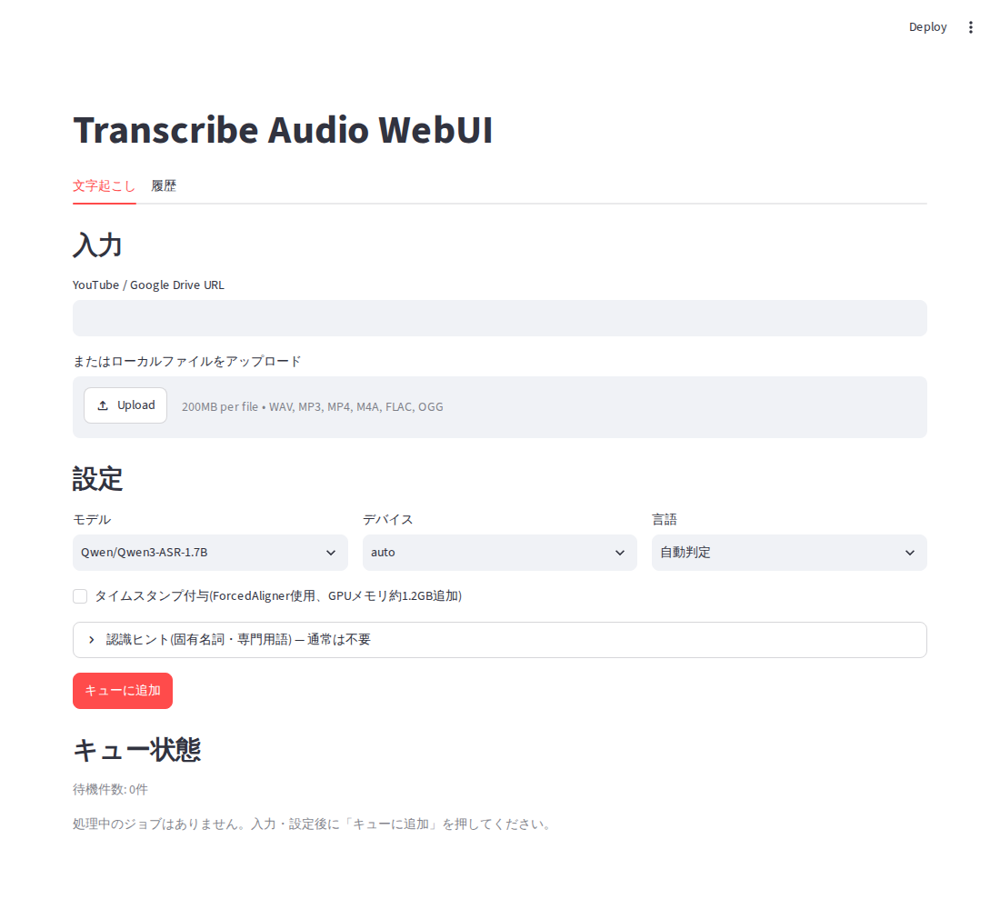
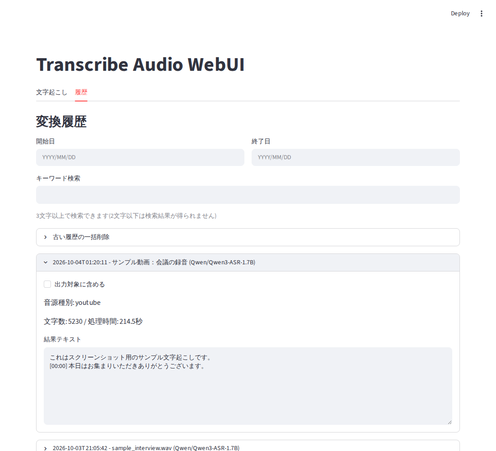

# 音声文字起こしシステム（tc） 🎙️

[](https://www.python.org/downloads/)
[](https://github.com/astral-sh/uv)
[](https://huggingface.co/Qwen/Qwen3-ASR-1.7B)
[](https://opensource.org/licenses/MIT)

## ✨ 概要

**シンプルで高精度な日本語音声文字起こしツール**

- **🏆 既定モデルは Qwen3-ASR-1.7B** - 日本語・英語とも同じモデルで処理（他のモデルとの精度比較の根拠はこのリポジトリには載せていません）
- **⚡ ワンコマンド実行** - `./tc`だけでconfig.yamlから設定を自動読み込み（`uv run` 経由で起動するため、`uv sync` 済みの仮想環境を使います）
- **🎛️ 3つの文字起こしエンジン** - Qwen3-ASR（既定）・Whisper・Nemotron をモデル名で自動切替
- **☁️ 入力はローカル・Google Drive・YouTube・X（旧Twitter）** - Google Drive / YouTube の音声は結果を自動アップロード
- **🖥️ WebUI（本番稼働中）** - ブラウザから投入でき、進捗バーと経過・残り時間、履歴の検索ができる
- **🔧 uv パッケージ管理** - 最新のPython依存関係管理ツール使用
- **🎯 シンプル設計** - 複雑な設定不要、すぐに使える

## 🚀 クイックスタート

### 1. 必要な準備

```bash
# uvのインストール（未インストールの場合）
curl -LsSf https://astral.sh/uv/install.sh | sh

# プロジェクトのクローン
git clone <repository-url>
cd tc

# 依存関係のインストール(pyproject.tomlのdefault-groupsでdev/qwen3含め自動解決)
uv sync
```

### 2. Google Drive認証設定

#### credentials.jsonの取得

1. **Google Cloud Consoleにアクセス**
   ```
   https://console.cloud.google.com/
   ```

2. **Google Drive APIを有効化**
   - 「APIとサービス」→「ライブラリ」
   - 「Google Drive API」を検索して有効化

3. **OAuth 2.0クライアントIDの作成**
   - 「APIとサービス」→「認証情報」
   - 「認証情報を作成」→「OAuth クライアント ID」
   - アプリケーションの種類: **「デスクトップアプリ」**
   - 名前を入力（例: "TC Transcription App"）

4. **credentials.jsonをダウンロード**
   - 作成した認証情報の右側にある**ダウンロードアイコン**をクリック
   - ダウンロードしたファイルを `credentials.json` にリネーム
   - プロジェクトルート (`/path/to/tc/`) に配置

5. **OAuth同意画面の設定**
   ```
   https://console.cloud.google.com/apis/credentials/consent
   ```
   - 公開ステータスを「本番環境」に設定
   - または「テストユーザー」に自分のGmailアドレスを追加

#### 初回認証（WSL/Linux環境）

```bash
# 初回実行時に認証URLが表示されます
./tc

# 1. 表示されたURLをブラウザ（Windows側）で開く
# 2. Googleアカウントでログインして権限を許可
# 3. ブラウザがlocalhost:8080にリダイレクトされる
# 4. アドレスバーのURL全体をコピー（例: http://localhost:8080/?code=...）
# 5. ターミナルに戻ってURLを貼り付けてEnter

# 一度認証すると token.pickle が生成され、次回から自動認証されます
```

### 3. 設定ファイル編集

`config/config.yaml`を編集して処理対象URLを設定：

```yaml
gdrive:
  url: "https://drive.google.com/file/d/your_file_id/view"

whisper:
  model: Qwen/Qwen3-ASR-1.7B   # デフォルト
  language: null                # 既定は自動判定（ja/en等を指定すると強制）
  device: cuda  # または cpu、auto
```

### 4. 実行

```bash
# シンプル実行（推奨）
./tc

# 完了！結果は output/ フォルダ（output/YYYYMMDD_HHMMSS_transcription.txt）に保存されます。
# 入力が Google Drive / YouTube の場合は Google Drive にもアップロードされます
```

動作だけ確認したいときは `./tc --dry-run` を使います（設定読み込みと入力解決までで終了し、文字起こしはしません）。

ブラウザから使いたいときは WebUI（Streamlit）を起動します。URL またはファイルを投入すると、進捗バーつきで順に処理し、
履歴も検索できます。

```bash
uv run streamlit run webui.py --server.headless true --server.port 8501
# 起動後、ブラウザで http://localhost:8501 を開く
```

機能・保存先・自動削除・本番での常駐（systemd）は、[WebUI（Streamlit）](#webuistreamlit) の節を参照してください。



*「文字起こし」タブ。入力 → 設定 → 「キューに追加」の順に操作します。処理が始まると、下の「キュー状態」に進捗バーと経過時間が出ます。*

## 💻 使用方法

### 基本実行

```bash
# config.yamlの設定で自動実行
./tc

# 別のファイルを指定
./tc https://drive.google.com/file/d/another_file_id/view

# ローカルファイルを処理
./tc audio.mp3

# YouTube / X（旧Twitter）の動画URLを処理
./tc <動画のURL>
```

> X の動画URLは `https://x.com/<ユーザー>/status/<数字>`（`twitter.com` も可）の形式です。
> 結果の Google Drive へのアップロードは、入力が Google Drive / YouTube の場合だけ行われます
> （X とローカルファイルは `output/` への保存のみ）。

### オプション

```bash
# アップロードをスキップ
./tc --no-upload

# 出力ディレクトリを指定
./tc --output-dir results

# モデルを変更（従来のWhisperエンジンに切り替え）
./tc --model kotoba-tech/kotoba-whisper-v2.2

# 言語を指定（config.yaml の whisper.language を上書き）
./tc --language ja

# デバイスを指定（cuda / cpu / auto）
./tc --device cpu

# アップロード先の Google Drive フォルダIDを指定
./tc --folder-id <フォルダID>

# 設定読み込み・入力解決までで終了（文字起こしはしない。起動確認用）
./tc --dry-run

# ヘルプ表示
./tc --help
```

プロファイル（モデルと言語の組）で選びたい場合は `./transcribe.py` を使います（カスタム設定のプロファイル `6` では
対話式にモデルなどを尋ねます）。
指定できるのは、入力（位置引数）、`--profile`（`-p`、プロファイル番号。`1` 日本語（高速）・`3` English・
`5` 日本語（最高精度・Qwen3-ASR）・`6` カスタム設定）、`--language`（`-l`、`ja` / `en`）、`--folder-id` です。
`./transcribe` は `.venv` を有効化して `transcribe.py` を実行するだけのシェルスクリプトなので、先に `uv sync` で
`.venv` を作っておく必要があります（`./tc` と `./transcribe.py` は `uv run` で起動します）。
詳細は [CLIの使用方法](docs/user-guides/new_cli_usage.md) を参照してください。

### 一時ファイルと処理後に残るファイル

- YouTube / X の動画から取り出した音声と、Google Drive からダウンロードした音声は、処理の終了時
  （成功・失敗・中断のいずれでも）に削除されます。削除に失敗したときは警告だけを出し、処理結果は失敗にしません。
  ローカルファイルの入力は削除しません。
- `yt-dlp` が見つからないときは、自動インストールはせず、`uv sync` を案内するエラーで止まります。
  yt-dlp の呼び出しにはタイムアウトがあります（メタデータ取得 60 秒、ダウンロード中に出力が 300 秒途絶えると中断）。
- 処理後に残るのは、`output/<日時>_transcription.txt`、`output/history.db`、`logs/transcription.log` です。
  WebUI ではさらに `output/uploads/` と `output/queue_downloads/` が使われます（次節）。

### WebUI（Streamlit）

CLI（`./tc`）に加えて、ブラウザから操作できるWebUI（`webui.py`、Streamlit 製）があります。本番環境では、
systemd のユーザーサービス `tc-webui.service` が `tc-prod` ディレクトリ（`dev` ブランチ）で常駐させています。
常駐化・再起動・内部構成は [`docs/system-docs/webui_architecture.md`](docs/system-docs/webui_architecture.md) を
参照してください。

**手動で起動する場合**（開発・動作確認用）:

```bash
uv run streamlit run webui.py --server.headless true --server.port 8501
```

起動後、ブラウザで `http://localhost:8501` を開きます。

**機能概要**:

- **文字起こしタブ**: YouTube / Google Drive / X の動画URL（入力欄のラベルは「YouTube / Google Drive URL」ですが、
  X のURLも入力できます）、またはローカルファイルのアップロードから文字起こしを実行できます。
  モデル（Qwen3-ASR・kotoba-whisper・whisper-large-v3・Nemotron）・デバイス・言語の選択、
  タイムスタンプ付与（ForcedAligner使用、Nemotron では選べません）に対応しています。
  認識ヒント（固有名詞・専門用語）は、折りたたみ欄に入力し、「リスクを理解した」チェックを入れたときだけ使われます。
- **ジョブキュー**: 複数の入力を投入すると、現在の処理完了後に自動で次の処理を開始します
  （同時並列実行は行わず、逐次処理のみ対応）。待機件数・処理中の対象・完了済み一覧をUI上で確認できます。
- **進捗表示**: 進捗バーと「経過 m:ss / 残り約 m:ss」を表示します。進捗率が分かるのは、YouTube / X のダウンロード、
  Qwen3-ASR で 300 秒を超える音声のチャンク進捗、Whisper 系の 30 秒チャンク進捗です。残り時間は進捗が 3% に
  なってから出ます。Nemotron、Qwen3-ASR の 300 秒以下の音声、Google Drive のダウンロードは経過時間のみです。
- **タイムスタンプとSRT**: タイムスタンプ付与にチェックを入れると、保存テキストの各行頭に `[MM:SS]` が付き
  （ForcedAligner が成功したとき）、完了結果に「SRTプレビュー」が出ます。SRTにできる区間情報が無いときは
  「SRTを生成できるタイムスタンプ情報がありません」と表示されます（[タイムスタンプ機能](docs/feature/timestamp_feature.md)）。
- **履歴タブ**: 過去の変換履歴（`output/history.db`、SQLite）を開始日・終了日で絞り込み、キーワード（3文字以上）で
  検索して閲覧できます。チェックを入れた履歴を Markdown 1 ファイルにまとめて出力できます。
  「古い履歴の一括削除」は、N日より前の履歴を「対象件数の確認」→「削除」の2段階で消します（消えるのはデータベースの
  記録だけで、`output/` のファイルと Google Drive 上のファイルは消えません）。

  

**保存先と自動削除**（保持日数は `webui.py` の定数 `UPLOAD_RETENTION_DAYS` / `DOWNLOAD_RETENTION_DAYS`）:

| 場所 | 内容 | 削除 |
|------|------|------|
| `output/uploads/<一意>/<ファイル名>` | アップロードしたファイル（同名でも上書きしない） | 7 日を過ぎた項目を、新しい投入のたびに削除 |
| `output/queue_downloads/<トークン>/` | URL入力のダウンロード作業領域（音声は処理の終了時に削除されるが、空のディレクトリや失敗時の部分ファイルが残る） | 1 日を過ぎた項目を、新しい投入のたびに削除 |

処理待ち・処理中のジョブが使うファイルは消しません。履歴DBが記録するアップロード元のパスは、7 日後には存在しなくなります。
挙動の正本は [プロジェクト仕様](docs/spec/00-project-spec.md)（D7・D8）です。

## 🔧 設定

### config/config.yaml

```yaml
gdrive:
  url: "処理対象のGoogle Drive URL"      # ./tc を引数なしで実行したときの入力
  upload_folder_id: "アップロード先フォルダID"  # 省略時は元ファイルと同じフォルダ（--folder-id で上書き可）

whisper:
  model: Qwen/Qwen3-ASR-1.7B   # デフォルト
  language: null                # 既定は自動判定（ja/en等を指定すると強制）
  device: cuda                  # cuda / cpu / auto
  context_file: "config/context_hints.txt"  # 認識ヒント（Qwen3-ASR用、任意）
  include_timestamps: false     # true で行頭に [MM:SS] を付与（Qwen3-ASRで有効、後述）
```

- `whisper.model` は `whisper:` の下にありますが、Qwen3-ASR・Nemotron を含む全モデル共通の設定です。
  モデル名で使うエンジンが決まります（「サポートモデル」参照）。
- `whisper.context_file`: 1行1語彙、`#` 始まりはコメントです。書式は `config/context_hints.txt.sample` を
  参照してください。ファイルが無い・空の場合はヒントなしで動作します。
  認識ヒントを使うのは Qwen3-ASR だけです（Whisper・Nemotron は無視します）。
  音声が長くてチャンク分割される場合、ヒントは最初のチャンクにだけ適用されます。
- `whisper.include_timestamps`: Qwen3-ASR で有効になるオプトイン機能です（`tc` が読みます）。
  Whisper 系は、この設定に関係なく常に 30 秒ごとの `[MM:SS]` が付き、Nemotron は付きません。詳細は
  [`docs/feature/timestamp_feature.md`](docs/feature/timestamp_feature.md) を参照してください。
- `whisper.language` を `config.yaml` から**削除した**場合、`tc` は `ja` として扱います（`null` と書けば自動判定）。
- 項目ごとに、`tc` / `transcribe.py` / WebUI のどれが読むかは [設定ガイド](docs/user-guides/configuration.md) を
  参照してください（WebUI は `gdrive.upload_folder_id` を読まず、Drive 入力の結果は常に元ファイルと同じフォルダに保存します）。

### 環境変数と .env ファイル

`tc` は起動時にプロジェクト直下の `.env` があれば読み込みます（`python-dotenv`）。
現行のコードが必須とする環境変数はありません。

## 🏗️ アーキテクチャ

### プロジェクト構造

```
tc/
├── tc                          # メインCLIコマンド
├── transcribe                  # transcribe.py を起動するシェルスクリプト
├── transcribe.py               # Rich UI対話型CLI
├── webui.py                    # WebUI（Streamlit）
├── suppress_warnings.py        # 警告抑制
├── config/
│   ├── config.yaml            # 設定ファイル
│   └── context_hints.txt.sample  # 認識ヒントの書式サンプル
├── core/                      # コア機能
│   ├── config.py              # 統一設定管理
│   ├── logging.py             # 統一ロガー（setup_logging を tc / transcribe.py / webui.py の main() が呼ぶ）
│   ├── transcription_interface.py  # UnifiedTranscriber（ファサード）
│   ├── transcription_types.py # TranscriptionResult などの型
│   ├── engine_factory.py      # モデル名でエンジンを選ぶ（create_engine）
│   ├── qwen3_engine.py        # Qwen3-ASR エンジン（+ qwen3_chunking.py / qwen3_text.py）
│   ├── whisper_engine.py      # Whisper エンジン（+ whisper_text.py）
│   ├── history.py             # 変換履歴 DB の検索・件数・削除
│   ├── nemotron_engine.py     # Nemotron エンジン（隔離venvのサブプロセス）
│   ├── model_manager.py       # モデルキャッシュ管理（Whisper用）
│   ├── cli_common.py          # CLI共通ヘルパー（出力ファイル名、Drive への保存）
│   ├── cli_workflow.py        # 入力解決、finalize_transcription（保存・アップロード・履歴・一時音声の削除）
│   ├── progress.py            # 進捗通知（ProgressMessage、yt-dlp の進捗の解析）
│   ├── housekeeping.py        # WebUI の output/uploads・queue_downloads の古い項目の削除
│   ├── webui_workflow.py      # WebUIのジョブキュー
│   └── utils.py               # URL検出・デバイス解決、sanitize_upload_filename、one_line
├── handlers/                  # 外部サービスハンドラー
│   ├── gdrive.py              # Google Drive クライアント
│   ├── gdrive_auth.py         # Google Drive の OAuth 認証（get_drive_service）
│   └── youtube.py             # YouTube / X 音声抽出（yt-dlp。タイムアウトと進捗通知つき）
├── scripts/                   # 補助スクリプト
│   ├── release_dev_main.sh    # dev → main の統合・push・WebUI 再起動（開発者向け）
│   ├── setup_nemotron_venv.sh # Nemotron 用 venv の構築
│   └── e2e_local.sh ほか      # E2E、GPU 監視など
├── tests/                     # テストファイル
├── output/                    # 出力ファイル（履歴DB output/history.db を含む）
├── logs/                      # ログファイル
├── venv-nemotron/             # Nemotron 専用の仮想環境（任意、後述）
├── .env                       # 環境変数（任意）
└── credentials.json           # Google Drive認証
```

### 主要機能

1. **統一設定管理** (`core/config.py`)
   - YAML設定の読み込み
   - 環境変数との統合
   - デフォルト値の管理

2. **文字起こしエンジン** (`core/transcription_interface.py`、判定は `core/engine_factory.py`)
   - Qwen3-ASR / Whisper / Nemotron の3エンジン（モデル名で自動切替。Nemotron は `core/nemotron_engine.py`）
   - 音声前処理
   - Qwen3-ASR は長音声を5分（300秒）単位でチャンク分割して処理（Nemotron は350秒を超えるとストリーミング推論で処理）
   - Qwen3-ASR は文節改行フォーマット

3. **Google Drive連携** (`handlers/gdrive.py`)
   - ファイルダウンロード
   - 結果アップロード
   - 権限管理

4. **YouTube / X 音声抽出** (`handlers/youtube.py`)
   - YouTube・X の動画から音声抽出（yt-dlp。`PATH`、現在の Python と同じ `bin/`、`.venv/bin/yt-dlp` の順に探す）
   - メタデータ取得（60 秒でタイムアウト）、ダウンロードの進捗通知

5. **CLIインターフェース** (`tc`、`transcribe.py`)
   - 引数解析、設定読み込み、進捗表示、エラーハンドリング
   - 保存・アップロード・履歴記録・一時音声の削除は、共通の `core/cli_workflow.py`（`finalize_transcription`）が行う

## 🎯 サポートモデル

### デフォルトモデル
- **Qwen/Qwen3-ASR-1.7B**
  - 日本語・英語を指定でき、それ以外の言語指定と `null` は自動判定になります（[多言語対応ガイド](docs/user-guides/language_support_guide.md)）
  - 長音声は5分単位のチャンクに分割して処理します
  - `./tc` でデフォルト動作

### 日本語特化モデル（Whisperエンジン）
- kotoba-tech/kotoba-whisper-v2.2
- drewschaub/whisper-large-v3-japanese-4k-steps

### 多言語モデル（Whisperエンジン）
- openai/whisper-large-v3
- openai/whisper-large-v2
- openai/whisper-medium
- openai/whisper-small

### Nemotron（専用の仮想環境が必要）
- **nvidia/nemotron-3.5-asr-streaming-0.6b**
  - `./tc --model nvidia/nemotron-3.5-asr-streaming-0.6b` で使えます
  - 本体の `.venv`（`qwen-asr` が `transformers<5` を要求）とは依存関係が両立しないため、
    専用の仮想環境 `venv-nemotron/` のPythonをサブプロセスとして起動して推論します
  - 事前に `./scripts/setup_nemotron_venv.sh` で `venv-nemotron/` を作成してください
    （`venv-nemotron/` が既にある場合は何もしません）。未作成のまま実行すると、
    未構築を知らせるエラーで停止します
  - 認識ヒントとタイムスタンプ付与には対応していません。出力は1つのテキストです
  - 実際に読み込まれるモデルは `scripts/nemotron_infer.py` に固定されており、
    モデル名は `nemotron` を含むかどうかでエンジンを選ぶためだけに使われます

> モデル名に `nemotron` を含む場合は NemotronSubprocessEngine、`qwen3-asr`（または `qwen3_asr`）を含む場合は
> Qwen3ASREngine、それ以外は WhisperTranscriptionEngine が自動選択されます。
> 既定のモデルは `config/config.yaml` の `whisper.model` です（現在 `Qwen/Qwen3-ASR-1.7B`）。

## 📊 出力形式

### 文字起こし結果（Qwen3-ASR・デフォルト）

文節毎に改行された読みやすいテキスト：

```
こんにちは。
今日は文字起こしのテストをしています。
それでは、
始めましょう。
...
```

タイムスタンプ（`[MM:SS]`）の付き方はエンジンと入口で異なります
（詳細は [タイムスタンプ機能](docs/feature/timestamp_feature.md)）。

| エンジン | `[MM:SS]` |
|----------|-----------|
| Whisper 系（`--model kotoba-tech/kotoba-whisper-v2.2` など） | 設定に関係なく、常に30秒ごと |
| Qwen3-ASR | 既定では付かない。`tc` は `whisper.include_timestamps: true`、WebUI は「タイムスタンプ付与」のチェックで、各行の行頭に付く。`transcribe.py` は設定を渡さないので付かない |
| Nemotron | 付かない（出力は1つのテキスト） |

ファイル名は `output/YYYYMMDD_HHMMSS_transcription.txt` です（`--output-dir` で出力先を変更できます）。

### 変換履歴（メタデータ）

`tc`・`transcribe.py`・WebUI は、変換のたびに `output/history.db`（SQLite）へ次の項目を記録します
（記録に失敗しても文字起こし自体は失敗として扱いません）。
- 処理日時・入力の種別と元のURL/パス・タイトル
- 使用モデル・デバイス・言語
- 文字数・音声長・処理時間
- チャンク失敗数・反復検出数
- タイムスタンプ付与・認識ヒント使用の有無
- 結果テキスト・出力ファイルのパス・Google Drive の URL

`output/history.db` は実行したディレクトリ基準のパスで、`--output-dir` を変えても移りません。

## 🔍 トラブルシューティング

### よくある問題

#### 1. Google Drive認証エラー（WSL環境）

**エラー**: `could not locate runnable browser`

**原因**: WSL環境ではブラウザを自動起動できません。

**解決策**: 認証URLを手動でブラウザにコピーしてください。
```bash
# 実行すると認証URLが表示されます
./tc

# 表示されたURLをWindows側のブラウザで開いて認証
# リダイレクトされたURLをターミナルに貼り付け
```

#### 2. OAuth 2.0認証エラー

**エラー**: `Error 400: invalid_request` または `Missing required parameter: redirect_uri`

**原因**: Google Cloud Consoleの設定が不足しています。

**解決策**:
1. OAuth同意画面を「本番環境」に設定
   - https://console.cloud.google.com/apis/credentials/consent
2. または「テストユーザー」に自分のメールアドレスを追加

#### 3. numba初期化エラー

**エラー**: `initialization of _internal failed without raising an exception`

**原因**: `resampy`パッケージの依存関係の問題です。

**解決策**: 現行の依存関係は `resampy` ではなく `librosa` を使います。再発したときは依存関係を再同期してください。
```bash
# 依存関係を再同期(pyproject.toml/uv.lockが情報源)
uv sync
```

#### 4. CUDA out of memory
```bash
# CPUモードで実行
./tc --device cpu
```

#### 5. ModuleNotFoundError: No module named 'googleapiclient'
```bash
# 依存関係を再同期(pyproject.toml/uv.lockが情報源)
uv sync
```

#### 6. Nemotron を指定したのに「Nemotron隔離venvが未構築です」で止まる
```bash
# 専用の仮想環境 venv-nemotron/ を作成
./scripts/setup_nemotron_venv.sh
```

#### 7. 「yt-dlp が見つかりません」で止まる
自動インストールは行いません。プロジェクトのディレクトリで `uv sync` を実行してください。

#### 8. YouTube / X の取得が止まる・失敗する
yt-dlp の呼び出しにはタイムアウトがあります（メタデータ取得 60 秒、ダウンロード中に出力が 300 秒途絶えると中断）。
画面やログの文言と対処は [TROUBLESHOOTING.md](docs/user-guides/TROUBLESHOOTING.md) を参照してください。

### ログ確認

```bash
# 詳細ログの確認（pytest 実行中のログは logs/transcription_test.log）
tail -f logs/transcription.log

# エラーログの検索
grep -i error logs/transcription.log
```

## 🧪 開発・デバッグ

### テスト

```bash
uv run pytest
```

### E2Eテスト

#### ローカルE2E（推奨）

ドライラン（依存最小で入口確認）:
```bash
./scripts/e2e_local.sh
```

フル実行（モデルがキャッシュ済みの場合）:
```bash
E2E_MODE=full ./scripts/e2e_local.sh
```

#### pytestでドライラン確認

```bash
uv run pytest tests/test_e2e_dry_run.py -v
```

このテストは `tc --dry-run` を使い、ローカルの音声ファイルのみで、GPU/ネットワークを一切使用せずに
ランチャー起動確認（設定読み込み・入力解決）を行います。

### 依存関係管理

```bash
# パッケージの追加（pyproject.toml と uv.lock が更新される）
uv add <パッケージ名>

# 依存関係の同期 (uv が pyproject.toml/uv.lock を情報源とする)
uv sync
```

## 📝 ライセンス

MIT License

## 🤝 コントリビューション

1. このリポジトリをフォーク
2. 機能ブランチを作成 (`git checkout -b feature/amazing-feature`)
3. 変更をコミット (`git commit -m 'Add amazing feature'`)
4. ブランチにプッシュ (`git push origin feature/amazing-feature`)
5. プルリクエストを作成

## 📞 サポート

- Issues: [GitHub Issues](../../issues)
- ドキュメント: `docs/` フォルダ内の各種ガイド
- 設定ガイド: [docs/user-guides/configuration.md](docs/user-guides/configuration.md)

## 🔄 更新履歴

変更履歴は [CHANGELOG.md](CHANGELOG.md) を参照してください。

---

**🎙️ 簡単・高精度・日本語対応の音声文字起こしツール `tc`**
