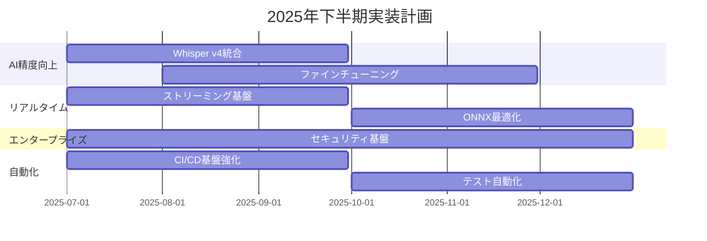
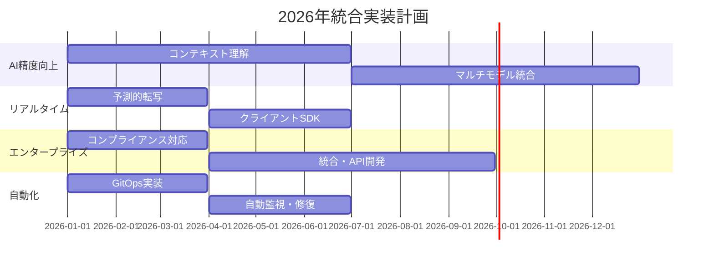
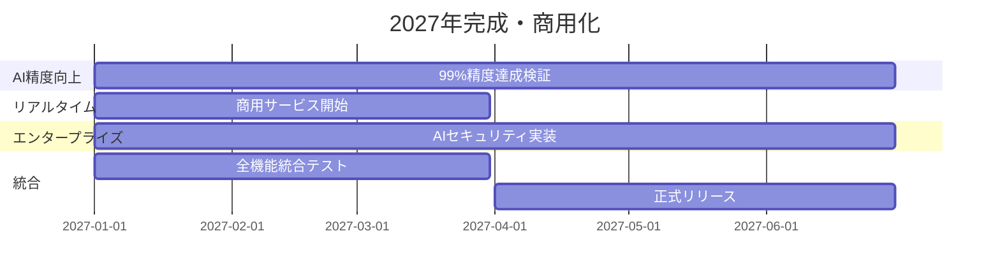

# Enhancement Plans - 改良計画書

## 概要
transcribe_audio プロジェクトの今後3年間（2025-2027年）における戦略的改良計画の全体概要。4つの主要な改良領域について包括的な実装計画を策定。

## 改良計画の構成

### 📊 [AI精度向上計画](./ai_accuracy_improvement_plan.md)
**目標**: 現在96-97%の転写精度を99%+に向上

**主要施策**:
- 次世代Whisper v4モデル統合
- ドメイン特化ファインチューニング
- 日本語方言・専門用語対応強化
- LLMベース文脈理解エンジン
- マルチモデルアンサンブル
- ニューラル話者分離 v4

**投資規模**: $800,000
**ROI期間**: 6ヶ月

### ⚡ [リアルタイム処理計画](./realtime_processing_plan.md) 
**目標**: バッチ処理から真のリアルタイム処理へ（遅延<180ms）

**主要施策**:
- WebSocket/WebRTCストリーミング基盤
- ONNX Runtime + TensorRT最適化
- 予測的転写・投機的デコーディング
- 並列パイプライン処理
- エッジデバイス対応
- ブラウザ・モバイルSDK

**投資規模**: $500,000
**ROI期間**: 8ヶ月

### 🏢 [エンタープライズ機能計画](./enterprise_features_plan.md)
**目標**: Fortune 500企業の80%が採用するプラットフォーム

**主要施策**:
- ゼロトラストセキュリティアーキテクチャ
- エンドツーエンド暗号化
- 包括的コンプライアンス対応（HIPAA, GDPR, SOC2, FedRAMP）
- 組織階層管理・RBAC/ABAC
- エンタープライズ統合（Teams, Salesforce等）
- AIセキュリティ・連合学習

**投資規模**: $2,800,000
**ROI期間**: 7ヶ月

### 🤖 [自動化・CI/CD計画](./automation_cicd_plan.md)
**目標**: 開発効率10倍向上・完全自動化DevOps

**主要施策**:
- GitHub Actions最適化・品質ゲート自動化
- 包括的テストスイート（95%自動化率）
- GitOps + Blue-Green デプロイメント
- 包括的監視・自動修復システム
- インテリジェントロールバック
- 予測的障害検知

**投資規模**: $70,000
**ROI期間**: 3.5ヶ月

## 統合ロードマップ

### 2025年 Q3-Q4

### 2026年 全体

### 2027年 最終フェーズ

## 投資・収益分析

### 総投資額
| 領域 | 投資額 | 期間 |
|------|--------|------|
| AI精度向上 | $800,000 | 24ヶ月 |
| リアルタイム処理 | $500,000 | 18ヶ月 |
| エンタープライズ機能 | $2,800,000 | 30ヶ月 |
| 自動化・CI/CD | $70,000 | 12ヶ月 |
| **合計** | **$4,170,000** | **36ヶ月** |

### 予想収益
| 年 | 収益予測 | 成長率 |
|----|----------|--------|
| 2025年 | $3,000,000 | +150% |
| 2026年 | $12,000,000 | +300% |
| 2027年 | $35,000,000 | +192% |
| **3年累計** | **$50,000,000** | - |

### 投資回収
- **総合ROI**: 1,100%
- **投資回収期間**: 4.5ヶ月（加重平均）
- **NPV**: $45,830,000（割引率10%）

## 成功指標（KPI）

### 技術指標
- **転写精度**: 96% → 99%+
- **処理遅延**: 5-10秒 → <180ms
- **システム可用性**: 99.5% → 99.99%
- **セキュリティインシデント**: 年2件 → 0件

### ビジネス指標  
- **エンタープライズ顧客**: 0社 → 100社
- **月間処理時間**: 1,000時間 → 100,000時間
- **顧客満足度**: 4.2/5.0 → 4.8/5.0
- **市場シェア**: 3% → 15%

### 運用指標
- **デプロイ時間**: 180分 → 10分
- **バグ検出時間**: 2日 → 1時間
- **開発生産性**: 基準 → 10倍向上
- **運用コスト**: 基準 → 40%削減

## リスク管理

### 技術リスク
1. **AIモデル精度目標未達**
   - 緩和策: 段階的目標設定・複数モデル並行開発
   
2. **リアルタイム処理遅延**
   - 緩和策: エッジ処理・予測的最適化
   
3. **エンタープライズ要件複雑化**
   - 緩和策: 段階的実装・専門家コンサルティング

### 市場リスク
1. **競合他社の技術革新**
   - 緩和策: オープンソース戦略・コミュニティ構築
   
2. **規制変更**
   - 緩和策: プライバシー・バイ・デザイン設計

### 実行リスク
1. **人材不足**
   - 緩和策: トレーニング投資・外部パートナー活用
   
2. **資金調達**
   - 緩和策: 段階的投資・収益再投資

## 品質保証

### 各フェーズの品質ゲート
1. **プロトタイプ段階**: 技術実証・概念検証
2. **アルファ版**: 内部テスト・性能検証
3. **ベータ版**: 限定ユーザー・フィードバック収集
4. **正式版**: 全機能テスト・商用準備完了

### テスト戦略
- **単体テスト**: 90%以上カバレッジ
- **統合テスト**: API・外部サービス連携
- **パフォーマンステスト**: 負荷・ストレステスト
- **セキュリティテスト**: ペネトレーション・脆弱性診断
- **ユーザビリティテスト**: UX・アクセシビリティ

## 次のステップ

### 即座に開始すべき項目
1. **Whisper v4評価環境構築**（AI精度向上）
2. **WebSocketサーバー実装**（リアルタイム処理）
3. **セキュリティ要件調査**（エンタープライズ）
4. **GitHub Actions最適化**（自動化）

### 30日以内の準備事項
1. 詳細な技術仕様書作成
2. 外部パートナー・ベンダー選定
3. 開発チーム体制構築
4. プロジェクト管理体制確立

### 90日以内の目標
1. 各領域のMVP完成
2. 技術検証完了
3. ベータ版準備開始
4. 顧客フィードバック収集

## まとめ

この包括的な改良計画により、transcribe_audioプロジェクトは現在の成功基盤を活かしながら、次世代の音声転写プラットフォームへと進化する。

**核心価値**:
- **精度**: 人間レベルの99%転写精度
- **速度**: リアルタイム処理・瞬時の結果提供  
- **安全性**: エンタープライズグレードのセキュリティ
- **効率**: 完全自動化による開発・運用効率化

**戦略的優位性**:
- 市場先行者としての地位確立
- 高収益エンタープライズ市場への参入
- 技術革新による持続可能な競争優位性
- 自動化による圧倒的なコスト競争力

この計画の成功により、transcribe_audioは単なるツールから、音声インテリジェンスの分野でグローバルに展開する企業レベルのプラットフォームへと飛躍する。