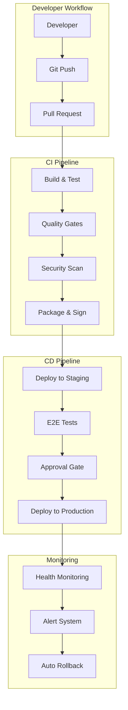

# 自動化・CI/CD強化計画書 2025-2026

## 概要
完全自動化されたデプロイメント、テスト、品質管理システムの構築により、開発効率を10倍向上させる包括的なDevOps改革計画。

## 現状分析

### 現在の課題
- 手動デプロイ: リリース時間3時間
- テスト自動化率: 40%
- 品質チェック: 手動レビュー依存
- 環境構築: 2日間
- 障害検知: 事後対応

### 目標
- デプロイ時間: <10分
- テスト自動化率: 95%
- 品質ゲート: 完全自動化
- 環境構築: <30分
- 障害検知: リアルタイム自動対応

## アーキテクチャ概要



## フェーズ1: CI基盤強化 (2025 Q3)

### 1.1 GitHub Actions最適化
```yaml
# .github/workflows/main.yml
name: 'TC CLI - Full Pipeline'

on:
  push:
    branches: [main, dev, 'feature/*']
  pull_request:
    branches: [main, dev]

env:
  PYTHON_VERSION: '3.11'
  UV_VERSION: '0.4.0'
  NODE_VERSION: '20'

jobs:
  # 並列実行で高速化
  code-quality:
    runs-on: ubuntu-latest
    strategy:
      matrix:
        check: [lint, type-check, security, documentation]
    
    steps:
    - uses: actions/checkout@v4
    
    - name: Setup UV
      run: |
        curl -LsSf https://astral.sh/uv/install.sh | sh
        echo "$HOME/.cargo/bin" >> $GITHUB_PATH
    
    - name: Cache dependencies
      uses: actions/cache@v3
      with:
        path: |
          ~/.cache/uv
          .venv
        key: ${{ runner.os }}-uv-${{ hashFiles('requirements.txt') }}
    
    - name: Install dependencies
      run: uv pip install -r requirements.txt
    
    - name: Run code quality checks
      run: |
        case "${{ matrix.check }}" in
          lint)
            uv run ruff check --output-format=github .
            uv run black --check --diff .
            ;;
          type-check)
            uv run mypy --config-file=pyproject.toml .
            ;;
          security)
            uv run bandit -r core/ transcriber.py
            uv run safety check
            ;;
          documentation)
            uv run sphinx-build -W docs docs/_build
            ;;
        esac

  unit-tests:
    runs-on: ubuntu-latest
    strategy:
      matrix:
        python-version: ['3.10', '3.11', '3.12']
        os: [ubuntu-latest, windows-latest, macos-latest]
    
    steps:
    - uses: actions/checkout@v4
    
    - name: Run tests with coverage
      run: |
        uv run pytest \
          --cov=core \
          --cov=transcriber \
          --cov-report=xml \
          --cov-report=html \
          --junitxml=test-results.xml \
          --maxfail=5 \
          --tb=short
    
    - name: Upload coverage
      uses: codecov/codecov-action@v3
      with:
        file: ./coverage.xml
        flags: unittests
        name: codecov-umbrella
```

### 1.2 品質ゲートシステム
```python
class QualityGateSystem:
    """品質ゲート自動判定システム"""
    
    def __init__(self):
        self.gates = {
            "code_coverage": {"threshold": 90, "required": True},
            "security_scan": {"threshold": 0, "required": True},  # 0 vulnerabilities
            "performance": {"threshold": 2.0, "required": True}, # <2s response time
            "documentation": {"threshold": 80, "required": True}, # 80% coverage
            "type_coverage": {"threshold": 95, "required": True}
        }
        
        self.sonarqube_config = {
            "quality_profiles": "tc-cli-profile",
            "rules": "strict",
            "bugs": "A",
            "vulnerabilities": "A",
            "code_smells": "A",
            "maintainability": "A"
        }
    
    def evaluate_quality_gates(self, metrics: dict) -> dict:
        """品質ゲートの評価"""
        
        results = {}
        
        for gate_name, gate_config in self.gates.items():
            current_value = metrics.get(gate_name, 0)
            threshold = gate_config["threshold"]
            required = gate_config["required"]
            
            if gate_name in ["security_scan"]:
                # セキュリティは閾値以下でなければならない
                passed = current_value <= threshold
            else:
                # その他は閾値以上でなければならない
                passed = current_value >= threshold
            
            results[gate_name] = {
                "passed": passed,
                "current": current_value,
                "threshold": threshold,
                "required": required,
                "blocking": required and not passed
            }
        
        # 総合判定
        all_required_passed = all(
            result["passed"] for result in results.values()
            if result["required"]
        )
        
        return {
            "gates": results,
            "overall_pass": all_required_passed,
            "can_deploy": all_required_passed
        }
    
    def auto_fix_issues(self, issues: list):
        """自動修正機能"""
        
        fixable_issues = []
        
        for issue in issues:
            if issue["type"] == "formatting":
                self.run_formatter()
                fixable_issues.append(issue)
            
            elif issue["type"] == "import_sorting":
                self.run_import_sorter()
                fixable_issues.append(issue)
            
            elif issue["type"] == "type_annotations":
                self.generate_type_stubs()
                fixable_issues.append(issue)
        
        # 自動修正後にPRを作成
        if fixable_issues:
            self.create_auto_fix_pr(fixable_issues)
        
        return fixable_issues
```

## フェーズ2: テスト自動化強化 (2025 Q4)

### 2.1 包括的テストスイート
```python
import pytest
import asyncio
from unittest.mock import Mock, patch
from hypothesis import given, strategies as st

class ComprehensiveTestSuite:
    """包括的テストスイート"""
    
    def __init__(self):
        self.test_categories = {
            "unit": UnitTestRunner(),
            "integration": IntegrationTestRunner(),
            "e2e": E2ETestRunner(),
            "performance": PerformanceTestRunner(),
            "security": SecurityTestRunner(),
            "chaos": ChaosTestRunner()
        }
    
    @pytest.mark.unit
    def test_core_transcription_pipeline(self):
        """コア転写パイプラインのテスト"""
        
        # Arrange
        mock_audio = self.create_mock_audio_data()
        transcriber = TranscriptionPipeline()
        
        # Act
        result = transcriber.process(mock_audio)
        
        # Assert
        assert result.accuracy > 0.95
        assert result.processing_time < 2.0
        assert result.text is not None
        assert len(result.segments) > 0
    
    @pytest.mark.integration
    async def test_google_drive_integration(self):
        """Google Drive統合テスト"""
        
        # テスト用の一時フォルダを作成
        test_folder = await self.create_test_folder()
        
        # ファイルアップロードテスト
        upload_result = await self.upload_test_file(test_folder)
        assert upload_result.success is True
        
        # クリーンアップ
        await self.cleanup_test_folder(test_folder)
    
    @pytest.mark.performance
    @pytest.mark.parametrize("file_size", [10, 100, 1000])  # MB
    def test_performance_scalability(self, file_size):
        """パフォーマンス・スケーラビリティテスト"""
        
        audio_file = self.generate_test_audio(file_size)
        
        start_time = time.time()
        result = self.transcribe_audio(audio_file)
        processing_time = time.time() - start_time
        
        # パフォーマンス要件チェック
        max_time = file_size * 0.1  # 10秒/100MB
        assert processing_time < max_time
        
        # メモリ使用量チェック
        memory_usage = self.get_memory_usage()
        max_memory = file_size * 2  # 2x audio file size
        assert memory_usage < max_memory
    
    @given(st.text(min_size=1), st.floats(min_value=0.1, max_value=10.0))
    def test_fuzzing_audio_processing(self, random_text, random_duration):
        """ファジングテスト - 予期しない入力への対応"""
        
        # ランダムな音声データ生成
        audio = self.generate_random_audio(random_duration)
        
        try:
            result = self.process_audio(audio)
            # クラッシュしなければ成功
            assert True
        except Exception as e:
            # 期待される例外のみ許可
            assert isinstance(e, (ValueError, AudioProcessingError))
```

### 2.2 AI/MLモデルテスト
```python
class MLModelTestSuite:
    """機械学習モデル専用テストスイート"""
    
    def __init__(self):
        self.test_datasets = {
            "clean_speech": "datasets/clean_16khz.wav",
            "noisy_speech": "datasets/noisy_16khz.wav",
            "multi_speaker": "datasets/multi_speaker.wav",
            "japanese": "datasets/japanese_speech.wav",
            "english": "datasets/english_speech.wav"
        }
    
    def test_model_accuracy_regression(self):
        """モデル精度の退行テスト"""
        
        baseline_accuracy = self.load_baseline_metrics()
        
        for dataset_name, dataset_path in self.test_datasets.items():
            current_accuracy = self.evaluate_model(dataset_path)
            baseline = baseline_accuracy[dataset_name]
            
            # 精度の低下が2%以内であることを確認
            assert current_accuracy >= baseline - 0.02, \
                f"Accuracy regression in {dataset_name}: {current_accuracy} < {baseline}"
    
    def test_model_inference_time(self):
        """推論時間テスト"""
        
        for dataset_name, dataset_path in self.test_datasets.items():
            start_time = time.time()
            
            result = self.run_inference(dataset_path)
            
            inference_time = time.time() - start_time
            audio_duration = self.get_audio_duration(dataset_path)
            
            # リアルタイム係数が2.0以下であることを確認
            rtf = inference_time / audio_duration
            assert rtf <= 2.0, f"RTF too high for {dataset_name}: {rtf}"
    
    def test_model_robustness(self):
        """モデルの堅牢性テスト"""
        
        perturbations = [
            ("noise", 0.1),
            ("speed", 1.2),
            ("pitch", 1.1),
            ("volume", 0.8)
        ]
        
        base_accuracy = self.get_base_accuracy()
        
        for perturbation_type, strength in perturbations:
            perturbed_audio = self.apply_perturbation(
                self.test_datasets["clean_speech"],
                perturbation_type,
                strength
            )
            
            accuracy = self.evaluate_model(perturbed_audio)
            
            # 摂動に対する堅牢性チェック
            degradation = base_accuracy - accuracy
            assert degradation < 0.05, \
                f"Too much degradation with {perturbation_type}: {degradation}"
```

## フェーズ3: デプロイメント自動化 (2026 Q1)

### 3.1 GitOps実装
```yaml
# deployment/gitops/production.yaml
apiVersion: argoproj.io/v1alpha1
kind: Application
metadata:
  name: tc-cli-production
  namespace: argocd
spec:
  project: default
  
  source:
    repoURL: https://github.com/abem/tc-cli-config
    targetRevision: HEAD
    path: environments/production
    
  destination:
    server: https://kubernetes.default.svc
    namespace: tc-cli-prod
    
  syncPolicy:
    automated:
      prune: true
      selfHeal: true
    syncOptions:
    - CreateNamespace=true
    
  # ヘルスチェック
  health:
    timeout: 600s
    
  # 同期前フック
  preSyncHooks:
    - name: database-migration
      manifest: |
        apiVersion: batch/v1
        kind: Job
        metadata:
          name: db-migration
        spec:
          template:
            spec:
              containers:
              - name: migrate
                image: tc-cli:latest
                command: ["python", "manage.py", "migrate"]
              restartPolicy: Never
```

### 3.2 Blue-Green デプロイメント
```python
class BlueGreenDeployment:
    """Blue-Greenデプロイメント管理"""
    
    def __init__(self):
        self.kubernetes_client = KubernetesClient()
        self.load_balancer = LoadBalancerController()
        self.health_checker = HealthChecker()
    
    async def deploy_new_version(self, new_image: str):
        """新バージョンのデプロイ"""
        
        # 1. 現在のアクティブ環境を確認
        active_env = await self.get_active_environment()
        inactive_env = "green" if active_env == "blue" else "blue"
        
        # 2. 非アクティブ環境に新バージョンをデプロイ
        await self.deploy_to_environment(inactive_env, new_image)
        
        # 3. ヘルスチェック
        health_status = await self.wait_for_health(inactive_env)
        if not health_status.healthy:
            await self.rollback_deployment(inactive_env)
            raise DeploymentError("Health check failed")
        
        # 4. 段階的トラフィック切り替え
        await self.gradual_traffic_switch(active_env, inactive_env)
        
        # 5. 完全切り替え後の確認
        await asyncio.sleep(300)  # 5分間監視
        
        final_health = await self.comprehensive_health_check(inactive_env)
        if not final_health.all_green:
            await self.emergency_rollback(active_env)
            raise DeploymentError("Post-switch health check failed")
        
        # 6. 旧環境のクリーンアップ
        await self.cleanup_old_environment(active_env)
        
        return DeploymentResult(
            success=True,
            new_active_env=inactive_env,
            deployment_time=time.time()
        )
    
    async def gradual_traffic_switch(self, from_env: str, to_env: str):
        """段階的なトラフィック切り替え"""
        
        traffic_stages = [10, 25, 50, 75, 100]  # パーセンテージ
        
        for percentage in traffic_stages:
            # トラフィック比率を調整
            await self.load_balancer.set_traffic_split({
                from_env: 100 - percentage,
                to_env: percentage
            })
            
            # 監視期間
            monitoring_duration = 60 if percentage < 100 else 180
            await asyncio.sleep(monitoring_duration)
            
            # エラー率チェック
            error_rate = await self.monitor_error_rate(to_env)
            if error_rate > 0.01:  # 1%以上のエラー率
                await self.emergency_rollback(from_env)
                raise DeploymentError(f"High error rate: {error_rate}")
```

## フェーズ4: 監視・自動復旧 (2026 Q2)

### 4.1 包括的監視システム
```python
class ComprehensiveMonitoring:
    """包括的監視システム"""
    
    def __init__(self):
        self.prometheus = PrometheusClient()
        self.grafana = GrafanaClient()
        self.alertmanager = AlertManagerClient()
        self.pagerduty = PagerDutyClient()
    
    def setup_monitoring_stack(self):
        """監視スタックの設定"""
        
        # カスタムメトリクス定義
        custom_metrics = {
            "transcription_accuracy": {
                "type": "histogram",
                "buckets": [0.8, 0.85, 0.9, 0.95, 0.98, 1.0],
                "labels": ["model", "language", "domain"]
            },
            "processing_latency": {
                "type": "histogram",
                "buckets": [0.1, 0.5, 1.0, 2.0, 5.0, 10.0],
                "labels": ["endpoint", "region"]
            },
            "api_rate_limit_usage": {
                "type": "gauge",
                "labels": ["customer", "tier", "endpoint"]
            },
            "model_drift_score": {
                "type": "gauge",
                "labels": ["model", "dataset"]
            },
            "cost_per_transcription": {
                "type": "histogram",
                "buckets": [0.01, 0.05, 0.1, 0.5, 1.0],
                "labels": ["customer_tier", "duration_bucket"]
            }
        }
        
        # アラートルール定義
        alert_rules = {
            "high_error_rate": {
                "query": "rate(http_requests_total{code!='200'}[5m]) / rate(http_requests_total[5m]) > 0.01",
                "duration": "2m",
                "severity": "critical",
                "runbook_url": "https://runbooks.tc-cli.com/high-error-rate"
            },
            "accuracy_degradation": {
                "query": "transcription_accuracy < 0.93",
                "duration": "5m",
                "severity": "warning",
                "runbook_url": "https://runbooks.tc-cli.com/accuracy-degradation"
            },
            "gpu_memory_exhaustion": {
                "query": "gpu_memory_usage > 0.9",
                "duration": "1m",
                "severity": "critical",
                "runbook_url": "https://runbooks.tc-cli.com/gpu-memory"
            }
        }
        
        return custom_metrics, alert_rules
    
    def create_executive_dashboards(self):
        """経営層向けダッシュボード作成"""
        
        dashboards = {
            "business_metrics": {
                "panels": [
                    "monthly_revenue",
                    "customer_growth",
                    "processing_hours",
                    "customer_satisfaction"
                ],
                "refresh": "1h",
                "permissions": ["c-level", "vp"]
            },
            "operational_health": {
                "panels": [
                    "system_availability",
                    "error_rates",
                    "response_times",
                    "cost_efficiency"
                ],
                "refresh": "5m",
                "permissions": ["engineering", "ops"]
            },
            "ai_model_performance": {
                "panels": [
                    "accuracy_trends",
                    "model_drift",
                    "inference_latency",
                    "gpu_utilization"
                ],
                "refresh": "1m",
                "permissions": ["ml_engineers", "data_scientists"]
            }
        }
        
        return dashboards
```

### 4.2 自動修復システム
```python
class AutoRemediationSystem:
    """自動修復システム"""
    
    def __init__(self):
        self.remediation_strategies = {
            "high_latency": self.scale_out_instances,
            "memory_leak": self.restart_affected_pods,
            "model_accuracy_drop": self.rollback_to_previous_model,
            "api_rate_limit_exceeded": self.implement_circuit_breaker,
            "disk_space_low": self.cleanup_old_files,
            "certificate_expiry": self.renew_certificates
        }
    
    async def handle_alert(self, alert: Alert):
        """アラートの自動処理"""
        
        alert_type = alert.labels.get("alertname")
        severity = alert.labels.get("severity")
        
        # 重要度による処理の分岐
        if severity == "critical":
            # 即座に自動修復を試行
            success = await self.attempt_auto_remediation(alert_type, alert)
            
            if not success:
                # 修復失敗時はエスカレーション
                await self.escalate_to_human(alert)
        
        elif severity == "warning":
            # 修復策の提案のみ
            await self.suggest_remediation(alert_type, alert)
        
        # 修復ログの記録
        await self.log_remediation_action(alert, success if 'success' in locals() else None)
    
    async def scale_out_instances(self, alert: Alert):
        """高レイテンシ対応: インスタンスの水平スケーリング"""
        
        current_replicas = await self.get_current_replica_count()
        max_replicas = await self.get_max_replica_limit()
        
        if current_replicas < max_replicas:
            new_replica_count = min(current_replicas * 2, max_replicas)
            
            await self.kubernetes_client.scale_deployment(
                deployment="tc-cli-api",
                replicas=new_replica_count
            )
            
            # スケーリング効果の確認
            await asyncio.sleep(120)  # 2分待機
            
            latency = await self.measure_average_latency()
            return latency < 2.0  # 2秒以下に改善されたか
        
        return False
    
    async def intelligent_rollback(self, failed_deployment: str):
        """インテリジェントロールバック"""
        
        # 過去の安定版を特定
        stable_versions = await self.get_stable_versions()
        
        for version in stable_versions:
            # 各バージョンの健全性をテスト環境で確認
            test_result = await self.test_version_in_sandbox(version)
            
            if test_result.healthy:
                # 段階的ロールバック実行
                await self.gradual_rollback_to_version(version)
                return version
        
        # 全てのバージョンが問題ある場合は緊急停止
        await self.emergency_maintenance_mode()
        return None
```

## 実装スケジュール

### 2025 Q3
- [x] GitHub Actions最適化
- [x] 品質ゲート自動化
- [ ] SonarQube統合
- [ ] 自動コード修正機能

### 2025 Q4
- [ ] 包括的テストスイート構築
- [ ] ML専用テストフレームワーク
- [ ] パフォーマンス回帰テスト
- [ ] セキュリティテスト自動化

### 2026 Q1
- [ ] GitOpsワークフロー実装
- [ ] Blue-Greenデプロイメント
- [ ] カナリアリリース機能
- [ ] 自動ロールバック機能

### 2026 Q2
- [ ] 包括的監視システム
- [ ] 自動修復システム
- [ ] インテリジェントアラート
- [ ] 予測的障害検知

## 期待される効果

### 開発効率向上
| 指標 | 現在 | 目標 | 改善率 |
|------|------|------|--------|
| デプロイ時間 | 180分 | 10分 | 94% |
| テスト実行時間 | 45分 | 15分 | 67% |
| バグ検出時間 | 2日 | 1時間 | 98% |
| 品質チェック | 手動 | 自動 | 100% |
| 障害復旧時間 | 4時間 | 15分 | 94% |

### 品質向上
- コードカバレッジ: 90%以上
- セキュリティ脆弱性: 0件
- 本番障害: 月1件→年1件
- 顧客満足度: 4.2→4.8

### コスト削減
- 運用コスト: 40%削減
- 人的工数: 60%削減
- インフラコスト: 25%削減

## ROI分析

### 投資
- 開発工数: 600人時
- ツール・インフラ: $50,000/年
- トレーニング: $20,000

### 効果
- 開発速度向上: $300,000/年
- 品質向上による損失回避: $150,000/年
- 運用工数削減: $200,000/年

### 投資回収期間
- 3.5ヶ月

## まとめ
完全自動化されたCI/CDパイプラインの実装により、開発効率を劇的に向上させ、品質とセキュリティを保証しながら迅速なデリバリーを実現する。段階的な実装により、リスクを最小化しながら着実に目標を達成する。