# 運用・リリース手順書

**対象**: 開発・運用担当
**作成日**: 2026-10-04
**確認方法**: `scripts/release_dev_main.sh` の本文と冒頭の説明を読み、`bash -n` で構文を、`--help` と `--dry-run` で
動作を確認した（`--dry-run` は何も変更しないが、`git fetch` は行う）。**スクリプトの実行（`--dry-run` 以外）はこの
文書の作成では行っていない**。`tests/test_release_script.py`（20 件）を実行して全件が通ることを確認した。

WebUI の内部構造と、サービスの運用（systemd、ログ、ヘルスチェック）は
[WebUI 内部サーバー構成](webui_architecture.md) にある。この文書は、コードを本番へ反映する手順に絞る。

## 1. ブランチと本番の関係

- **更新の順序は feature → dev → main**。feature から dev と main を個別に更新しない
  （履歴が分岐し、修復に手間がかかるため。リポジトリの `CLAUDE.md`）。
- **main の更新は、ユーザーの明示的な指示があるときだけ**行う。自動的な判断や「念のため」の更新はしない。
  `scripts/release_dev_main.sh` を実行すること自体が、その指示にあたる。
- **本番は `/home/abem/Projects/tc-prod`**。ブランチ **dev** をチェックアウトしていて、WebUI は systemd の
  `tc-webui.service`（ユーザーサービス）で常駐する。
- したがって、**dev の更新が本番コードの更新**である。ただし稼働中の WebUI には自動で反映されない
  （`--server.fileWatcherType none`）。**反映するには WebUI の再起動が要る**。
- `tc-prod` の `output` / `logs` / `.venv` / 認証関連のファイルなどは、開発用の `/home/abem/Projects/tc` と共有する
  （[WebUI 内部サーバー構成](webui_architecture.md) §7）。

## 2. 統合スクリプト `scripts/release_dev_main.sh`

feature ブランチを dev → main の順に統合し、origin へ push して、WebUI を再起動する。

### 使い方

```bash
# 確認だけ(何も変更しない。origin の fetch はする)
scripts/release_dev_main.sh --dry-run <featureブランチ>

# 統合・push・WebUI の再起動
scripts/release_dev_main.sh <featureブランチ> "<mainのマージコミットメッセージ>"
```

| 引数・オプション | 意味 |
|---|---|
| 第 1 引数 `<featureブランチ>` | 統合するブランチ。`tc-prod` のリポジトリにあるブランチ名（worktree で作ったブランチも同じリポジトリ） |
| 第 2 引数 `"<メッセージ>"` | main に作るマージコミットのメッセージ。`--dry-run` 以外では必須（無ければ中止） |
| `--dry-run` | 前提の確認とジョブの有無の確認だけを行い、何も変更せずに終わる |
| `--no-restart` | 統合と push だけ行い、WebUI は再起動しない（ジョブがあっても止まらない） |
| `--force-restart` | WebUI にジョブがあっても再起動する（ジョブは失われる） |
| `-h` / `--help` | 冒頭の説明を表示する |

不明な `--` オプションはエラー（終了コード 2）になる。

### 止まる前提（1 つでも崩れていれば、何も変更せずに中止）

- `tc-prod` が dev で、追跡ファイルに未コミットの変更が無い。
- ローカルの dev と main が origin（fetch 直後）と一致し、dev と main の**内容（tree）が同じ**。
- dev が feature の祖先で、取り込むコミットがある（fast-forward できる）。
- main がどの worktree にもチェックアウトされていない。
- WebUI のジョブ（ダウンロード中・待機中・処理中）が無い。ログの状態遷移と、WebUI 配下の
  `yt-dlp` / `ffmpeg` / `nemotron_infer` のプロセスから判断する。**確認できなければ「ある」とみなす**
  （ログが無い場合も含む）。ジョブの判定は、再起動する場合（`--no-restart` でない場合）にだけ、統合を止める条件になる。

### 手順の順序（本番を動かすのは最後）



1. **前提の確認**: origin を fetch し、上の前提を確かめる。崩れていれば中止。
2. **main へのマージ**: 一時 worktree（`/tmp/release-dev-main.*`）で main に feature を `--no-ff` でマージし、
   マージ後の内容（tree）が feature と一致することを確認する。競合すれば中止（何も変更しない）。
3. **origin へ push**: dev と main を `--atomic` で一度に push する。拒否されればここで止まる
   （本番もローカルの main も未変更）。
4. **本番を追従**: push が成功したあとで、本番の dev を fast-forward し、ローカルの main を進める。最後に
   dev / main がそれぞれ origin と一致し、dev と main の内容が同じことを確認する。
5. **WebUI の再起動**: `systemctl --user restart tc-webui.service` を実行し、最大 30 秒、ヘルスチェック
   （`http://localhost:8501/_stcore/health`）が 200 になるのを待つ。

ジョブがあって再起動できない場合は、手順 2 より前（何も変更する前）に止まる。

### 実行例（`--dry-run`、2026-10-04 に実行）

```text
$ scripts/release_dev_main.sh --dry-run <ブランチ>

== 前提の確認 ==
origin を fetch します
dev: 35108af   <ブランチ>: 336e28d   (dev に取り込むコミット: 5件)
main: 60a7838
注意: BUSY: ジョブが終了していません(item_id=3 が PROCESSING。ほか0件)

ドライラン: 前提はすべて満たしています(origin を fetch して確認済み)。何も変更していません。
ただし、このままの実行は WebUI のジョブがあるため止まります(--no-restart か --force-restart を指定してください)。
```

この例では、前提は満たしているが、実行中のジョブがあるため、このままでは止まる。コミットの値は実行時点のもの。

### WebUI にジョブがあるときの扱い

| 状況 | 対応 |
|---|---|
| ジョブが終わるのを待てる | 終わってから、スクリプトを再実行する（推奨） |
| 統合だけ先に済ませたい | `--no-restart` を付ける。**WebUI は古いコードのままなので、後で再起動が要る**（ジョブが無い時に `systemctl --user restart tc-webui.service`） |
| ジョブを失ってよい | `--force-restart`。処理中・待機中のジョブは失われる |
| ドキュメントだけの変更 | WebUI の動作に影響しないので、**再起動は不要**。`--no-restart` で統合する |

画面のキューはブラウザセッション単位なので、別のブラウザの投入分は画面に出ない
（[WebUI 内部サーバー構成](webui_architecture.md) §8。コードの読解による）。スクリプトはログとプロセスで判定するので、
画面に出ないジョブも検出できる。

### 途中で止まったときの復旧

スクリプトは、止まった理由と、必要なコマンドを標準エラーに出す。

| 止まった場所 | 状態 | 対応 |
|---|---|---|
| 手順 1（前提の確認） | 何も変更していない | 表示された原因（origin が先に進んだ、dev と main の内容が違う、等）を確認して直し、再実行する |
| 手順 2（マージ）の競合・不一致 | 何も変更していない（一時 worktree は自動で片づく） | feature を dev の最新から作り直すなどして競合を解消する |
| 手順 3（push の拒否） | origin・本番 dev・ローカルの main のいずれも未変更 | `git fetch` して原因（origin が先に進んだ等）を確認し、再実行する |
| 手順 4 で、本番 dev の fast-forward に失敗 | **origin は更新済み**、本番 dev が未更新 | `git -C /home/abem/Projects/tc-prod merge --ff-only origin/dev` |
| 手順 4 で、ローカルの main の更新に失敗 | origin は更新済み、ローカルの main が未更新 | `git -C /home/abem/Projects/tc-prod fetch origin && git -C /home/abem/Projects/tc-prod branch -f main origin/main` |
| 手順 5（再起動）のヘルスチェック失敗 | **統合と push は完了**。WebUI が 200 を返さない | `systemctl --user status tc-webui.service` と `journalctl --user -u tc-webui.service -n 50 --no-pager` で原因を確認する |

- 手順 3 までの失敗は、再実行してよい（変更が無いため）。手順 4 以降で止まったときは、再実行せず、
  上の表のコマンドで追従させる（origin が先に更新されていて、前提の確認で止まるため）。
- main を削除・再作成するような操作は、復旧の手段にしない（リポジトリの `CLAUDE.md`）。
  ブランチが分岐した場合の対処も `CLAUDE.md` に従い、ユーザーに確認する。

### スクリプトの安全装置の検査

`tests/test_release_script.py`（20 件）が、スクリプトの安全装置を、一時的なリポジトリと origin で検査している。
検査の対象は、統合と再起動の成功、`--no-restart`、2 回目の統合、`--dry-run` が何も変えないこと、
origin が先に進んでいる場合・追跡ファイルの変更・dev と main の内容の相違・祖先でない feature・不明なブランチと
オプション・main のチェックアウト・メッセージ無しの拒否、push 拒否時に本番が進まないこと、dev と main の
`--atomic`、解決中・処理中のジョブと、取得プロセスが再起動を止めること、終了済みのジョブは止めないこと、
ログが無いときに止めること、`--force-restart` の上書き、である。スクリプトを変更したときは、次を実行する。

```bash
bash -n scripts/release_dev_main.sh
uv run python -m pytest tests/test_release_script.py -q
```

## 3. WebUI の再起動

スクリプトを使わずに再起動する場合（設定の変更やコード変更の反映など）の手順。

**再起動の前に**（処理中・待機中のジョブは失われる）:

1. WebUI の画面（キュー状態）で、解決中・待機・処理中の項目が無いことを確認する。
2. 画面で確認できなければ、`logs/transcription.log` の `状態遷移` 行で、サービスの起動以降に DONE / FAILED に
   なっていない `item_id` が無いことを確認する。
3. 迷うときは、スクリプトの `--dry-run` の「WebUI のジョブはありません」の表示を使う（画面に出ない
   ブラウザセッションの分も、ログとプロセスで判定できる）。

```bash
systemctl --user restart tc-webui.service
```

**再起動のあとで**:

```bash
# 状態(active (running) になっていること)
systemctl --user status tc-webui.service

# ヘルスチェック(ok が返ること。起動に数秒かかるので、失敗したら少し待って再実行する)
curl -sf http://localhost:8501/_stcore/health

# 直近のログ(起動の失敗や例外が無いこと)
journalctl --user -u tc-webui.service -n 20 --no-pager
```

アプリのログ（キューの状態遷移など）は `logs/transcription.log` にある
（[WebUI 内部サーバー構成](webui_architecture.md) §6）。

## 4. 実機での確認の範囲

この文書のコマンドのうち、実機で実行して確認したのは次のとおり。

- 実行した: `bash -n scripts/release_dev_main.sh`、`scripts/release_dev_main.sh --help`、
  `scripts/release_dev_main.sh --dry-run <ブランチ>`、`uv run python -m pytest tests/test_release_script.py -q`（20 件が通過）。
- 実行していない: `scripts/release_dev_main.sh` の統合・push・再起動（`--dry-run` 以外）、
  `systemctl --user restart` / `stop`、2026-10-04 の `systemctl --user status` とヘルスチェックの `curl`（同じ呼び出しの中で実行を試みたが、
  この環境の安全フックに止められ、結果を得ていない。2026-08-05 に実行した結果が `webui_architecture.md` §6・§7 にある）、復旧のコマンド（表の `git ... merge --ff-only` など。
  スクリプトの本文のメッセージに書かれたとおりに転記した）。
