# 音声文字起こしシステム システム概要

> この文書は現行の実装に合わせています。利用者に見える挙動の正本は [docs/spec/00-project-spec.md](../spec/00-project-spec.md) です。
> セットアップは `CONTRIBUTING.md` / `DEVELOPMENT.md`、設定の詳細は `docs/user-guides/` を参照してください。
> 2025年7月時点の記録は `docs/historical-records/current_status_2025_july.md` にあります。

## 何をするシステムか

音声・動画を文字起こしし、結果をテキストとして `output/` に保存します。

- **入力**: ローカルの音声ファイル、Google Drive の URL、YouTube の URL、X（旧 Twitter）の動画 URL
- **出力**: `output/` のテキストと、変換履歴 `output/history.db`。入力が YouTube または Google Drive のときは、結果を Google Drive にもアップロードします。**X の動画 URL はアップロード対象外**（`source_type="twitter"`）で、`output/` に保存されるだけです
- **エンジン**: Qwen3-ASR（既定）・Whisper・Nemotron。モデル名で自動的に切り替わります
- **入口**: `tc`（推奨 CLI）、`transcribe.py`（Rich UI の対話型 CLI）、`webui.py`（Streamlit の WebUI）
- **オプション**: 認識ヒント（Qwen3-ASR）、タイムスタンプ付与（Qwen3-ASR。ForcedAligner を使用）

話者分離は撤去済みです（コミット `ffbe913`、2026-08-05）。

## 全体の構成



入口は 3 つあり、入力の解決（URL からの取得）、保存、アップロード、履歴記録、一時音声の削除は `core/cli_workflow.py` を共用します。エンジンは入口が `UnifiedTranscriber` 経由で呼びます。

- **CLI（`tc` / `transcribe.py`）にはキューがありません**。1 回の実行で 1 件を処理します
- **WebUI にはキューがあります**。複数件を投入でき、1 件ずつ順に処理します（`core/webui_workflow.py`）

## 1 件の処理で何が起きるか



- **解決**（`resolve_input_audio`）: 入力をローカルの音声ファイルにします。YouTube / X は yt-dlp で取得、Google Drive は Drive API でダウンロード、ローカルはそのまま使います
- **待機**: WebUI だけ。キュー項目は `RESOLVING`（解決中）→ `QUEUED`（待機）→ `PROCESSING`（処理中）→ `DONE` / `FAILED` と遷移します。解決はバックグラウンドで行うので、処理中のジョブがあっても追加投入できます
- **処理**: モデル名でエンジンを選び（次節）、文字起こしします
- **保存〜削除**: `finalize_transcription` が**この順に直列で**行います。tc / transcribe.py / webui.py が共用します
  - 保存: `output/` にテキストを書きます。`timestamps_included` が真で segments があるときだけ `[MM:SS] ` を行頭に付けます（Whisper 系は設定に関係なく、エンジンが 30 秒ごとに付けます）
  - アップロード: 入力が YouTube または Google Drive のときだけ。X とローカルは対象外です。WebUI では失敗しても続行し、tc は失敗を例外として伝えます（履歴は記録しません）
  - 履歴: `output/history.db` に記録します。失敗しても処理結果は失敗にしません
  - 削除: yt-dlp 由来と Google Drive 由来の音声を、成功・失敗・中断のいずれでも処理の終了時に削除します。ローカル入力は削除しません

進捗は `core/progress.py` で通知します。WebUI では、ダウンロードの割合、Qwen3-ASR 長音声のチャンク進捗、Whisper の 30 秒チャンク進捗を進捗バーに出し、経過時間と残り時間（進捗 3% 未満では残りを出さない）を表示します。Nemotron と短い音声は経過時間のみです。

## エンジンの選択



`core/engine_factory.py` の `create_engine` が、この順に判定します（`UnifiedTranscriber.__init__` から呼ばれます。`qwen3_asr` の表記も Qwen3-ASR になります）。

| エンジン | モデル | 長音声の扱い |
|---|---|---|
| Qwen3ASREngine | `Qwen/Qwen3-ASR-1.7B`（既定） | 300 秒（5 分）を超えるとチャンクに分割 |
| WhisperTranscriptionEngine | `kotoba-tech/kotoba-whisper-v2.2`（日本語）、`openai/whisper-large-v3`（英語等） | 30 秒単位 |
| NemotronSubprocessEngine | `nvidia/nemotron-3.5-asr-streaming-0.6b`（専用の仮想環境 `venv-nemotron/` のサブプロセス） | 350 秒を超えるとストリーミング推論。失敗したら分割方式にフォールバック |

GPU メモリの実測値（RTX 4080 SUPER 16GB、コード内コメントの記録）: Qwen3-ASR（bf16）のロード後は約 11.3GB、ForcedAligner の追加で約 1.2GB 増えます。Nemotron は 5 分の音声で最大約 7.3GB です。CPU でも動作します（`--device cpu`）。

## 使い方

```bash
# config/config.yaml の設定（既定モデル・gdrive.url）で実行
./tc

# ローカルファイル / Google Drive URL / YouTube・X の動画URL
./tc audio.mp3
./tc <動画のURL>

# 言語・モデル・デバイスを指定
./tc audio.mp3 --language ja --device cuda
./tc audio.mp3 --model kotoba-tech/kotoba-whisper-v2.2

# 起動確認（文字起こしを行わない）
./tc audio.mp3 --dry-run
```

Nemotron は、初回のみ専用の仮想環境を作ります。

```bash
./scripts/setup_nemotron_venv.sh
./tc audio.mp3 --model nvidia/nemotron-3.5-asr-streaming-0.6b
```

WebUI の起動（開発時）:

```bash
uv run streamlit run webui.py --server.headless true --server.port 8501
```

WebUI の内部構成は [webui_architecture.md](webui_architecture.md) を参照してください。

## どこに何が保存されるか

| 場所 | 内容 | 保持 |
|---|---|---|
| `output/` | 文字起こし結果のテキスト | 残る |
| `output/history.db` | 変換履歴（`core/history.py` で検索・件数・削除） | 残る |
| `output/uploads/<一意>/<安全化した名前>` | WebUI でアップロードされた音声。同名でも上書きしません。名前は `sanitize_upload_filename` で安全化（最大 200 文字） | 7 日 |
| `output/queue_downloads/<トークン>/` | WebUI の URL 入力のダウンロード先 | 1 日 |
| `logs/transcription.log` | 実行ログ（pytest 中は `logs/transcription_test.log`） | 残る |

`output/uploads` と `output/queue_downloads` は、期限を過ぎた項目を WebUI への新しい投入のたびに削除します（`core/housekeeping.py`）。処理待ち・処理中のジョブが使うファイルは消しません。

## yt-dlp の扱い

`handlers/youtube.py` の `find_yt_dlp` が、PATH → 現在の Python と同じ `bin/` → `.venv/bin/yt-dlp` の順に探します。見つからなければ `YtDlpNotFoundError` で `uv sync` を案内します（自動インストールはしません）。応答が止まって居座らないよう、`--socket-timeout 30`、メタデータ取得 60 秒、出力が 300 秒途絶えたら中断、のタイムアウトを持ちます。

## 本番運用

WebUI は systemd のユーザーサービス `tc-webui.service` が、`/home/abem/Projects/tc-prod`（`dev` をチェックアウト）で常駐させています。`tc-prod` の `output` / `logs` / `.venv` / `.env` / `venv-nemotron` などは、開発用の作業ツリー（`/home/abem/Projects/tc`）へのシンボリックリンクで共有しています。`dev` から `main` への統合・push・WebUI の再起動は `scripts/release_dev_main.sh` が行います（`--dry-run` で確認できます）。手順の詳細は `release_operations.md` を参照してください（作成中のため、この文書からのリンクは張っていません）。

## 設定

`config/config.yaml` のうち、コードが読んで動作に影響するキーは次のとおりです。

```yaml
gdrive:
  url: "処理対象のGoogle Drive URL"       # ./tc を引数なしで実行したときの入力
  upload_folder_id: "アップロード先フォルダID"  # 省略時は元ファイルと同じフォルダ

whisper:
  model: Qwen/Qwen3-ASR-1.7B   # モデル名でエンジンが決まる
  language: null                # null は自動判定
  device: cuda                  # cuda / cpu / auto
  context_file: "config/context_hints.txt"   # 認識ヒント（Qwen3-ASR用）
  include_timestamps: false     # true で行頭に [MM:SS]（Qwen3-ASR専用）
```

## プロジェクト構造

```
tc/
├── tc                          # メインCLIコマンド
├── transcribe                  # transcribe.py を起動するシェルスクリプト
├── transcribe.py               # Rich UI対話型CLI
├── webui.py                    # WebUI（Streamlit）
├── suppress_warnings.py        # 警告抑制システム
├── config/
│   ├── config.yaml            # 設定ファイル
│   └── context_hints.txt.sample  # 認識ヒントの書式サンプル
├── core/                      # 統一アーキテクチャ
│   ├── config.py              # 統一設定管理
│   ├── logging.py             # 統一ロガー（setup_logging）
│   ├── transcription_interface.py  # UnifiedTranscriber（ファサード）
│   ├── transcription_types.py # 結果・セグメント・エンジンの型
│   ├── engine_factory.py      # モデル名でエンジンを選ぶ（create_engine）
│   ├── qwen3_engine.py        # Qwen3-ASR エンジン（+ qwen3_chunking.py / qwen3_text.py）
│   ├── whisper_engine.py      # Whisper エンジン（+ whisper_text.py）
│   ├── nemotron_engine.py     # Nemotron エンジン（サブプロセス）
│   ├── model_manager.py       # モデルキャッシュ管理（Whisper用）
│   ├── cli_common.py          # CLI共通ヘルパー
│   ├── cli_workflow.py        # 入力解決（resolve_input_audio）と、保存・アップロード・履歴・削除（finalize_transcription）
│   ├── webui_workflow.py      # WebUI のジョブキュー・進捗・経過時間・SRT 整形
│   ├── progress.py            # 進捗通知（ProgressMessage / emit_progress）
│   ├── housekeeping.py        # 作業領域の整理（cleanup_old_entries）
│   ├── history.py             # 変換履歴 DB の検索・件数・削除
│   └── utils.py               # URL検出・デバイス解決・アップロード名の安全化
├── handlers/                  # 外部サービスハンドラー
│   ├── gdrive.py              # Google Drive クライアント
│   ├── gdrive_auth.py         # Google Drive の OAuth 認証（get_drive_service）
│   └── youtube.py             # YouTube / X 音声抽出（yt-dlp）
├── scripts/                   # release_dev_main.sh（dev→main 統合）、E2E、Nemotron 用 venv 構築などの補助
├── samples/                   # E2E 用のサンプル音声
├── venv-nemotron/             # Nemotron 専用の仮想環境（setup_nemotron_venv.sh で作成。リポジトリには含まない）
├── docs/                      # ドキュメント（spec/ に仕様の正本）
├── output/                    # 文字起こし結果・変換履歴DB・WebUI の作業領域
├── logs/                      # 実行ログ
└── tests/                     # テストファイル
```

## テスト・検証

```bash
# 単体・結合テスト
uv run pytest

# 起動確認（GPU・ネットワーク不要）
uv run pytest tests/test_e2e_dry_run.py -v

# ローカルE2E（ドライラン。E2E_MODE=full で実変換）
./scripts/e2e_local.sh
```

## 困ったとき

[README](../../README.md) の「トラブルシューティング」と [TROUBLESHOOTING.md](../user-guides/TROUBLESHOOTING.md) を参照してください。バグ報告にはログ（`logs/transcription.log`）と使用コマンドを添えてください。開発の規約は `docs/developer-guides/coding_standards.md` にあります。

## 使用ライブラリ

PyTorch（BSD）、Transformers（Apache 2.0）、qwen-asr / Qwen3-ASR、yt-dlp、Streamlit（各自のライセンスに従う）。バージョンの正は `pyproject.toml` と `uv.lock` です。
