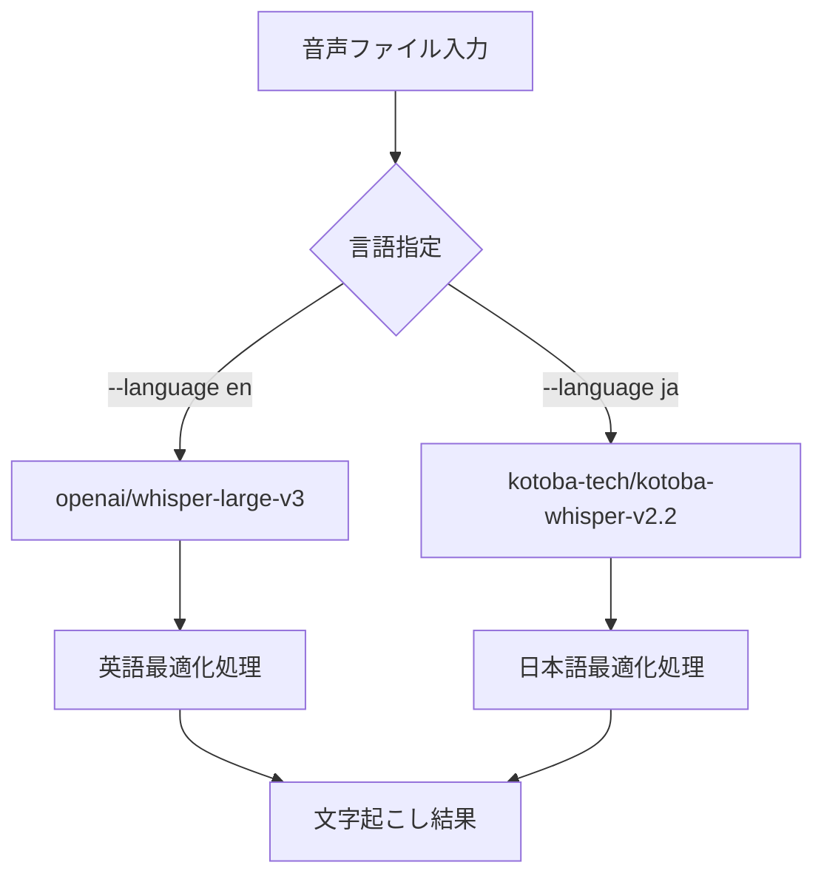
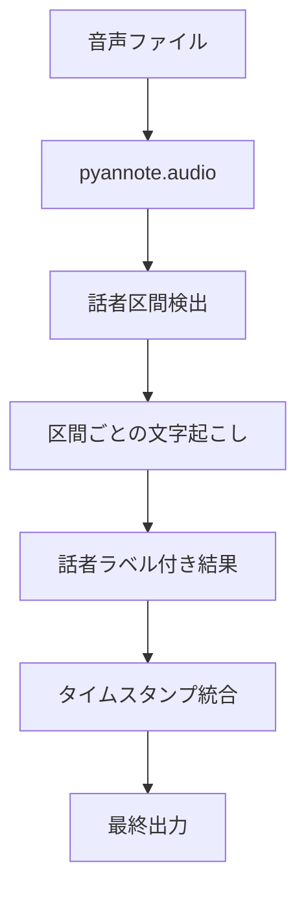

# 音声文字起こしシステム 2025年版 完全ガイド

## 📊 システム概要

### 🎯 主要機能
- **多言語対応**: 日本語・英語の高精度文字起こし
- **話者分離**: pyannote.audio v3.3.2による複数話者の自動識別
- **言語別モデル自動選択**: 言語に応じた最適なWhisperモデルの自動選択
- **Google Drive連携**: 音声ファイルの自動ダウンロード・結果アップロード
- **ローカルファイル対応**: Google Drive認証なしでのローカル処理

### 🔧 技術スタック
- **AI Models**: 
  - 英語: openai/whisper-large-v3
  - 日本語: kotoba-tech/kotoba-whisper-v2.2
  - 話者分離: pyannote/speaker-diarization-3.1
- **Deep Learning**: PyTorch 2.7.1, transformers, pyannote.audio v3.3.2
- **Language**: Python 3.11+
- **Infrastructure**: CUDA GPU推奨、CPU対応

## 🚀 使用方法

### 基本的な文字起こし
```bash
# 日本語音声（自動的にkotoba-whisper-v2.2を使用）
./tc --language ja

# 英語音声（自動的にwhisper-large-v3を使用）
./tc --language en
```

### 話者分離付き文字起こし
```bash
# 日本語音声の話者分離
./tc --language ja --enable-diarization --max-speakers 3

# 英語音声の話者分離
./tc --language en --enable-diarization --max-speakers 2
```

### ローカルファイル処理
```bash
# Google Drive認証不要でローカルファイルを処理
./exec_local.sh audio.wav --language en --enable-diarization
```

## 🔄 処理フロー

### 1. 言語別モデル自動選択


### 2. 話者分離フロー


## 📁 プロジェクト構造

```
tc/
├── tc                          # メインCLIコマンド
├── transcribe.py               # Rich UI対話型CLI
├── speaker_diarization.py      # 話者分離コア実装
├── suppress_warnings.py        # 警告抑制システム
├── config/
│   └── config.yaml            # 設定ファイル
├── core/                      # 統一アーキテクチャ
│   ├── __init__.py            # パッケージ初期化
│   ├── config.py              # 統一設定管理
│   ├── logging.py             # 統一ロガー
│   ├── transcription_interface.py  # 文字起こしエンジン
│   ├── model_manager.py       # モデルキャッシュ管理
│   ├── cli_common.py          # CLI共通ヘルパー
│   ├── cli_workflow.py        # 入力解決・アップロードフロー
│   └── utils.py               # URL検出・デバイス解決
├── handlers/                  # 外部サービスハンドラー
│   ├── __init__.py
│   ├── gdrive.py              # Google Drive クライアント
│   └── youtube.py             # YouTube音声抽出
├── docs/                      # ドキュメント
├── output/                    # 文字起こし結果
├── logs/                      # 実行ログ
└── tests/                     # テストファイル
```

## ⚙️ 設定詳細

### config.yaml の言語別モデル設定
```yaml
whisper:
  language_models:
    ja:
      default: kotoba-tech/kotoba-whisper-v2.2
      alternatives:
        - drewschaub/whisper-large-v3-japanese-4k-steps
        - openai/whisper-large-v3
    en:
      default: openai/whisper-large-v3
      alternatives:
        - large-v3
        - medium
        - small

speaker_diarization:
  enable: false
  model: "pyannote/speaker-diarization-3.1"
  device: "auto"
  output_format:
    show_speaker_labels: true
    speaker_label_format: "話者{num}"
```

## 🧪 テスト・検証

### 利用可能なテストツール
```bash
# 機能統合テスト
python3 quick_test_exec.py

# 話者分離テスト
python3 test_with_local_file.py

# HuggingFace設定確認
python3 setup_huggingface.py

# 長時間音声処理状況確認
python3 quick_exec.py
```

### テスト結果例
- ✅ 英語モデル自動選択: openai/whisper-large-v3
- ✅ 日本語モデル自動選択: kotoba-tech/kotoba-whisper-v2.2
- ✅ 話者分離機能: 正常動作（要HuggingFaceトークン）
- ✅ ローカルファイル処理: Google Drive認証不要

## 📊 パフォーマンス特性

### 処理時間目安
| 音声長 | 通常文字起こし | 話者分離付き |
|--------|---------------|-------------|
| 1分    | 10-30秒       | 1-3分       |
| 10分   | 2-5分         | 20-30分     |
| 60分   | 15-30分       | 2-3時間     |

### ハードウェア要件
- **最小構成**: CPU、8GB RAM
- **推奨構成**: CUDA GPU、16GB RAM
- **話者分離推奨**: GPU必須、16GB以上

## 🔧 トラブルシューティング

### よくある問題と解決法

#### 1. 英語音声が日本語として認識される
**解決済み**: 言語別モデル自動選択機能により解決

#### 2. 話者分離機能が動作しない
```bash
# HuggingFaceトークン設定確認
python3 setup_huggingface.py

# モデルアクセス許可確認
# https://huggingface.co/pyannote/speaker-diarization-3.1
```

#### 3. 長時間音声でタイムアウト
```bash
# ローカルファイル処理を使用
./exec_local.sh long_audio.wav --language en

# 分割処理を検討（10分以下に分割）
```

#### 4. Google Drive認証エラー
```bash
# ローカル処理に切り替え
./exec_local.sh audio.wav --language en --enable-diarization
```

## 🔄 アップデート履歴

### 2025年7月版 主要更新
1. **言語別モデル自動選択**: 英語・日本語で最適なモデルを自動選択
2. **話者分離機能完全実装**: pyannote.audio v3.3.2対応
3. **統一CLI**: main_cli.py による一貫したインターフェース
4. **ローカルファイル対応**: exec_local.sh でGoogle Drive認証不要
5. **警告抑制システム**: クリーンな出力表示
6. **包括的テストスイート**: 自動テスト・検証機能

### 技術的改善
- PyTorch 2.7.1 対応
- HuggingFace Token自動検出（環境変数・CLI両対応）
- エラーハンドリング強化
- メモリ効率化
- パフォーマンス最適化

## 📞 サポート・貢献

### バグレポート・機能要求
- GitHub Issues で報告
- ログファイル（logs/transcribe_*.log）を添付
- 使用コマンドと期待される動作を明記

### 開発参加
- コーディング標準: docs/coding_standards.md 参照
- テスト必須: 新機能には適切なテストを追加
- ドキュメント更新: 機能変更時は関連ドキュメントも更新

## 📜 ライセンス・クレジット

### 使用ライブラリ
- **OpenAI Whisper**: MIT License
- **pyannote.audio**: MIT License  
- **PyTorch**: BSD License
- **Transformers**: Apache 2.0 License

### 開発チーム
- プロジェクト実装: Claude Code Assistant
- アーキテクチャ設計: AI-Human Collaboration

---

**最終更新**: 2025年7月13日  
**バージョン**: v2025.07-speaker-diarization  
**対応言語**: 日本語、英語  
**話者分離**: 完全対応