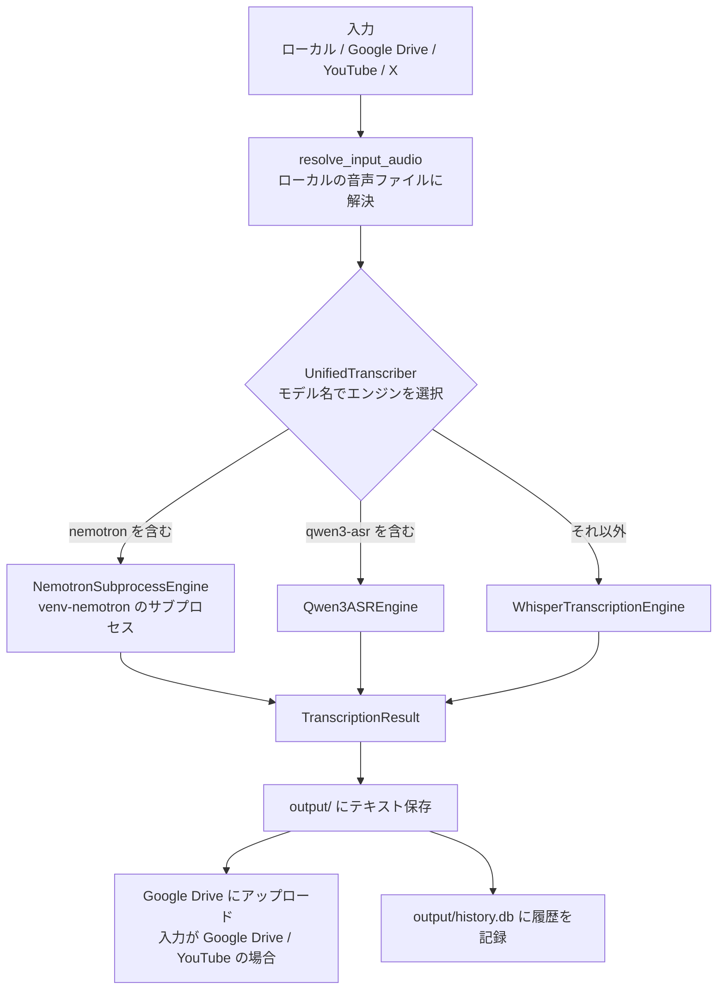

# 音声文字起こしシステム システム概要

> この文書は現行の実装に合わせて更新しています（ファイル名の `2025` は初版の年です）。
> セットアップ手順は `CONTRIBUTING.md` / `DEVELOPMENT.md`、設定の詳細は `docs/user-guides/` を参照してください。
> 2025年7月時点の記録は `docs/historical-records/current_status_2025_july.md` にあります。

## 📊 システム概要

### 🎯 主要機能
- **3つの文字起こしエンジン**: Qwen3-ASR（既定）・Whisper・Nemotron。モデル名で自動切替
- **自動言語判定**: 既定は自動判定。`ja` / `en` などを指定すると強制
- **多様な入力**: ローカルファイル・Google Drive URL・YouTube URL・X（旧Twitter）の動画URL
- **Google Drive連携**: 入力が Google Drive / YouTube の場合、結果を自動アップロード
- **WebUI**: Streamlit のプロトタイプ（キュー処理・変換履歴の閲覧）
- **オプション機能**: 認識ヒント（Qwen3-ASR）、タイムスタンプ付与（Qwen3-ASR、ForcedAligner使用）

話者分離機能は撤去済みです（コミット `ffbe913`、2026-08-05）。

### 🔧 技術スタック
- **AI Models**:
  - 既定: `Qwen/Qwen3-ASR-1.7B`（Qwen3ASREngine）
  - 日本語特化 Whisper: `kotoba-tech/kotoba-whisper-v2.2`、英語等: `openai/whisper-large-v3`（WhisperTranscriptionEngine）
  - `nvidia/nemotron-3.5-asr-streaming-0.6b`（NemotronSubprocessEngine、専用仮想環境）
- **Deep Learning**: PyTorch、transformers、`qwen-asr`
- **音声取得**: yt-dlp（YouTube・X）、Google Drive API
- **UI**: Rich（`transcribe.py`）、Streamlit（`webui.py`）
- **Language**: Python 3.12+、パッケージ管理は uv（`pyproject.toml` / `uv.lock`）
- **Infrastructure**: CUDA GPU 推奨、CPU も可（`--device cpu`）

バージョンの正は `pyproject.toml` と `uv.lock` です。

## 🚀 使用方法

### 基本的な文字起こし
```bash
# config/config.yaml の設定（既定モデル・gdrive.url）で実行
./tc

# ローカルファイル / Google Drive URL / YouTube・X の動画URL
./tc audio.mp3
./tc <動画のURL>

# 言語・モデル・デバイスを指定
./tc audio.mp3 --language ja --device cuda
./tc audio.mp3 --model kotoba-tech/kotoba-whisper-v2.2
```

### Nemotron の使用
```bash
# 初回のみ: 専用の仮想環境 venv-nemotron/ を作成
./scripts/setup_nemotron_venv.sh

./tc audio.mp3 --model nvidia/nemotron-3.5-asr-streaming-0.6b
```

### WebUI の起動
```bash
uv run streamlit run webui.py --server.headless true --server.port 8501
```
内部構成と常駐化は [webui_architecture.md](webui_architecture.md) を参照してください。

### 起動確認（文字起こしを行わない）
```bash
./tc audio.mp3 --dry-run
```

## 🔄 処理フロー

> 図は Mermaid のコードブロックです（機械検査は未実施）。


```mermaid
graph TD
    A["入力<br/>ローカル / Google Drive / YouTube / X"] --> B["resolve_input_audio<br/>ローカルの音声ファイルに解決"]
    B --> C{"UnifiedTranscriber<br/>モデル名でエンジンを選択"}
    C -->|"nemotron を含む"| D["NemotronSubprocessEngine<br/>venv-nemotron のサブプロセス"]
    C -->|"qwen3-asr を含む"| E["Qwen3ASREngine"]
    C -->|"それ以外"| F["WhisperTranscriptionEngine"]
    D --> G["TranscriptionResult"]
    E --> G
    F --> G
    G --> H["output/ にテキスト保存"]
    H --> I["Google Drive にアップロード<br/>入力が Google Drive / YouTube の場合"]
    H --> J["output/history.db に履歴を記録"]
```

## 📁 プロジェクト構造

```
tc/
├── tc                          # メインCLIコマンド
├── transcribe                  # transcribe.py を起動するシェルスクリプト
├── transcribe.py               # Rich UI対話型CLI
├── webui.py                    # WebUI（Streamlit）
├── config.py                   # Google Drive 認証（get_drive_service）
├── suppress_warnings.py        # 警告抑制システム
├── config/
│   ├── config.yaml            # 設定ファイル
│   └── context_hints.txt.sample  # 認識ヒントの書式サンプル
├── core/                      # 統一アーキテクチャ
│   ├── __init__.py            # パッケージ初期化（ロガー構成）
│   ├── config.py              # 統一設定管理
│   ├── logging.py             # 統一ロガー
│   ├── transcription_interface.py  # UnifiedTranscriber・Qwen3-ASR / Whisper エンジン
│   ├── nemotron_engine.py     # Nemotron エンジン（サブプロセス）
│   ├── model_manager.py       # モデルキャッシュ管理（Whisper用）
│   ├── cli_common.py          # CLI共通ヘルパー
│   ├── cli_workflow.py        # 入力解決・アップロード・変換履歴
│   ├── webui_workflow.py      # WebUI のジョブキュー
│   └── utils.py               # URL検出・デバイス解決
├── handlers/                  # 外部サービスハンドラー
│   ├── __init__.py
│   ├── gdrive.py              # Google Drive クライアント
│   └── youtube.py             # YouTube / X 音声抽出
├── scripts/                   # E2E、Nemotron 用 venv 構築などの補助スクリプト
├── docs/                      # ドキュメント
├── output/                    # 文字起こし結果・変換履歴DB
├── logs/                      # 実行ログ（logs/transcription.log）
└── tests/                     # テストファイル
```

## ⚙️ 設定詳細

`config/config.yaml` のうち、コードが読んで動作に影響するキーは次のとおりです。

```yaml
gdrive:
  url: "処理対象のGoogle Drive URL"       # ./tc を引数なしで実行したときの入力
  upload_folder_id: "アップロード先フォルダID"  # 省略時は元ファイルと同じフォルダ

whisper:
  model: Qwen/Qwen3-ASR-1.7B   # モデル名でエンジンが決まる
  language: null                # null は自動判定
  device: cuda                  # cuda / cpu / auto
  context_file: "config/context_hints.txt"   # 認識ヒント（Qwen3-ASR用）
  include_timestamps: false     # true で行頭に [MM:SS]（Qwen3-ASR専用）
```

エンジンの選択規則（`core/transcription_interface.py` の `UnifiedTranscriber.__init__`）:

| モデル名 | エンジン |
|---|---|
| `nemotron` を含む | NemotronSubprocessEngine |
| `qwen3-asr`（または `qwen3_asr`）を含む | Qwen3ASREngine |
| それ以外 | WhisperTranscriptionEngine |

## 🧪 テスト・検証

```bash
# 単体・結合テスト
uv run pytest

# 起動確認（GPU・ネットワーク不要）
uv run pytest tests/test_e2e_dry_run.py -v

# ローカルE2E（ドライラン。E2E_MODE=full で実変換）
./scripts/e2e_local.sh
```

## 📊 パフォーマンス特性

### ハードウェア要件
- **最小構成**: CPU でも動作します（`--device cpu`）
- **推奨構成**: CUDA GPU
- **GPUメモリの実測値**（RTX 4080 SUPER 16GB、コード内コメントの記録）:
  Qwen3-ASR（bf16）のロード後は約11.3GB、ForcedAligner を追加すると約12.5GB。
  Nemotron は5分の音声で最大約7.3GB

### 長音声の処理
- Qwen3-ASR: 300秒（5分）を超える音声はチャンクに分割して処理します
- Nemotron: 350秒を超える音声はストリーミング推論で処理し、失敗した場合は分割方式にフォールバックします
- Whisper: 30秒単位で処理します

## 🔧 トラブルシューティング

よくある問題は [README](../../README.md) の「トラブルシューティング」と
[TROUBLESHOOTING.md](../user-guides/TROUBLESHOOTING.md) を参照してください。

## 📞 サポート・貢献

### バグレポート・機能要求
- リポジトリの Issues で報告
- ログファイル（`logs/transcription.log`）を添付
- 使用コマンドと期待される動作を明記

### 開発参加
- コーディング標準: `docs/developer-guides/coding_standards.md` 参照
- テスト必須: 新機能には適切なテストを追加
- ドキュメント更新: 機能変更時は関連ドキュメントも更新

## 📜 使用ライブラリ
- **PyTorch**: BSD License
- **Transformers**: Apache 2.0 License
- **qwen-asr / Qwen3-ASR**: モデル・パッケージ各自のライセンスに従う
- **yt-dlp**、**Streamlit**: 各自のライセンスに従う
