# WebUI 内部サーバー構成

**対象**: `webui.py` と `core/webui_workflow.py`（Streamlit の WebUI）
**作成日**: 2026-08-05（作成ロール 作/saku）
**更新日**: 2026-10-04（アプリ内部の章（§8〜§12）を追加。運用の章（§1〜§7）を現行の本番稼働に合わせて直した）
**確認方法**: §1〜§7 は実機（本リポジトリの `.venv`、Streamlit 1.60.0、WSL2環境）での起動・ログ採取・
`ss` によるポート確認に基づく。起動ログの例（§2）と Streamlit のスタックの確認（§1）は 2026-08-05 の採取で、
2026-10-04 に再確認したのは Streamlit のバージョン、本番の待受（§3）、サービスファイル（§7）、
`tc-prod` の構成（§7）。§8〜§12 はコードの読解に基づく（画面操作での実機確認は、そう書いた箇所を除いて未実施）。

**この文書の位置づけ**: 利用者向けの操作手順は別の文書（利用者向けガイド）に任せ、WebUI の挙動の要点
（キュー、進捗、作業領域の整理、履歴）はこの文書（§8〜§12）に集約する。リリースと再起動の手順は
[運用・リリース手順書](release_operations.md) にある。

---

## 1. サーバースタック

`webui.py` は Streamlit を通じて以下のスタックで動作する（実機確認: `uv pip show streamlit`）。

```
$ uv pip show streamlit
Name: streamlit
Version: 1.60.0
Requires: altair, anyio, blinker, click, gitpython, httptools, itsdangerous, numpy,
          packaging, pandas, pillow, protobuf, pyarrow, pydeck, python-multipart,
          requests, starlette, tenacity, toml, typing-extensions, uvicorn, watchdog,
          websockets
```

- **ASGIアプリケーション**: [Starlette](https://www.starlette.io/)。本バージョンのStreamlitパッケージ内に
  `streamlit/web/server/starlette/`(`starlette_app.py`・`starlette_server.py`・`starlette_websocket.py`等)
  が実在することを実機確認済み。
- **ASGIサーバー**: [uvicorn](https://www.uvicorn.org/)。`starlette_server.py` 内で
  `uvicorn.Config` を組み立て `uvicorn.Server(uvicorn_config)` を生成・`.run()` する実装であることを
  ソース実測で確認済み（`grep -n "uvicorn\." streamlit/web/server/starlette/starlette_server.py` で
  複数箇所ヒット）。
- **Tornadoは不使用**: 旧バージョンのStreamlitはTornadoベースのサーバー実装だったが、
  **本バージョン(1.60.0)ではTornadoへの依存が無い**ことを実機確認済み(`uv pip show tornado` →
  `Package(s) not found`、パッケージ自体が未インストール)。Streamlitの過去バージョン情報を参照する際は
  Tornado前提の記述と混同しないよう注意すること。

## 2. 起動コマンドと起動ログ

**起動コマンド**（開発時の手動起動。ブラウザを自動で開く既定動作を含む）:

```bash
uv run streamlit run webui.py
```

**ヘッドレス起動**（自動テスト・サーバー環境向け。ブラウザ自動起動を抑制。`--server.headless` の
既定値はLinuxでSSH接続時など一部条件でtrueになる場合があるが、明示指定が確実）:

```bash
uv run streamlit run webui.py --server.headless true --server.port 8501
```

**ポートについて**: 本番（systemd、§7）のポートは **8501**。この文書のコマンド例も 8501 に揃えている。
下の起動ログの例だけは、2026-08-05 に検証用として 8503 で起動して採取した**過去の記録**で、
ポート番号と IP アドレス以外の形式は今も同じと考えられる（再採取はしていない）。

**起動ログの代表例**（2026-08-05 に実機で採取。ポート 8503 で起動した検証用の記録）:

```
Collecting usage statistics. To deactivate, set browser.gatherUsageStats to false.

2026-08-05 00:46:31.199 Uvicorn server started on :::8503

  You can now view your Streamlit app in your browser.

  Local URL: http://localhost:8503
  Network URL: http://172.28.0.5:8503
  External URL: http://203.0.113.1:8503

  Detected WSL. Using poll-based file watching for better compatibility. To force watchdog, set server.fileWatcherType = "watchdog".
```

- 1行目「Collecting usage statistics」は Streamlit の匿名利用統計収集に関する案内。
  `~/.streamlit/config.toml` または起動フラグで `browser.gatherUsageStats = false` を設定すると
  収集を無効化できる（本プロジェクトでは未設定＝既定の収集有効状態）。
- 「Uvicorn server started on :::8503」がASGIサーバー(uvicorn)の起動完了ログ(本番なら `:::8501`)。

## 3. バインド・公開URLとセキュリティ注意

起動ログに表示される3種のURLの意味:

| URL種別 | 意味 |
|---|---|
| Local URL | サーバーを実行しているマシン自身からのアクセス用(`localhost`)。 |
| Network URL | 同一LAN/プライベートネットワーク上の他端末からアクセスする際のURL(実機確認時はWSL2の内部ネットワークアドレスが表示された。例: `172.28.0.5` は例示用のプレースホルダで、実際の値は環境ごとに異なる)。 |
| External URL | インターネット経由でグローバルにアクセス可能な場合のURL(実機確認時は開発機の実際のグローバルIPが表示された。例: `203.0.113.1` はRFC 5737のドキュメント用予約アドレスによる例示であり、実測値そのものではない)。 |

**バインドアドレスの実機確認**: `--server.address` を指定しない場合(既定は未設定)、サーバーは
**全インターフェースにバインドされる**。2026-08-05 の検証起動(8503)で実測確認した結果:

```
LISTEN 0      2048                *:8503             *:*    users:(("streamlit",...))
```

**本番の実測(2026-10-04、`ss -ltnp`)**: 稼働中の本番サービス(§7。`ExecStart` に `--server.address` の指定は無い)も
同じく全インターフェースで待ち受けている。

```
LISTEN 0      2048                *:8501             *:*    users:(("streamlit",pid=451,fd=7))
```

`*:8501`(IPv6表記では `:::8501`)は全アドレスでの待受を意味する。`uv run streamlit run --help`
の `--server.address` 説明文でも「Default: (unset)」であることが明記されており、既定動作として
特定アドレスへの制限は行われない。

**🚨 セキュリティ上の注意事項(必須記載事項)**:

- `webui.py` は**認証機構を一切実装していない**(本ソース内に認証・アクセス制御コードは存在しない)。
- 上記のとおり既定で全インターフェースにバインドされるため、ファイアウォール等で外部到達性が
  確保された環境(クラウドVM・ポート開放されたネットワーク等)で起動すると、
  **認証なしで誰でも音声のアップロード・文字起こし実行・変換履歴(結果テキスト含む)の閲覧が
  可能な状態になる**。
- ローカル開発・検証以外の用途で起動する場合は、以下のいずれかの対策を必ず講じること:
  - `--server.address 127.0.0.1` を指定しローカルホストのみへバインドを限定する。
  - リバースプロキシ(nginx等)でBasic認証・IP制限を前段に設ける。
  - VPN等、信頼できるネットワーク経由でのみアクセス可能にする。
- 本番も同じ構成(認証なし・全インターフェースで待受)であり、到達できる範囲は、ホストのネットワークと
  ファイアウォールの設定で決まる。到達範囲の制限は WebUI の外側(ネットワーク)の責任になる。
- 本プロトタイプ(Phase2)の時点では認証機能は設計・実装のいずれにも含まれていない
  (`00_レビュー依頼/作から計への設計書_WebUIフレームワーク選定とプロトタイプ方針_20260806.md`にも
  認証に関する記載なし)。認証機能が必要な場合はPhase3以降の検討課題として別途起案すること。

## 4. WSL2固有の挙動

本プロジェクトの開発環境(WSL2)で起動すると、起動ログに以下が実機確認された:

```
Detected WSL. Using poll-based file watching for better compatibility. To force watchdog, set server.fileWatcherType = "watchdog".
```

- Streamlitは既定でファイル変更監視に`watchdog`パッケージ(inotify等のOSネイティブ機構を利用)を
  使うが、**WSL2環境を検知するとポーリング方式(定期的にファイルの変更有無を確認する方式)へ
  自動フォールバックする**。
- これはWSL2のファイルシステム(特にWindows側ドライブをマウントしている場合)でinotifyイベントが
  正しく配送されないケースがあるための互換性対応。
- ポーリング方式は監視間隔ぶんの検知遅延が生じるが、`webui.py`は開発中のホットリロード
  (`server.runOnSave`)を前提とした設計ではないため、通常利用への実害はない。
- 明示的に `watchdog` 方式を強制したい場合は `--server.fileWatcherType watchdog` を指定できる
  (ログの案内どおり)。WSL2特有の制約下では非推奨。

## 5. 通信方式

ブラウザとサーバー間は **WebSocket** で状態同期する。Streamlitパッケージ内に
`streamlit/web/server/starlette/starlette_websocket.py`(冒頭コメント:
`"""WebSocket handling for the Starlette server."""`)が実在することを実機確認済み。

**実行モデル**: Streamlitはユーザー操作(ウィジェット操作等)のたびに**スクリプト全体を再実行**し、
差分をWebSocket経由でブラウザへ配信する(仮想DOM的な差分配信)。これが `webui.py` の
`st.session_state` を多用した状態管理(`st.session_state["job_queue"]` へのジョブキュー
(`core/webui_workflow.py` の `TranscriptionJobQueue`)の保持等)の設計上の理由である。

**`@st.fragment(run_every="1s")` による部分再実行**: `webui.py` の `_render_queue_and_result()`
はフラグメント化されており、画面全体ではなく該当部分のみを1秒間隔で自動再実行してポーリング的に
進捗を再描画する。この設計の詳細な採用理由は既存設計書で扱い済み:

> 5節「5分チャンク分割処理の非同期・安定動作方式」…UI側の自動更新には `st.fragment(run_every="1s")`
> （Streamlit 1.37+の部分再実行機能）を採用し、進捗表示部分のみを1秒間隔で再描画する。これにより
> 画面全体の再実行（Streamlitのデフォルト動作）によるチラつき・状態喪失を避ける。
>
> — `00_レビュー依頼/作から計への設計書_WebUIフレームワーク選定とプロトタイプ方針_20260806.md` §5

## 6. 起動/停止・ログ確認の正式な手順

本番(`tc-prod`)の WebUI は systemd で常駐している(§7)。この節の手動起動は、開発機での確認や
自動テスト用で、**本番のサービスと同じポート(8501)で起動すると衝突する**。本番が動いている間は、
別のポート(例: 8503)で起動すること。

### 起動(フォアグラウンド、開発時の通常利用)

```bash
uv run streamlit run webui.py
```

ブラウザが自動で開く(WSL2からWindows側ブラウザが開かない場合は、起動ログのLocal URLを
手動でブラウザに貼り付ける)。停止は起動したターミナルで `Ctrl+C`。

### 起動(バックグラウンド、動作確認・自動テスト用途)

```bash
nohup uv run streamlit run webui.py --server.headless true --server.port 8501 \
  > /tmp/webui.log 2>&1 &
echo $!   # PIDを控える
```

Streamlit 自体の標準出力・標準エラー(起動ログ、例外のトレース)は、上記のようにリダイレクトして初めて
ファイルに残る。アプリのログ(キューの状態遷移など)は別に、`logs/transcription.log` へ出る(下の「ログ確認」)。

### 起動確認(ヘルスチェック)

```bash
curl -sf http://localhost:8501/_stcore/health
# 正常時: "ok" を返す
```

### ログ確認

ログは 2 か所ある。

**アプリのログ（`logs/transcription.log`）**: `webui.py` の `main()` が `core.logging.setup_logging()` を呼び、
キューの状態遷移（`状態遷移 item_id=… QUEUED->PROCESSING …`）、入力解決の開始・完了、作業領域の整理などを記録する。

```bash
tail -f logs/transcription.log
```

- 形式: `%(asctime)s - %(name)s - %(levelname)s - %(message)s`
- ローテーション: `RotatingFileHandler`、1 ファイル 10MB、5 世代（`transcription.log.1` 〜 `.5`）
  （`core/logging.py`）。
- pytest の実行中は本番のログを汚さないよう `logs/transcription_test.log` に出る。
- `tc-prod` では `logs` が `/home/abem/Projects/tc/logs` へのシンボリックリンクなので、本番も開発用チェックアウトも
  同じログファイルに書く（§7「tc-prod の構成」）。

**Streamlit のログ（起動ログ・例外）**: 手動でリダイレクトした場合は `/tmp/webui.log`、systemd 経由なら
`journalctl --user -u tc-webui.service`（§7）。起動ログに Local/Network/External URL・WSL2ポーリング注記等
（2〜4節参照）が出力される。

### 停止

```bash
# 起動時に控えたPIDで停止
kill <PID>

# PIDを控えていない場合、プロセス名で検索して停止
pkill -f "streamlit run webui.py"
```

### 稼働中プロセス・ポートの確認

```bash
ss -tlnp | grep <PORT>
# または
ps aux | grep "streamlit run webui.py"
```

## 7. systemdによる常駐化・自動起動

6節の起動/停止手順は開発時の手動運用(フォアグラウンド/バックグラウンド起動)を前提としている。
**systemdユーザーサービスによる常駐化は、これとは別の本番の運用モード**であり、
ログイン有無に関わらずマシン起動時に自動でWebUIを起動し、プロセスが落ちた場合も自動再起動する。

> ⚠️ 以下は**本開発機(WSL2、ユーザー`abem`)で実際に構築・実機確認した環境固有の設定例**である。
> 他ホストで同様の常駐化を構築する場合の**再現手順**として記載する。ユーザー名・作業ディレクトリ
> パス等は環境ごとに異なるため、自環境の値に置き換えて適用すること(§3節のIPアドレス
> プレースホルダ化と同じ配慮)。

### tc-prod の構成と、本番の更新の意味

本番の WebUI は `/home/abem/Projects/tc-prod`（git のチェックアウト。ブランチは **dev**）で動く。
開発用の作業ツリー（`/home/abem/Projects/tc` と、その配下の worktree）とは別のディレクトリである。
`tc-prod` の中身は、コードを除いて開発用の `/home/abem/Projects/tc` と共有する
（`ls -la /home/abem/Projects/tc-prod` で 2026-10-04 に確認）。

| `tc-prod` 内の名前 | 実体 |
|---|---|
| `output` | `/home/abem/Projects/tc/output` へのシンボリックリンク（出力テキスト、`history.db`、`uploads`、`queue_downloads`） |
| `logs` | `/home/abem/Projects/tc/logs` へのシンボリックリンク |
| `.venv` | `/home/abem/Projects/tc/.venv` へのシンボリックリンク |
| 環境変数ファイル（隠しファイルの `.env`） | `/home/abem/Projects/tc/` の同名ファイルへのシンボリックリンク（内容は読まない） |
| Google Drive の認証ファイル 2 つ（`credentials.json`、`token.pickle`） | `/home/abem/Projects/tc/` の同名ファイルへのシンボリックリンク（内容は読まない・消さない） |
| `venv-nemotron` | `/home/abem/Projects/tc/venv-nemotron` へのシンボリックリンク |

- **`tc-prod` の dev を更新することが、本番コードの更新**である。コードを置き換えただけでは、稼働中の WebUI には
  反映されない（`--server.fileWatcherType none` のため。下のサービスファイル）。反映するにはサービスの再起動が要る。
- 出力・履歴・ログが開発用と共有なので、開発機で動かした WebUI やテストの出力も、同じ `output/` に入る。
- 統合から再起動までの手順は `scripts/release_dev_main.sh`（[運用・リリース手順書](release_operations.md)）。

### サービスファイル

`~/.config/systemd/user/tc-webui.service`(**このファイル自体はリポジトリ管理対象外**。
ホームディレクトリ配下`~/.config/`にあり、Gitの追跡範囲外)。実機で`cat`して再確認した内容:

```ini
[Unit]
Description=tc WebUI (Streamlit) - Transcribe Audio
After=network.target

[Service]
Type=simple
WorkingDirectory=/home/<ユーザー名>/Projects/tc-prod
ExecStart=/home/<ユーザー名>/.local/bin/uv run streamlit run webui.py --server.headless true --server.port 8501 --server.fileWatcherType none
Restart=on-failure
RestartSec=5

[Install]
WantedBy=default.target
```

(`WorkingDirectory`・`ExecStart`内の`<ユーザー名>`部分は環境固有値のプレースホルダ。
本開発機での実際の値は`abem`。`WorkingDirectory`は常駐運用用に配置したチェックアウト
(本開発機では`tc-prod`)で、開発用の作業ツリーとは別である。`--server.fileWatcherType none`は
ファイル変更の監視を無効にする指定で、ソースを編集しても稼働中のWebUIが自動リロードされない。
反映するには再起動する)。

### 有効化コマンド

```bash
systemctl --user daemon-reload && systemctl --user enable --now tc-webui.service
```

`daemon-reload`でユニットファイルの変更をsystemdに反映し、`enable --now`で自動起動を有効化した上で
即座に起動する(実機実行済み、既に有効化・稼働中の状態に対しては冪等に成功することを確認)。

### ログイン無しでの自動起動(linger)

systemdユーザーサービスは既定では、そのユーザーが一度もログインしていない状態(SSH未接続等)では
起動しない。`loginctl enable-linger <ユーザー名>` を実行すると、ログイン有無に関わらずユーザーの
systemdインスタンスがマシン起動時から動き続ける(本開発機で実機確認: `loginctl show-user abem`の
出力に`Linger=yes`を確認済み)。

**これはユーザーアカウント単位のシステム設定であり、リポジトリのコード変更ではない**
(`~/.config/systemd/`同様、Git管理対象外)。

```bash
loginctl enable-linger <ユーザー名>
```

### 運用コマンド

```bash
# 状態確認(稼働中プロセスのPID・メモリ使用量・直近ログが表示される)
systemctl --user status tc-webui.service

# 再起動(コードの反映等。必ず下の「再起動の前に」を満たしてから)
systemctl --user restart tc-webui.service

# 停止(常駐化を一時的に止める。自動起動の無効化はenableの取り消しが別途必要)
systemctl --user stop tc-webui.service

# ログ確認(リアルタイム追尾)
journalctl --user -u tc-webui.service -f

# ログ確認(直近N件、追尾しない)
journalctl --user -u tc-webui.service -n 20 --no-pager
```

**再起動の前に（必須）**: 再起動・停止すると、処理中のジョブ（ダウンロード・文字起こし）と、処理待ちの項目は
失われる（ジョブのスレッドとキューはサービスのプロセスの中にあるため。§8）。

1. WebUI の画面（キュー状態）で、解決中・待機・処理中の項目が無いことを確認する。ただしキューは
   ブラウザセッション単位なので（§8）、別のブラウザの投入分は画面に出ない。
2. 画面で確認できない場合は、`logs/transcription.log` の `状態遷移` 行で、サービスの起動後に
   DONE / FAILED になっていない `item_id` が無いことを確認する。
3. 統合してから再起動する場合は、`scripts/release_dev_main.sh` を使う。スクリプトが上の確認を
   自動で行い、ジョブがあれば何も変更せずに止まる（[運用・リリース手順書](release_operations.md)）。

再起動後は、ヘルスチェック（`curl -sf http://localhost:8501/_stcore/health` が `ok` を返す）で確認する。

実機で実行して確認したのは、`systemctl --user status`、`journalctl` の直近表示（以上 2026-08-05）、
`ss -ltnp`、サービスファイルの `cat`、`ls -la /home/abem/Projects/tc-prod`、`git -C` での `tc-prod` のブランチ確認
（以上 2026-10-04）。`restart` と `stop` は、稼働中のサービスが実際の利用で使われているため、この文書の
作成・更新では**実行していない**。

`journalctl`経由のログは、6節で説明した Streamlit の標準出力・標準エラーをsystemdが代替する形になる
(systemd-journaldへ自動的に取り込まれるため、6節のような`nohup ... > file 2>&1`によるリダイレクトが不要)。
アプリのログ(`logs/transcription.log`)はjournalとは別に、6節のとおりファイルに出る。

## 8. アプリの構造（キューとスレッド）

ここから §12 までは、アプリ内部の説明で、**コードの読解に基づく**（`webui.py`、`core/webui_workflow.py`、
`core/progress.py`、`core/housekeeping.py`、`core/utils.py`、`core/history.py`、`core/cli_workflow.py`）。
画面を実際に操作しての確認は、この更新では行っていない。

**画面の構成**: `main()`（`webui.py`）は「文字起こし」と「履歴」の 2 つのタブを作る。「文字起こし」タブは
入力フォーム、設定パネル、コンテキストのヒント、「キューに追加」ボタン、キューの表示（フラグメント）の順。

**キューはブラウザセッション単位**: ジョブキュー（`TranscriptionJobQueue`）は `st.session_state["job_queue"]` に
持つ（`_get_queue()`、`webui.py` L232-235）。`st.session_state` は Streamlit が**ブラウザのセッションごと**に持つ
ので、コードの読解からは次のことになる（**実機では未確認**）。

- 別のタブや別のブラウザ、ページの再読み込みでは、新しいセッションになり、**キューの一覧（待機・処理中・完了済み）が
  見えなくなる**。
- 一方、文字起こしのスレッドと解決のスレッドはサービスのプロセスの中で動き続け、完了すれば `finalize_transcription` が
  保存・アップロード・履歴の記録まで行う。結果のテキストは `output/` に、履歴は `output/history.db`（「履歴」タブ）に残る。
  見えなくなるのは、画面上のキュー一覧と、完了済みの詳細表示だけである。
- 同じ理由で、複数の人（複数のブラウザ）が投入した分は、互いのキューには出ない。ただし処理は**サービス全体で 1 件ずつ
  ではなく、セッションごとに 1 件**（キューがセッションごとにあるため）。複数のセッションから投入すると、
  GPU 上で複数の文字起こしが同時に走り得る（コードの読解による。この点も実機未確認）。
- サービスを再起動すると、プロセスのスレッドとセッションが失われ、処理中・待機中の項目は消える（§7「再起動の前に」）。

**スレッド**: 文字起こしのスレッド（`start_transcription_job`、`core/webui_workflow.py`）と、入力解決のスレッド
（`_start_resolution_job`、`webui.py`）は、どちらもデーモンスレッドで、画面の再描画（スクリプトの再実行）とは独立に動く。
画面の更新は `@st.fragment(run_every="1s")` の `_render_queue_and_result()`（`webui.py` L463-）が毎秒呼ばれて行い、
状態の遷移（開始・完了・失敗の確定）もこの関数が行う。

## 9. キュー項目の状態遷移

`QueueItemState`（`core/webui_workflow.py` L68-93）は 5 つの状態を持つ。`str` を継承した `Enum` なので、Streamlit の
自動リロードでモジュールが再読込されても `QueueItemState.DONE == "done"` が成り立つ（tc-ops #548 の是正）。



| 遷移 | メソッド（`core/webui_workflow.py`） | 呼び出し元 | 条件 |
|---|---|---|---|
| (新規)→RESOLVING | `enqueue_pending`（L147-159） | `webui._enqueue_job`（L344） | 「キューに追加」で、URL かアップロードがある |
| RESOLVING→QUEUED | `resolve_success`（L161-166） | `_start_resolution_job` の `_run`（`webui.py` L285） | 解決が成功。`resolution` を設定し、進捗を初期化する |
| RESOLVING→FAILED | `resolve_failed`（L168-176） | `_run` の例外（`webui.py` L277）、または `resolution is None`（L283） | 解決で例外、または入力が無い。後続の項目には影響しない |
| QUEUED→PROCESSING | `dispatch_next`（L198-218） | `_dispatch_next_job`（`webui.py` L350-352。フラグメントが毎秒呼ぶ、L484） | PROCESSING が無く QUEUED があるとき、先頭を起動する（同時に 1 件） |
| PROCESSING→DONE | `mark_done`（L220-226） | フラグメント（`webui.py` L482） | `job.done` かつ `job.error is None`（保存・アップロード・履歴・一時音声の削除のあと） |
| PROCESSING→FAILED | `mark_failed`（L228-233） | フラグメント（`webui.py` L479） | `job.done` かつ `job.error` がある |

- **DONE と FAILED は終端**で、以後は遷移しない。FAILED の項目があっても、後続の QUEUED は止まらない。
- `enqueue`（L135-145。直接 QUEUED にする）は `webui.py` からは呼ばれない。テストと後方互換のために残している。
- 遷移のたびに `logs/transcription.log` へ `状態遷移 item_id=N A->B ...` が出る（新規は `(新規)->RESOLVING`）。
  リリース用スクリプトは、この行でジョブの有無を判定する（[運用・リリース手順書](release_operations.md)）。

## 10. 1 件の処理の流れ

同時に処理するのは 1 件（GPU とモデルが 1 インスタンスのため。`TranscriptionJobQueue` の docstring）。
投入は処理中でも受け付ける。

- **入力フォーム**: URL（YouTube / X / Google Drive）かファイルのアップロード。「キューに追加」で `_enqueue_job` を呼ぶ。
- **`_enqueue_job`**（`webui.py` L305-347）: 入力の検証（どちらも無ければエラー表示）→ 投入ごとの token の生成
  （`uuid4` の先頭 8 文字）→ 設定の確定（`device` を解決し、コンテキストを書き戻す）→ ラベルの決定（URL は 1 行化、
  アップロードは保存名と同じ安全な名前）→ `_sweep_old_files`（§11）→ `enqueue_pending`（RESOLVING）→ 解決スレッドの開始。
  この関数は `st.*` の呼び出し（Streamlit の暗黙の中断点）を、入力検証のエラー表示を除いて含まず、
  キューへの追加は中断されない（tc-ops #440 是正3）。
- **解決スレッド**（`_start_resolution_job` の `_run`）: `_resolve_input` で、URL なら `resolve_input_audio`
  （ダウンロード。`output/queue_downloads/<token>/`）、アップロードなら保存（§11）。成功なら `resolve_success`、
  例外か入力なしなら `resolve_failed`。
- **QUEUED → PROCESSING**: フラグメントが毎秒 `dispatch_next` を呼び、`_start_job_from_item` が設定から
  `TranscriptionConfig` と `UnifiedTranscriber` を作って、文字起こしスレッドを開始する。
- **文字起こしスレッド**: `UnifiedTranscriber.transcribe()` を `progress_callback` つきで実行する。結果は `job.result`、
  例外は `job.error` に入り、最後に `job.done = True`。
- **フラグメント**（毎秒）: `drain_progress` で進捗を取り出し `apply_progress` で反映（§11）。`job.done` になったら、
  成功なら `_save_and_record`（`core.cli_workflow.finalize_transcription`: 保存 → アップロード → 履歴 → 一時音声の削除）
  のあと `mark_done`、失敗なら一時音声を削除して `mark_failed`。
- 完了した項目は「完了済み一覧」に出る（結果のプレビュー、保存先、Drive の URL）。

## 11. 進捗表示・作業領域・安全化・履歴

### 進捗表示の流れ



- **文字起こし側**: エンジンが `emit_progress`（`core/progress.py`）で `ProgressMessage(text, fraction)` を
  `progress_callback` に渡す。`ProgressMessage` は `str` のサブクラスで、`fraction`（0.0〜1.0。`None` は率が不明）を持つ。
  `start_transcription_job` のコールバックがこれを `job.progress_queue` に積み、フラグメントが `drain_progress`
  （ノンブロッキング）で全部取り出す。率を出すのは Qwen3-ASR の長音声（チャンク）と Whisper（30 秒チャンク）。
- **ダウンロード側**: `handlers/youtube.py` が yt-dlp の進捗行を `parse_ytdlp_progress` で率にして `emit_progress` で通知し、
  `on_status`（解決スレッドの `_on_status`）経由で、キューを通さずに直接 `apply_progress` へ渡す。
- **`apply_progress`**（`core/webui_workflow.py` L236-243）: `ProgressMessage` なら `item.progress` と
  `item.progress_text` に反映して `True` を返す。通常のメッセージは `False` を返し、呼び出し側が `item.log` に追記する
  （進捗は頻繁に届くので、ログには積まない）。
- **表示**（`_render_item_progress`、`webui.py` L449-460）: 率があれば進捗バー、無ければ経過時間つきの文言。
  経過は `format_elapsed`（`m:ss`、1 時間以上は `h:mm:ss`）、残りは `estimate_remaining`（経過 ×（1−率）÷ 率。
  **率が不明、または 3% 未満のときは出さない**）。率が取れない場合（短い音声、Nemotron）は経過時間のみ。
- **持ち越さない**: 解決（ダウンロード）段階の進捗は、`resolve_success` と `dispatch_next` が `progress` を初期化するので、
  文字起こし段階には持ち越されない。

### 作業領域と整理

| 場所 | 内容 | 保持 |
|---|---|---|
| `output/uploads/<一意>/<サニタイズ済み名>` | アップロードされたファイル | 7 日（`UPLOAD_RETENTION_DAYS`） |
| `output/queue_downloads/<token>/` | URL 入力のダウンロード（処理後の音声は削除され、空のディレクトリや失敗時の部分ファイルが残る） | 1 日（`DOWNLOAD_RETENTION_DAYS`） |

- 新しい投入のたびに、`_enqueue_job` が `_sweep_old_files`（`webui.py` L290-302）を呼び、`cleanup_old_entries`
  （`core/housekeeping.py`）で、保持期間を過ぎた項目を削除する。
- **QUEUED / PROCESSING の項目が使うファイルは、古くても消さない**。シンボリックリンクは辿らず、消さない。
  1 件の削除に失敗しても警告だけで続行する。
- 保持期間が 1 日未満の指定は `ValueError`（`MIN_RETENTION_DAYS`。全削除の事故を防ぐ）。
- **整理の失敗は投入を止めない**（`_sweep_old_files` は例外を警告ログにして続行する）。
- アップロードの履歴が記録する元ファイルのパスは、7 日後には存在しなくなる（`docs/spec` の D7）。

### アップロードの安全化と、ログ・ラベルの 1 行化

- **ファイル名**: `sanitize_upload_filename`（`core/utils.py`）が、区切り文字（`/`・`\`）より前のディレクトリ部分と
  制御文字を除き、最大 200 文字（超える分は拡張子を残して切り詰め）にする。空・`.`・`..` は `upload`。
- **保存先**: アップロードごとに `tempfile.mkdtemp` で一意なサブディレクトリを作り（同名のファイルを続けて
  アップロードしても互いを上書きしない）、保存先の親が `output/uploads/` の直下でなければ `ValueError`
  （`_resolve_input`、`webui.py` L211-218）。
- **1 行化**: `one_line`（`core/utils.py`）が、URL・アップロード名・エラー文の制御文字を `\n`・`\x1b` のような
  見える形にエスケープし、`limit`（既定 200 文字、エラー文は 1000 文字）を超える分を `…` で切る。ログの偽装と
  端末の制御シーケンスの混入を防ぐ。

### 履歴

- 履歴は `output/history.db`（SQLite。キーワード検索は FTS5 の仮想テーブル `transcription_history_fts`）。
  DDL とトリガーは `core/cli_workflow.py`、検索と一括削除は `core/history.py`
  （`connect_history` / `search_history` / `count_history_before` / `delete_history_before`）。
- 記録は `finalize_transcription` が行う（tc / `transcribe.py` / WebUI 共通）。
- 「古い履歴の一括削除」（履歴タブ）は **DB の行だけ**を消す。`output/` のファイルと Google Drive 上のファイルは消さない。
  UI は 2 段階（「① 対象件数を確認」→「② N 件を削除する」）で、確認時の日付と件数を `st.session_state` に持ち、
  N を変えると確認が無効になる（`_render_history_cleanup_section`、`webui.py` L530-）。

## 12. 変更時の注意

- 状態遷移を足す・変えるときは、`TranscriptionJobQueue` のメソッドを通す（直接 `item.state` を書かない）。
  遷移のログ行（`状態遷移 item_id=N A->B`）は、リリース用スクリプトのジョブ判定が読むので、書式を変えない
  （変えると、ログからのジョブ判定が働かなくなる恐れがある。`dispatch_next呼び出し` の行も同じ。`tests/test_release_script.py` が判定を検査している）。
- `QueueItemState` の比較は `==` を使う（`is` は自動リロード後に一致しない。§9）。
- スレッドから Streamlit の UI（`st.*`）を呼ばない（`ScriptRunContext` が無い）。UI への反映は項目のフィールドを
  更新し、フラグメントの再描画に任せる。

---

## 【参考】検査コマンド一覧(本文書作成時に実機実行したコマンド)

```bash
uv pip show streamlit
uv pip show tornado
find "$(uv run python3 -c 'import streamlit, os; print(os.path.dirname(streamlit.__file__))')" \
  -iname "*starlette*" -o -iname "*uvicorn*"
grep -n "uvicorn\." <streamlit_install_dir>/web/server/starlette/starlette_server.py
uv run streamlit run --help
uv run streamlit run webui.py --server.headless true --server.port 8503 &
ss -tlnp | grep 8503
curl -sf http://localhost:8503/_stcore/health
grep -n "WebSocket" <streamlit_install_dir>/web/server/starlette/starlette_websocket.py

# 7節(systemd常駐化)分(2026-08-05)
systemctl --user status tc-webui.service
cat ~/.config/systemd/user/tc-webui.service
loginctl show-user <ユーザー名> | grep -i linger
systemctl --user daemon-reload
systemctl --user enable --now tc-webui.service
journalctl --user -u tc-webui.service -n 20 --no-pager

# 2026-10-04 の再確認分
uv pip show streamlit
ss -ltnp | grep 8501
cat ~/.config/systemd/user/tc-webui.service
ls -la /home/abem/Projects/tc-prod
git -C /home/abem/Projects/tc-prod branch --show-current
```
