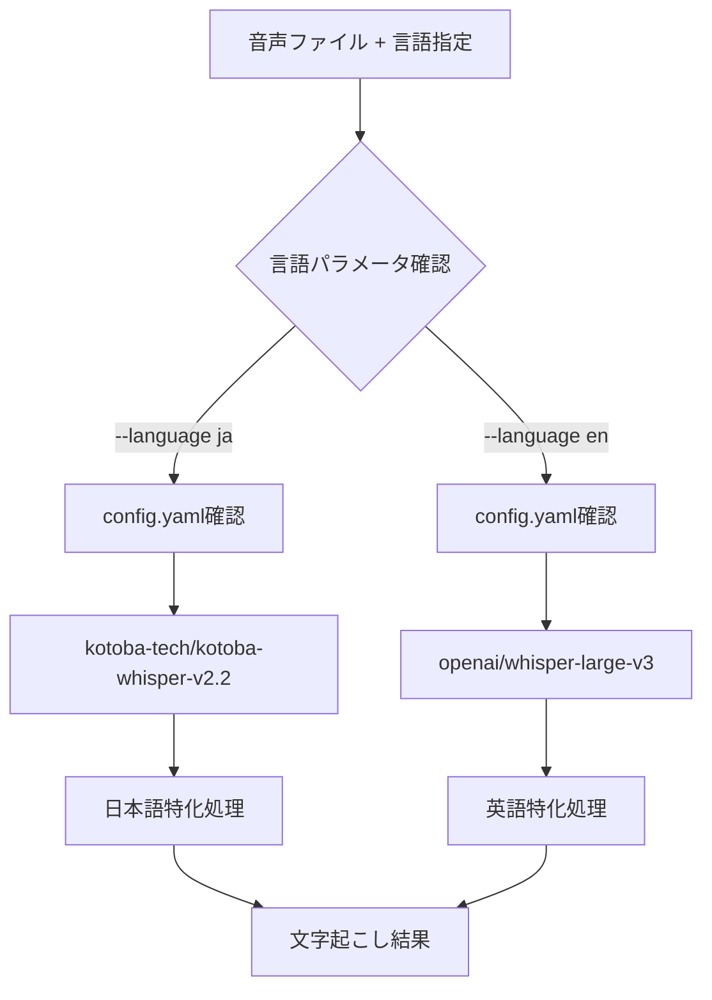

# 多言語対応ガイド - 言語別モデル自動選択

## 📋 概要

本システムでは、音声の言語に応じて最適なWhisperモデルを自動選択する機能を実装しています。これにより、各言語に特化したモデルを使用して、高精度な文字起こしを実現できます。

## 🎯 対応言語とモデル

### 日本語 (`--language ja`)
- **メインモデル**: `kotoba-tech/kotoba-whisper-v2.2`
- **特徴**: 日本語音声に特化した高精度モデル
- **最適化内容**: 
  - 日本語の音韻体系に最適化
  - ひらがな・カタカナ・漢字の適切な変換
  - 日本語特有の言い回し・表現に対応

### 英語 (`--language en`)
- **メインモデル**: `openai/whisper-large-v3`
- **特徴**: 英語音声の標準的な高精度モデル
- **最適化内容**:
  - 英語の音韻・アクセント・発音に最適化
  - 多様な英語方言・アクセントに対応
  - 専門用語・固有名詞の認識精度向上

## 🔄 自動選択メカニズム

### 1. 基本的な動作フロー


### 2. 設定ファイル統合
config.yamlの言語別モデル設定:
```yaml
whisper:
  language_models:
    ja:
      default: kotoba-tech/kotoba-whisper-v2.2
      alternatives:
        - drewschaub/whisper-large-v3-japanese-4k-steps
        - openai/whisper-large-v3
    en:
      default: openai/whisper-large-v3
      alternatives:
        - large-v3
        - medium
        - small
```

## 🚀 使用方法

### 基本的な使用例

#### 日本語音声の処理
```bash
# Google Drive URL（自動的にkotoba-whisper-v2.2を使用）
./tc --language ja

# ローカルファイル
./exec_local.sh japanese_audio.wav --language ja

# 話者分離付き
./tc --language ja --enable-diarization --max-speakers 3
```

#### 英語音声の処理
```bash
# Google Drive URL（自動的にwhisper-large-v3を使用）
./tc --language en

# ローカルファイル
./exec_local.sh english_audio.wav --language en

# 話者分離付き
./tc --language en --enable-diarization --max-speakers 2
```

### 手動モデル指定
```bash
# 特定のモデルを明示的に指定
./tc audio.wav --language en --model "large-v3"

# 日本語用代替モデルを指定
./tc audio.wav --language ja --model "openai/whisper-large-v3"
```

## 📊 パフォーマンス比較

### 日本語音声での性能比較
| モデル | 文字起こし精度 | 処理速度 | 推奨用途 |
|--------|---------------|----------|----------|
| kotoba-tech/kotoba-whisper-v2.2 | ⭐⭐⭐⭐⭐ | ⭐⭐⭐⭐ | 日本語音声（推奨）|
| openai/whisper-large-v3 | ⭐⭐⭐ | ⭐⭐⭐⭐ | 多言語対応 |
| drewschaub/whisper-large-v3-japanese | ⭐⭐⭐⭐ | ⭐⭐⭐ | 日本語特化 |

### 英語音声での性能比較
| モデル | 文字起こし精度 | 処理速度 | 推奨用途 |
|--------|---------------|----------|----------|
| openai/whisper-large-v3 | ⭐⭐⭐⭐⭐ | ⭐⭐⭐⭐ | 英語音声（推奨）|
| large-v3 | ⭐⭐⭐⭐ | ⭐⭐⭐⭐ | 英語標準 |
| medium | ⭐⭐⭐ | ⭐⭐⭐⭐⭐ | 高速処理 |

## 🔧 技術実装詳細

> **注記:** 以下は旧 `main_cli.py` 時代の実装例です。現在は `tc` ランチャー
> (uv run 経由) に統合されています。モデル自動選択のロジック自体は
> `core/config.py` の `UnifiedConfig` と各ランチャー側に引き継がれています。

### 1. 言語別モデル自動選択（概念）
```python
# core/config.py の UnifiedConfig 経由で config.yaml から取得
language_models = UnifiedConfig.get('whisper', 'language_models', default={})
if args.language in language_models:
    selected_model = language_models[args.language]['default']
else:
    # フォールバック
    selected_model = "openai/whisper-large-v3" if args.language == "en" else "kotoba-tech/kotoba-whisper-v2.2"
```

### 2. ランチャーでの呼び出し
```bash
# tc ランチャー(uv 経由)で言語・モデルを指定
./tc "$URL" --language "$SELECTED_LANGUAGE" --device "$DEVICE"
```

## 🧪 テスト・検証

### 自動テストスイート
```bash
# pytest でコア設定/ユーティリティの単体テストを実行
uv run pytest -q

# (言語選択の専用テストスクリプトは旧 main_cli.py 時代のもので現存しないため、
#  上記 pytest または下記手動検証を使用)
```

### 手動検証例
```bash
# 英語音声でのテスト
echo "Testing English model selection..."
./tc test_english.wav --language en --no-upload | grep "openai/whisper-large-v3"

# 日本語音声でのテスト  
echo "Testing Japanese model selection..."
./tc test_japanese.wav --language ja --no-upload | grep "kotoba-tech/kotoba-whisper-v2.2"
```

## 🐛 トラブルシューティング

### よくある問題と解決法

#### 1. 英語音声が日本語として認識される
**原因**: 言語パラメータが正しく渡されていない
**解決法**: `--language en` を明示的に指定

#### 2. モデル自動選択が機能しない
**原因**: config.yaml の設定ミス
**解決法**: config.yaml の language_models セクションを確認

#### 3. フォールバックモデルが使用される
**原因**: 指定したモデルが利用できない
**解決法**: ログを確認し、モデルのダウンロード状況をチェック

### デバッグ方法
```bash
# 詳細ログで言語選択過程を確認 (tc ランチャー使用)
./tc audio.wav --language en --no-upload 2>&1 | tee debug.log

# 設定ファイル確認 (uv 経由)
uv run python3 -c "
from core.config import UnifiedConfig
UnifiedConfig.load('config/config.yaml')
models = UnifiedConfig.get('whisper', 'language_models')
print(models)
"
```

## 🔄 今後の拡張予定

### 追加予定言語
- **中国語**: `openai/whisper-large-v3` + 中国語特化モデル
- **韓国語**: 韓国語特化Whisperモデル
- **スペイン語**: スペイン語圏向け最適化

### 機能拡張
- 自動言語検出機能
- 混合言語音声への対応
- リアルタイム言語切り替え

## 📞 サポート

### ログ確認
言語選択の問題がある場合、以下のログを確認:
```bash
# 最新のログファイル確認
tail -f logs/transcribe_*.log | grep -E "(言語|モデル|選択)"
```

### バグレポート
言語選択に関する問題は以下の情報を含めて報告:
- 使用したコマンド
- 期待されるモデル
- 実際に選択されたモデル
- ログファイルの該当部分

---

**最終更新**: 2025年7月13日  
**対応言語**: 日本語、英語  
**自動選択**: 完全対応  
**話者分離**: 全言語対応